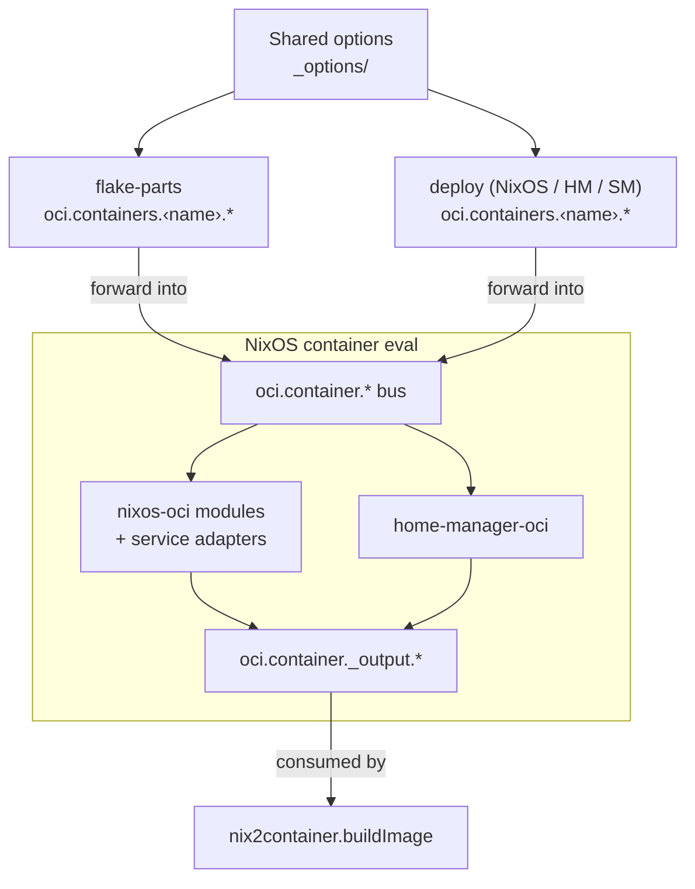

+++
title = "Contributing"
+++

# Contributing

Contributions are welcome! Here are some ways to help:

## Getting started

1. Fork and clone the repository
2. Enter the dev shell: `nix develop` (or use [direnv](https://direnv.net/) for automatic activation)
3. The dev shell provides all required tools (bats, lefthook, task, convco, typos, etc.)
4. Git hooks are managed by [lefthook](https://github.com/evilmartians/lefthook): they run automatically on commit (formatting, flake check, tests, commit message linting)
5. Make your changes
6. Submit a pull request

## Repository

- Source: [github.com/Dauliac/nix-oci](https://github.com/Dauliac/nix-oci)
- Issues: [github.com/Dauliac/nix-oci/issues](https://github.com/Dauliac/nix-oci/issues)

## Architecture

### flake-parts

nix-oci is a [flake-parts](https://flake.parts) module. All build-time logic (container definitions, library functions, checks, packages) is structured as flake-parts modules composed through `perSystem`. Consumers import the module via `imports = [ inputs.nix-oci.modules.flake.nix-oci ];`.

### import-tree (dendritic module discovery)

Modules are auto-discovered using [import-tree](https://github.com/denful/import-tree) instead of manual import lists. Each `.nix` file under `nix/modules/` is automatically imported; no need to register new files anywhere.

Convention: directories prefixed with `_` (e.g. `_options/`, `_nixos/`, `_nixos-oci/`) are **excluded** from import-tree auto-discovery and must be imported explicitly where needed. Use this for internal submodules, shared option fragments, or modules evaluated in a separate NixOS context.

### nix-lib (typed library functions)

Public library functions are declared through [nix-lib](https://github.com/feel-co/nix-lib) under the `nix-lib.lib.oci.*` namespace. Each function in `nix/modules/oci/lib/` declares its type, description, and implementation. Consumers access them via `config.lib.oci.*` in perSystem context.

This gives us typed function signatures, auto-generated reference docs, and testable library APIs.

### Shared pure libraries

Core logic lives in pure Nix files under `nix/lib/`:

- `oci.nix`: core OCI functions (ports, layers, labels, shadow, root, sandbox, seccomp)
- `container-checks.nix`: integration check helpers
- `identity.nix`: passwd/group file parsing for fromImage base images
- `deploy.nix`: deploy helpers (copyScript, autoStart, run args)
- `eval-container.nix`: shared NixOS container evaluation function

nix-lib wrappers in `nix/modules/oci/lib/` delegate to these pure functions. Deploy modules import them directly (not through nix-lib config).

### Shared NixOS eval

A single `evalContainerNixos` function (`nix/lib/eval-container.nix`) evaluates container NixOS configs. Both flake-parts build-time modules and deploy modules delegate to it, ensuring consistent behavior.

### Shared option definitions

Per-container options (package, entrypoint, healthcheck, hardening, etc.) are defined once in `nix/modules/oci/containers/_options/` and reused by both flake-parts and deploy module paths.

### perContainer (deferred module pattern)

Multiple modules can contribute container options via `oci.perContainer`, a deferred module collector. This lets option definitions (hardening, performance, healthcheck, etc.) live in separate files while composing into a single per-container submodule.

### Symmetric deploy targets (NixOS / home-manager / system-manager)

The three deploy targets (NixOS, home-manager, system-manager) are **symmetric by design**. They share the same `oci.containers` option tree, the same image build pipeline, and the same `_module.args` injection (nix2container, nixLibNixosModule). The compose module (`nix/modules/deploy/nix-oci/compose.nix`) wires them identically:

```nix
# Each target gets the same sub-modules and the same injected args
flake.modules.nixos.nix-oci       = { imports = [ enable backend containers load run ]; ... };
flake.modules.homeManager.nix-oci = { imports = [ enable backend containers load run ]; ... };
flake.modules.systemManager.nix-oci = { imports = [ enable backend containers load run ]; ... };
```

When adding a new feature or option to one deploy target, **add it to all three** (or to the shared modules in `deploy/nix-oci/options/`). Asymmetry between targets is a bug.

### The `oci.container` communication bus

The `oci.container.*` namespace inside the NixOS container eval is the **single communication bus** between all module layers. Every piece of data flows through it:



**Key rule**: flake-parts and deploy container options MUST NOT directly produce OCI image config. They forward values into the `oci.container.*` namespace of the NixOS eval, which derives all OCI output fields (entrypoint, healthcheck, env, labels, rootFilesystem, etc.) through the `_output.*` interface. The image builder then reads `_output.*` to produce the final image.

This ensures:
- A single derivation path for every OCI field, regardless of whether the image is built by flake-parts or a deploy module
- Service adapters can enrich/override any field (e.g. inject a health endpoint) without the caller knowing
- New OCI fields only need to be added in one place (a `_nixos-oci` module)

### No IFD (Import From Derivation)

nix-oci **never** uses IFD. All evaluation is pure: no derivation is built during `nix eval`, `nix flake show`, or `nix flake check`.

Why this matters:

- **Eval stays fast**: without IFD, evaluation is instant attribute traversal. IFD forces the evaluator to block while a derivation builds, creating sequential bottlenecks (eval → build → eval → build).
- **No builder required for eval**: tools like `nix flake show`, `nix flake check`, and documentation generators work without a running Nix daemon or build sandbox. CI jobs that only need eval remain lightweight.
- **Hydra-friendly**: Hydra separates evaluation from building. IFD collapses this boundary and breaks eval caching.
- **Cross-compilation works**: IFD derivations build for the build platform, which can cause confusing failures when cross-compiling for a different architecture.
- **Smaller attack surface**: IFD runs arbitrary derivations during eval, which expands trust requirements. Some Nix setups disable IFD entirely (`--no-allow-import-from-derivation`).

Where this constraint shows up concretely: the `fromImage` identity merge reads base image `/etc/passwd` and `/etc/group` from committed source files via `builtins.readFile` instead of extracting them from the base image at eval time. This requires a manual lock step (extract → commit) but preserves eval purity.

**Rule**: if you need data from an external source (base image, generated file), commit it to the repo and read it with `builtins.readFile` or `builtins.pathExists`. Never use `import (pkgs.runCommand ...)` or similar IFD patterns.

### Service adapters

NixOS service adapters (`nix/modules/_nixos-oci/service-adapters/`) automatically detect running services (nginx, postgresql, redis, etc.) and inject foreground mode, health endpoints, stop signals, and working directories into the `oci.container` bus. Users get production-ready container configs without manual OCI plumbing.

### Assertions for impossible states

Use NixOS/module `assertions` to reject invalid configurations at eval time rather than producing broken images at build time. If a state combination is impossible or nonsensical, **add an assertion**, don't silently ignore it.

Examples already in the codebase:
- `_home-manager-oci/defaults.nix`: asserts `home.username == oci.container.user` (prevents HM user mismatch)
- `container-checks.nix`: asserts mainService entrypoint was resolved, package is not null when required, etc.

Guidelines:
- If two options are mutually exclusive, assert it (e.g. `mainService` vs explicit `package` with entrypoint)
- If a combination leads to a broken image (empty entrypoint, missing user), assert it
- Prefer `assert` or module `assertions` over silent fallbacks: fail loud, fail early
- Write a clear `message` that tells the user what's wrong and how to fix it

## Project structure

- `nix/modules/oci/`: flake-parts build-time modules
- `nix/modules/oci/lib/`: nix-lib function declarations (typed, documented)
- `nix/modules/oci/containers/_options/`: shared per-container option definitions
- `nix/modules/deploy/`: NixOS and Home Manager deploy modules
- `nix/modules/_nixos-oci/`: NixOS container eval modules (service adapters, entrypoint, hardening)
- `nix/modules/_home-manager-oci/`: home-manager container eval defaults and assertions
- `nix/lib/`: pure shared libraries (no module system dependency)
- `examples/`: usage examples (build, deploy-nixos, deploy-home-manager)
- `nix/tests/`: end-to-end and integration tests
- `docs/`: documentation source (built with [NDG](https://github.com/feel-co/ndg))

## Running tests

```bash
# End-to-end tests (preferred way, via Taskfile)
task test

# All nix checks
nix flake check

# Integration test (NixOS VM)
nix build .#checks.x86_64-linux.deploy-integration
```

## Git hooks (lefthook)

Lefthook runs automatically on commit:

- **pre-commit**: `nix fmt`, `nix flake show`, `nix flake check`, `task test`
- **commit-msg**: [convco](https://convco.github.io/check/) (conventional commits) + typos check

## Module patterns: one file per option

Every option declaration lives in its own file, with the file path mirroring the option namespace path. This is the **core architectural pattern** of nix-oci.

### Rule: file path = option path

```
# Option: oci.container.hardening.seccomp
# File:   _nixos-oci/hardening/seccomp.nix

# Option: oci.cve.trivy.ignore.rootPath
# File:   security/cve/trivy/ignore/root-path.nix

# Option: performance.runtime.memory (deploy submodule)
# File:   _performance/memory.nix
```

### How to add a new option

1. **Create one `.nix` file** declaring the single option at its full dotted path:
   ```nix
   # nix/modules/oci/containers/_options/my-feature.nix
   { lib, ... }:
   {
     options.myFeature = lib.mkOption {
       type = lib.types.bool;
       default = false;
       description = "Enable my feature.";
     };
   }
   ```

2. **No registration needed** — `perContainer.nix` auto-discovers files in `_options/` via `discoverModules` (recursive `builtins.readDir`). For flake-level options, `import-tree` auto-discovers them.

3. **For submodule options** (e.g. `performance.runtime.*`), add the file to the `_performance/` directory. The `default.nix` auto-discovers it via `builtins.readDir`.

4. **For `_nixos-oci/` options**, follow the split pattern:
   - Pure option declarations → `feature/option-name.nix`
   - Computed outputs → `feature/outputs.nix`
   - Assertions + config → `feature/config.nix`

### When NOT to split

- **Submodule inner options** (`types.submodule { options = { ... }; }`): keep together in one file (e.g. `seccomp.nix` declares the whole seccomp submodule with enable/profile/mode/customProfileJson)
- **OCI struct fields** (healthcheck command/interval/timeout/retries): keep together — they map 1:1 to a single OCI config struct
- **Computed outputs** that aggregate multiple options: keep in `outputs.nix`
- **Type-coupled structural files** (perContainer, perTag, perArch): can't split

### Auto-discovery mechanisms

| Context | Mechanism | Skip prefix |
|---------|-----------|-------------|
| Flake-parts top-level | `import-tree ./modules` | `_` |
| Per-container options | `discoverModules ./_options` (builtins.readDir) | `_` |
| Deploy submodule | `_performance/default.nix` (builtins.readDir) | `default.nix` |
| `_nixos-oci/` modules | `import-tree ../../../_nixos-oci` | `_` |

### Naming conventions

- Use **kebab-case** for filenames: `glibc-tunables-preset.nix`, not `glibcTunablesPreset.nix`
- Match the **last segment** of the option path: `oci.container.hardening.disableDns` → `disable-dns.nix`
- Submodules get a single file named after the submodule: `seccomp.nix`, `landlock.nix`
- Subdirectories mirror namespace nesting: `cve/trivy/ignore/root-path.nix`

## Code style

- Format with `nix fmt`
- Prefix internal directories with `_` (excluded from import-tree)

### No raw `import` — use modules or nix-lib

**Never use `import` to pull in another module file.** All module composition goes through auto-discovery (`import-tree`, `discoverModules`, `builtins.readDir`) or explicit module system `imports` lists. Raw `import ./foo.nix` bypasses the module system, creates invisible coupling, and breaks the one-file-per-option contract.

| Allowed | Forbidden |
|---------|-----------|
| `imports = [ ./foo.nix ];` (module system) | `import ./foo.nix { inherit lib; }` |
| Auto-discovery via `import-tree` / `discoverModules` | `let x = import ./helpers.nix;` |
| `builtins.readFile` for data files (JSON, text) | `import (pkgs.runCommand ...)` (IFD) |
| Pure library imports in `nix/lib/*.nix` (shared libs) | Importing a module file as a plain function |

**Exceptions** (the only places raw `import` is acceptable):

- **`nix/lib/*.nix`** pure library files — these are not modules; they are plain functions imported by modules or nix-lib wrappers. Example: `import ./oci.nix { inherit lib; }` in `eval-container.nix`.
- **`import-tree` itself** — the root entry point that bootstraps auto-discovery.
- **`builtins.readFile`** — reading committed data files (passwd, JSON configs) is fine.

Why this matters:
- Auto-discovery means **dropping a file makes it exist** — no import list to forget
- Module-system `imports` get merged, deduplicated, and ordered correctly
- Raw `import` evaluates immediately and skips merge/override/priority logic
- Debugging circular imports is trivial when all composition goes through the module system

## Contributions we'd love to see

- **New service adapters**: add foreground mode, healthcheck, and stop signal support for more NixOS services (see `nix/modules/_nixos-oci/service-adapters/` for examples). Any service under `services.*` that can run in a container is a good candidate.
- **Tests for existing adapters**: improve coverage of service adapter behavior (healthcheck injection, stop signal detection, entrypoint extraction) with Container Structure Tests or VM integration tests.

## Related links

- [NixOS manual](https://nixos.org/manual/nixos/stable/)
- [Home Manager manual](https://nix-community.github.io/home-manager/)
- [flake-parts](https://flake.parts)
- [nix-oci on flake.parts](https://flake.parts/options/nix-oci.html)
- [nix2container](https://github.com/nlewo/nix2container)
