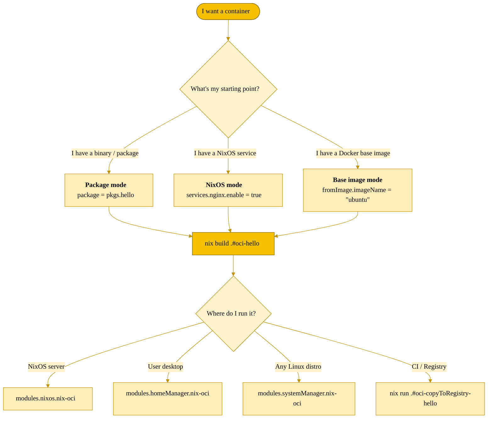
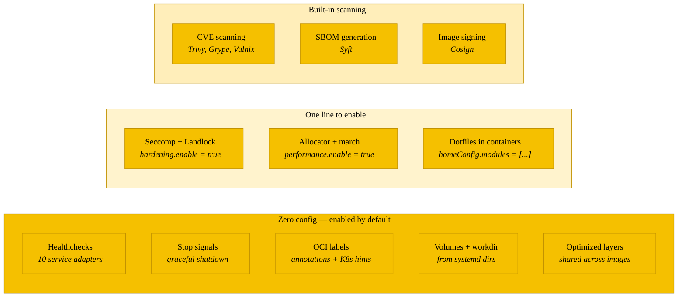

# nix-oci

A [flake-parts](https://flake.parts), [NixOS](https://nixos.org/manual/nixos/stable/), [Home Manager](https://nix-community.github.io/home-manager/) and [system-manager](https://system-manager.net) module system for OCI containers, powered by [nix2container](https://github.com/nlewo/nix2container).

nix-oci lets you **build**, **deploy** and **run** containers entirely from Nix -- including building images directly from NixOS service definitions.

## What you write vs. what you get

```mermaid
%%{init: {'theme': 'base', 'themeVariables': { 'primaryColor': '#f5c000', 'primaryTextColor': '#000', 'primaryBorderColor': '#c29200', 'secondaryColor': '#fff3cd', 'secondaryTextColor': '#000', 'secondaryBorderColor': '#c29200', 'tertiaryColor': '#ffeeba', 'tertiaryTextColor': '#000', 'tertiaryBorderColor': '#c29200', 'lineColor': '#c29200', 'textColor': '#000', 'fontFamily': 'system-ui, sans-serif' }}}%%
flowchart LR
    subgraph YOU_WRITE ["You write 5 lines of Nix"]
        direction TB
        A["services.nginx.enable = true"]
    end

    YOU_WRITE --> NIXOCI["nix-oci"]

    subgraph YOU_GET ["You get a production-ready container"]
        direction TB
        B["Minimal rootfs — no shell, no bloat"]
        C["Healthcheck auto-injected"]
        D["Seccomp + Landlock hardening"]
        E["OCI labels + metadata"]
        F["Optimized shared layers"]
        G["Ready to deploy on NixOS"]
    end

    NIXOCI --> YOU_GET

    style YOU_WRITE fill:#fff3cd,stroke:#c29200,color:#000
    style NIXOCI fill:#f5c000,stroke:#856404,color:#000,font-weight:bold
    style YOU_GET fill:#ffeeba,stroke:#c29200,color:#000
```



## Three ways to use it



## What you get for free



## Features

- **Build OCI images** declaratively from packages or NixOS modules
- **Deploy and run** containers on NixOS, Home Manager and system-manager via a unified `oci.*` API
- **Build containers from NixOS services** -- write `services.nginx.enable = true` and get a minimal container image
- **10 service adapters** -- nginx, httpd, caddy, postgresql, redis, bind, dnsmasq, postfix, vsftpd, php-fpm -- each auto-injects healthcheck endpoints, stop signals, and foreground mode
- **Automatic metadata** -- healthchecks, stop signals, working directories and volume declarations auto-derived from NixOS service configuration
- **fromImage base images** -- build on top of external OCI images (e.g. Docker Hub); identity files (`/etc/passwd`, `/etc/group`) pre-extracted at lock time, no IFD
- **Home Manager in containers** -- use `homeConfig.modules` to configure dotfiles, shell, git, and editors inside containers via Home Manager
- **Health-aware systemd services** -- containers with healthchecks get `sdnotify` integration so dependent services wait until the container is healthy (`READY=1`)
- **Optimized layer sharing** -- [popularity-based store-path layering](https://grahamc.com/blog/nix-and-layered-docker-images) so images sharing common dependencies share registry layers, dramatically reducing push and pull times
- **Multi-arch cross-compilation** -- build `aarch64` images on `x86_64` without emulation
- **Hardening** -- seccomp syscall filtering with argument-level filtering (namespace, socket, ioctl restrictions), io_uring blocking, memfd_create blocking, audit mode for profile discovery, Landlock LSM filesystem and network access control, capability dropping, read-only rootfs, no-new-privileges, DNS/TLS restrictions
- **Build-time assertions** -- validates port/privilege coherence (e.g. privileged ports require root or capabilities) and hardening configuration consistency
- **Performance** -- alternative memory allocators (mimalloc, tcmalloc) via `LD_PRELOAD`, glibc tunables, CPU-targeted builds (`-march`), glibc-hwcaps multi-level library optimization, zstd layer compression
- **Security scanning** -- CVE scanning (Trivy, Grype, Vulnix), SBOM generation (Syft), credentials leak detection, image signing (cosign), CIS compliance checking, image linting (Dockle)
- **Automatic OCI labels** -- OCI standard annotations, build metadata, hardening posture, Kubernetes PSS level, network ports, security hints
- **Nix-lib** -- overridable pure function library (`config.lib.oci.*`) for ports, layers, labels, seccomp profiles, identity parsing, deploy helpers
- **initializeNixDatabase** -- optionally populate `/nix/var/nix/db/db.sqlite` to run `nix` commands inside containers
- **Testing** -- Container Structure Tests, dgoss, dive
- **Debug variants** -- add shells and tools to any image for troubleshooting

## Quick Start: Build an image (flake-parts)

```nix
{
  inputs.nix-oci.url = "github:Dauliac/nix-oci";

  outputs = inputs:
    inputs.flake-parts.lib.mkFlake { inherit inputs; } {
      imports = [ inputs.nix-oci.modules.flake.nix-oci ];

      oci.enabled = true;

      perSystem = { pkgs, ... }: {
        oci.containers.hello = {
          package = pkgs.hello;
        };
      };
    };
}
```

Or use the template:

```bash
nix flake init -t github:Dauliac/nix-oci
```

## Quick Start: Deploy a container (NixOS)

```nix
{ inputs, pkgs, ... }:
{
  imports = [ inputs.nix-oci.modules.nixos.nix-oci ];

  oci = {
    enable = true;
    backend = "podman";
    containers.my-server = {
      package = pkgs.python3Minimal;
      entrypoint = [ "${pkgs.python3Minimal}/bin/python3" "-m" "http.server" "8080" ];
      autoStart = true;
      ports = [ "8080:8080" ];
    };
  };
}
```

## Quick Start: Build from a NixOS service

```nix
perSystem = { ... }: {
  oci.containers.my-caddy = {
    nixosConfig = {
      mainService = "caddy";
      modules = [
        ({ ... }: {
          services.caddy = {
            enable = true;
            virtualHosts."localhost:8080".extraConfig = ''
              respond "Hello from nix-oci!"
            '';
          };
        })
      ];
    };
    isRoot = true;
  };
};
```

## Documentation

- [Full documentation](https://dauliac.github.io/nix-oci/) (built with [NDG](https://github.com/feel-co/ndg))
- [nix-oci on flake.parts](https://flake.parts/options/nix-oci.html)
- [NixOS manual](https://nixos.org/manual/nixos/stable/)
- [Home Manager manual](https://nix-community.github.io/home-manager/)
- [system-manager](https://system-manager.net)
- [nix2container](https://github.com/nlewo/nix2container)
- [flake-parts](https://flake.parts)

## Examples

See the [examples](./examples) directory:

- [`examples/flake/`](./examples/flake/) -- flake-parts image building
- [`examples/deploy-nixos/`](./examples/deploy-nixos/) -- NixOS deployment
- [`examples/deploy-home-manager/`](./examples/deploy-home-manager/) -- Home Manager deployment
- [`examples/deploy-system-manager/`](./examples/deploy-system-manager/) -- system-manager deployment

## Contributing

Contributions are welcome! See [CONTRIBUTING.md](./CONTRIBUTING.md) for guidelines.

## License

MIT -- see [LICENSE](./LICENSE).

## Acknowledgments

Thanks to the contributors of [nix2container](https://github.com/nlewo/nix2container) and [flake-parts](https://github.com/hercules-ci/flake-parts). Logo set in [Frames Part One](https://nathanlaurent.github.io/frames.html) by Nathan Laurent (SIL Open Font License).
