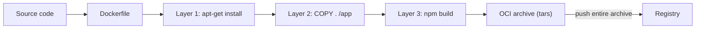
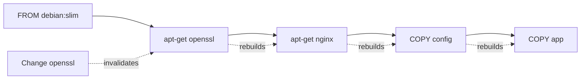
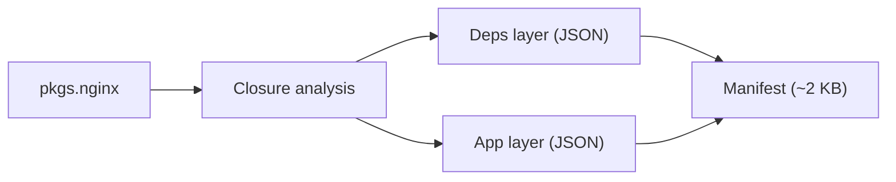
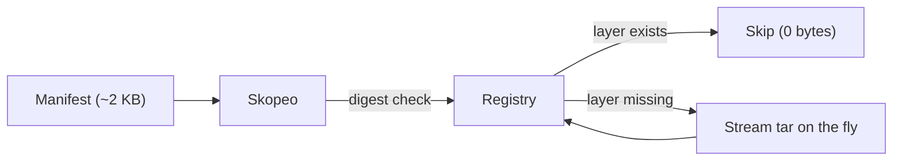
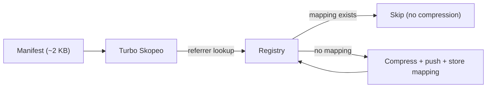

+++
title = "Archive-less container building"
description = "How nix2container builds OCI images without intermediate archives, reducing store bloat and enabling streaming pushes"
+++

# Archive-less container building

nix-oci relies on [nix2container](https://github.com/nlewo/nix2container),
a self-described **"archive-less `dockerTools.buildImage` implementation"**,
to build OCI images using a fundamentally different approach than traditional
tools: layers are never materialized as tar archives in the Nix store.
Instead, they exist as **JSON descriptions** of store paths, and actual
nix2container only produces tarballs at the moment a consumer needs them: when loading into
a runtime or pushing to a registry.

## The problem with archive-based builds

Traditional container build tools (whether `docker build` with a Dockerfile
or Nix's built-in `dockerTools.buildImage`) follow the same pattern:

1. Collect the filesystem contents.
2. Write one or more **tar archives** (layers) to disk.
3. Bundle them into an OCI/Docker archive.
4. Push or load that archive.



This creates two problems:

- **Store bloat**: the Nix store holds every store path *twice*: once as a
  Nix derivation output and once inside a layer tarball.
  A 500 MB image effectively costs 1 GB of disk.
- **Slow rebuilds**: changing a single dependency forces the entire archive to
  be rebuilt and re-written, even if most layers are identical to the previous
  build.

### Dockerfile: user-defined build graph

With Dockerfiles, the user manually defines the build graph as an ordered
sequence of `RUN`, `COPY`, and `ADD` instructions. Each instruction produces
a layer, and layers are **ordered and sequential**: changing one layer
invalidates all subsequent layers:



This means:
- Users must carefully order instructions to maximize cache hits.
- A single dependency change can cascade through the entire image.
- The layer graph is **linear**: users cannot express "these two
  things are independent and can cache separately".
- Build outputs are **non-reproducible**: `apt-get install` at two
  different times can produce different results.

Nix's `dockerTools.streamLayeredImage` partially addresses this by streaming
the archive instead of writing it to the store, but it still computes every
layer tarball on each invocation and cannot skip layers already present in a
registry.

## How nix2container solves it

nix2container takes a fundamentally different approach. Instead of a
user-defined linear build graph, the dependency graph comes **from Nix** --
it is a DAG (directed acyclic graph) derived from the package closure,
not a sequence of imperative instructions:



The key differences from Dockerfile builds:

| Aspect | Dockerfile | nix2container |
|---|---|---|
| Build graph | User-defined, linear, imperative | Nix-derived, DAG, declarative |
| Layer invalidation | Cascading (one change rebuilds all below) | Targeted (only affected layer changes) |
| Disk usage | Tars stored on disk (~2x image size) | JSON only (~2 KB) |
| Reproducibility | Non-deterministic (network, timestamps) | Bit-for-bit identical |
| Cache granularity | Per Dockerfile instruction | Per Nix store path |

nix2container replaces tar archives with lightweight **JSON metadata files**.
A built image in the Nix store is just a few kilobytes of JSON listing:

- The Nix store paths belonging to each layer.
- Pre-computed **digests and diff IDs** for every layer.
- OCI image configuration (entrypoint, env, labels, etc.).

`nix build` writes no tar archive. The image "recipe" is a
pure Nix derivation that produces only JSON. This is what **archive-less**
container building means.

### Streaming push with Skopeo

nix2container ships a small Go library (~250 lines) that plugs into
[Skopeo](https://github.com/containers/skopeo) as a custom `nix:` transport.
When you push an image:

1. Skopeo reads the JSON manifest.
2. For each layer, it checks the **pre-computed digest** against the registry.
   Skopeo skips layers that already exist; it generates and transfers no data
   for them.
3. Only missing layers are **tar-archived on the fly** and streamed directly
   to the registry, without touching the local disk.



This makes pushes dramatically faster:

| Operation | `dockerTools.buildImage` | `dockerTools.streamLayeredImage` | **nix2container** |
|---|---|---|---|
| Rebuild + push | ~10 s | ~7.5 s | **~1.8 s** |

*(Benchmarks from the [nix2container README](https://github.com/nlewo/nix2container).)*

### Cross-machine acceleration with nix2container-turbo

Vanilla nix2container has a subtle limitation: although it skips *uploading*
layers that already exist in the registry, it must still **re-compress every
layer locally** on each machine to compute the digest used for the check.
For large images, this compression step dominates push time — and the work
is repeated on every CI runner, developer machine, or deployment host that
pushes the same image.

[nix2container-turbo](https://github.com/schlarpc/nix2container-turbo)
eliminates this redundancy. It is a patched Skopeo that stores
**layer mappings** (Nix store path hash → compressed digest) as
[OCI referrer manifests](https://github.com/opencontainers/distribution-spec/blob/main/spec.md#listing-referrers)
directly in the registry. When any machine pushes the same image:

1. Skopeo queries the referrer manifests for each layer's source hash.
2. If a mapping exists, the layer is already in the registry with a known
   digest — **no local compression, no upload**.
3. Only truly new layers are compressed and pushed.



This makes repushes **sub-second regardless of image size**, because even
the local compression step is eliminated. The improvement is most dramatic
in CI environments where multiple runners push overlapping images.

#### SOCI v2: lazy pulling

nix2container-turbo can also generate
[SOCI v2](https://github.com/awslabs/soci-snapshotter) (Seekable OCI)
indexes inline during push. SOCI indexes enable **lazy pulling**: the
container runtime starts the container before the full image is downloaded,
fetching layer data on demand as the process accesses files.

This reduces cold-start times for large images significantly — AWS reports
~53 s → ~20 s for a 1 GB image on Fargate with soci-snapshotter.

nix-oci exposes both features declaratively:

```nix
{
  oci.turbo = {
    enable = true;       # Use turbo-patched skopeo for all pushes
    soci = true;         # Generate SOCI v2 indexes
    layerCache = true;   # Cross-machine layer cache (default when turbo is on)
  };
}
```

Per-container overrides are available via
`oci.containers.<name>.performance.turbo.*`.

### Loading into Docker / Podman

The same principle applies when loading images locally. nix2container
generates `copyToDockerDaemon` and `copyToPodman` scripts that use Skopeo to
stream layers into the local runtime without creating intermediate files.

## Comparison with other Nix container tools

| Tool | Archive in store | Incremental push | Cross-machine cache | Lazy pull | Layer optimization |
|---|---|---|---|---|---|
| `dockerTools.buildImage` | Yes (full OCI tar) | No | No | No | No |
| `dockerTools.buildLayeredImage` | Yes (layer tars) | No | No | No | Popularity-based |
| `dockerTools.streamLayeredImage` | No (streamed) | No (recomputes all) | No | No | Popularity-based |
| **nix2container** | **No (JSON only)** | **Yes (digest check)** | No (re-compresses locally) | No | **Popularity-based** |
| **nix2container-turbo** | **No (JSON only)** | **Yes (referrer lookup)** | **Yes (OCI Referrers)** | **Yes (SOCI v2)** | **Popularity-based** |

### Outside the Nix ecosystem

Several other tools pursue Dockerfile-free or layer-streaming strategies,
each targeting a specific language or workflow:

#### ko (Go)

[ko](https://ko.build/) builds container images from Go source code without
requiring Docker or a Dockerfile. It runs `go build` locally, places the
binary on a minimal [distroless](https://github.com/GoogleContainerTools/distroless)
base image, and pushes layers directly to a registry. ko includes multi-platform builds,
automatic SBOM generation, and Kubernetes YAML templating out of the box.
Because ko understands Go's build model, it can separate the base image from
the application binary and only re-push what changed.

See [Container images simplified with ko (Snyk)](https://snyk.io/blog/container-images-simplified-with-google-ko/)
and [Ship your Go applications faster to Cloud Run with ko (Google Cloud Blog)](https://cloud.google.com/blog/topics/developers-practitioners/ship-your-go-applications-faster-cloud-run-ko).

#### Jib (Java)

[Jib](https://github.com/GoogleContainerTools/jib) integrates with Maven and
Gradle to build Java container images without a Docker daemon. It splits the
application into three layers (dependencies, resources, and classes) and
a code-only change rebuilds and pushes only the thin classes layer. Jib pushes
layers in parallel directly to the registry, skipping the local `docker save`
step entirely.

See [Introducing Jib (Google Cloud Blog)](https://cloud.google.com/blog/products/application-development/introducing-jib-build-java-docker-images-better)
and [Jib 1.0.0 is GA (Google Cloud Blog)](https://cloud.google.com/blog/products/application-development/jib-1-0-0-is-ga-building-java-docker-images-has-never-been-easier).

#### Cloud Native Buildpacks

[Cloud Native Buildpacks](https://buildpacks.io/) auto-detect the application
type and produce images with modular, reusable layers. Unlike Dockerfile
builds, where a change in one layer invalidates all subsequent layers,
each buildpack contributes an independent layer that caches based on its own
inputs. When someone updates the OS base image, the platform
**rebases** existing application layers in milliseconds by swapping metadata,
without triggering a full rebuild.

See [Reduce, Reuse, Rebase: Sustainable Containers with Buildpacks (CNCF)](https://www.cncf.io/blog/2024/01/11/reduce-reuse-rebase-sustainable-containers-with-buildpacks/)
and [Dockerfiles vs. Cloud-native Buildpacks (Medium)](https://medium.com/@michael.vittrup.larsen/dockerfiles-vs-cloud-native-buildpacks-8acf8149dea1).

#### Nixery

[Nixery](https://nixery.dev/) takes the on-demand concept to its logical
extreme: it is a container **registry** that builds images at pull time.
A `docker pull nixery.dev/shell/git` request triggers Nix to assemble an
image containing those packages, using a
[popularity-based layering algorithm](https://tazj.in/blog/nixery-layers)
to maximize layer sharing across requests. Nixery caches built layers in a
storage bucket, making subsequent pulls of the same packages instant.

See [Nixery: Improved Layering Design (tazjin's blog)](https://tazj.in/blog/nixery-layers)
and [One Docker image to rule them all (DERLIN)](https://blog.derlin.ch/nixery-one-docker-image-to-rule-them-all).

#### Dagger

[Dagger](https://dagger.io/) exposes BuildKit as a programmable API.
Instead of writing Dockerfiles, users define container builds in Go, Python,
or TypeScript using a type-safe SDK. Each function call maps to a BuildKit
operation, giving full control over caching and parallelism. Because Dagger
runs its own BuildKit engine, it does not require a separate Docker daemon
install, but it still relies on BuildKit internally and produces the same
layer-tar artifacts. Dagger excels as a **CI/CD pipeline engine** that
happens to build containers, rather than a container-image tool per se.

See [Dagger documentation](https://docs.dagger.io/).

#### Earthly

[Earthly](https://earthly.dev/) extends Dockerfile syntax with an
`Earthfile` that supports targets, cross-references, and shared caching.
Like Dagger, it uses BuildKit under the hood but adds features such as
`SAVE ARTIFACT`, multi-target graphs, and Earthly Satellites for remote
build caching. Earthly brings reproducibility closer to Dockerfile users
by isolating builds in containers, though the resulting images still depend
on mutable base images and are not bit-for-bit reproducible by default.

See [Earthly documentation](https://docs.earthly.dev/).

#### Table 1: Build mechanism comparison

This table compares **how each tool builds and pushes images**: the
underlying model, disk usage, caching strategy, and reproducibility
guarantees.

> **Legend:** ✅ native / built-in — 🟡 partial or configurable — ❌ no support — 🔧 manual effort required — 🔌 needs external tool — ⚙️ own engine

<div class="table-scroll">

| Capability | Dockerfile (BuildKit) | Dagger | Earthly | Nix `dockerTools` | nix2container | **nix-oci** | ko | Jib | Buildpacks | Apko / Melange | Nixery |
|---|---|---|---|---|---|---|---|---|---|---|---|
| Language scope | Any | Any | Any | Any | Any | **Any** | Go only | Java only | Multi-lang | Any (Alpine) | Any (Nix) |
| Docker daemon required | ❌ Yes | ⚙️ Own engine | ⚙️ Own engine | ✅ No | ✅ No | ✅ **No** | ✅ No | ✅ No | ❌ Yes | ✅ No | ✅ No (is a registry) |
| Build model | Imperative (RUN) | Programmatic (SDK) | Imperative (Earthfile) | Declarative (Nix) | Declarative (Nix) | ✅ **Declarative (NixOS modules)** | Go build | Maven / Gradle plugin | Auto-detect | Declarative (YAML) | On-demand (pull) |
| Archive-less builds | ❌ | ❌ | ❌ | ❌ | ✅ | ✅ | 🟡 Partial | ✅ | ❌ | ❌ | ✅ |
| Incremental push | 🟡 Layer cache | 🟡 Layer cache | 🟡 Layer cache + Satellites | ❌ | ✅ Digest check | ✅ **Digest check** | ✅ | ✅ Parallel | 🟡 Rebase | ❌ | N/A (pull-based) |
| Reproducible builds | ❌ | ❌ | 🟡 Partial | ✅ | ✅ | ✅ **Bit-for-bit** | 🟡 Partial | 🟡 Configurable | ❌ | ✅ | ✅ |
| Multi-arch | ✅ | ✅ | ✅ | 🔧 Manual | 🔧 Manual | ✅ **Declarative** | ✅ | ✅ | ✅ | ✅ | ❌ |
| Layer optimization | 🔧 Manual ordering | 🔧 Manual ordering | 🔧 Manual ordering | ✅ Popularity | ✅ Popularity | ✅ **Popularity** | ✅ Automatic | ✅ 3-layer split | ✅ Automatic | 🔧 Manual | ✅ Popularity |
| Disk cost per image | ❌ ~2x (tars) | ❌ ~2x (tars) | ❌ ~2x (tars) | ❌ ~2x (tars) | ✅ **~0 (JSON)** | ✅ **~0 (JSON)** | 🟡 ~1x | ✅ ~0 (no tar) | ❌ ~2x (tars) | 🟡 ~1x | N/A |
| Base image model | FROM (mutable tags) | FROM (mutable tags) | FROM (mutable tags) | ✅ Nix closure | ✅ Nix closure | ✅ **Nix closure** | Distroless | Distroless | Builder-provided | Alpine packages | ✅ Nix closure |

</div>

#### Table 2: Security & supply chain

This table compares **security features** (scanning, signing, hardening,
and compliance) that each tool provides out of the box.
Tools whose scope is limited to image building (Apko/Melange, Nixery,
nix2container) are omitted here; they appear in Table 1.

> **Legend:** ✅ built-in — 🔌 needs external tool — 🔧 possible but manual — 🟡 partial — ❌ not available

<div class="table-scroll">

| Capability | Dockerfile (BuildKit) | Dagger | Earthly | Nix `dockerTools` | **nix-oci** | ko | Jib | Buildpacks |
|---|---|---|---|---|---|---|---|---|
| **Supply Chain** | | | | | | | | |
| CVE scanning | 🔌 External | 🔌 External | 🔌 External | 🔌 External | ✅ **Trivy, Grype, Vulnix** | 🔌 External | 🔌 External | 🔌 External |
| SBOM generation | 🔌 External | 🔌 External | 🔌 External | 🔌 External | ✅ **Syft** | ✅ Built-in | 🔌 External | ✅ Built-in |
| Image signing | 🔌 External | 🔌 External | 🔌 External | 🔌 External | ✅ **Cosign, keyless** | ✅ Cosign | 🔌 External | 🔌 External |
| Compliance audit | 🔌 External | 🔌 External | 🔌 External | 🔌 External | ✅ **Trivy** | ❌ | ❌ | ❌ |
| Image linting | 🔌 hadolint | 🔌 External | 🔌 External | ❌ | ✅ **Dockle** | ❌ | ❌ | ❌ |
| Credentials leak detection | 🔌 External | 🔌 External | 🔌 External | 🔌 External | ✅ **Trivy** | ❌ | ❌ | ❌ |
| **Runtime Hardening** | | | | | | | | |
| Seccomp profiles | 🔧 Manual | 🔧 Manual | 🔧 Manual | 🔧 Manual | ✅ **Auto-generated** | ❌ | ❌ | ❌ |
| Capability dropping | 🔧 Manual | 🔧 Manual | 🔧 Manual | 🔧 Manual | ✅ **Least-privilege** | ❌ | ❌ | ❌ |
| Read-only rootfs | 🔧 Manual | 🔧 Manual | 🔧 Manual | 🔧 Manual | ✅ **Built-in** | ❌ | ❌ | ❌ |
| Privilege escalation prevention | 🔧 Manual | 🔧 Manual | 🔧 Manual | 🔧 Manual | ✅ **Built-in** | ❌ | ❌ | ❌ |
| AppArmor MAC | ❌ | ❌ | ❌ | ❌ | ✅ **Built-in** | ❌ | ❌ | ❌ |

</div>

#### Table 3: Performance, runtime & testing

This table compares **runtime tuning and testing** capabilities.

> **Legend:** ✅ built-in — 🔧 possible but manual — 🟡 partial — ❌ not available

<div class="table-scroll">

| Capability | Dockerfile (BuildKit) | Dagger | Earthly | Nix `dockerTools` | **nix-oci** | ko | Jib | Buildpacks |
|---|---|---|---|---|---|---|---|---|
| **Performance** | | | | | | | | |
| Allocator selection | 🔧 Manual | 🔧 Manual | 🔧 Manual | 🔧 Manual | ✅ **jemalloc, mimalloc, …** | ❌ | ❌ | ❌ |
| Compiler optimization (march, LTO) | 🔧 Manual | 🔧 Manual | 🔧 Manual | 🔧 Manual | ✅ **Built-in** | ❌ | ❌ | ❌ |
| GPU / CUDA support | 🔧 Manual | 🔧 Manual | 🔧 Manual | 🔧 Manual | ✅ **Built-in** | ❌ | ❌ | ❌ |
| Health checks | 🔧 Manual | 🔧 Manual | 🔧 Manual | 🔧 Manual | ✅ **Auto-detected** | ❌ | ❌ | 🟡 Partial |
| Huge pages, glibc tunables | 🔧 Manual | 🔧 Manual | 🔧 Manual | 🔧 Manual | ✅ **Built-in** | ❌ | ❌ | ❌ |
| **Testing** | | | | | | | | |
| Structure tests | 🔌 External | 🔌 External | 🔌 External | 🔌 External | ✅ **Built-in** | ❌ | ❌ | ❌ |
| NixOS VM integration tests | ❌ | ❌ | ❌ | 🔧 Manual | ✅ **Built-in** | ❌ | ❌ | ❌ |

</div>

**Key takeaway**: Dagger and Earthly modernize the *build pipeline* but
still rely on BuildKit's imperative, tar-based model and leave security,
hardening, and tuning to external tools. nix-oci is the only tool that
covers the entire container lifecycle: build, scan, sign, harden, tune,
and test, in a single declarative module.

## Why it matters for nix-oci

Because nix-oci uses nix2container (and optionally nix2container-turbo)
as its backend:

- **Minimal store usage**: building dozens of container variants does not
  bloat your Nix store with duplicate tarballs.
- **Fast iteration**: rebuilding after a code change only recomputes the JSON
  manifest; pushing only transfers the changed layer.
- **Efficient CI**: CI runners benefit from smaller caches and shorter push
  times, since unchanged layers are never re-uploaded. With turbo enabled,
  even the local compression step is skipped thanks to cross-machine layer
  caching — repushes become sub-second regardless of image size.
- **Fast cold starts**: with turbo's SOCI v2 indexes, container runtimes
  can start containers before the full image is downloaded, cutting cold-start
  times significantly for large images.
- **Reproducibility**: the JSON manifest is a pure Nix derivation, so the
  image is bit-for-bit reproducible across machines.

## Further reading

### nix2container and Nix

- [nix2container](https://github.com/nlewo/nix2container): the backend powering nix-oci
- [nix2container-turbo](https://github.com/schlarpc/nix2container-turbo): patched Skopeo with cross-machine layer caching and SOCI v2 support
- [SOCI snapshotter](https://github.com/awslabs/soci-snapshotter): lazy pulling for containerd and AWS Fargate
- [OCI Referrers API](https://github.com/opencontainers/distribution-spec/blob/main/spec.md#listing-referrers): the distribution-spec mechanism turbo uses for layer cache storage
- [Building container images with Nix](https://lewo.abesis.fr/posts/nix-build-container-image/): foundational ideas behind the archive-less approach
- [Nix & Docker: Layer explicitly without duplicate packages](https://blog.eigenvalue.net/2023-nix2container-everything-once/): avoiding duplicate store paths in explicit layers
- [Nixery: Improved Layering Design](https://tazj.in/blog/nixery-layers): popularity-based layering for on-demand registry images
- [Minimal containers using Nix](https://tmp.bearblog.dev/minimal-containers-using-nix/): practical guide to small Nix-built containers
- [Using Nix with Dockerfiles](https://mitchellh.com/writing/nix-with-dockerfiles): Mitchell Hashimoto on combining Nix and Docker

### Dockerfile-free tools

- [Introducing Jib (Google Cloud Blog)](https://cloud.google.com/blog/products/application-development/introducing-jib-build-java-docker-images-better): building Java images without Docker
- [Container images simplified with ko (Snyk)](https://snyk.io/blog/container-images-simplified-with-google-ko/): building Go images without Docker
- [Reduce, Reuse, Rebase: Sustainable Containers with Buildpacks (CNCF)](https://www.cncf.io/blog/2024/01/11/reduce-reuse-rebase-sustainable-containers-with-buildpacks/): reusable layers and rebasing
- [Building Container Images without a Dockerfile](https://blog.ttulka.com/building-container-images-without-dockerfile/): overview of alternative approaches

### Build pipeline tools

- [Dagger documentation](https://docs.dagger.io/): programmable CI/CD engine exposing BuildKit as a type-safe SDK
- [Dagger architecture overview](https://docs.dagger.io/features/architecture): how Dagger wraps BuildKit into a DAG of containerized functions
- [Earthly documentation](https://docs.earthly.dev/): Dockerfile-like syntax with targets, cross-references, and shared caching
- [Earthly vs. Dockerfile (Earthly Blog)](https://earthly.dev/blog/earthly-vs-dockerfile/): how Earthfiles extend the Dockerfile model with better caching and reproducibility

### nix-oci

- [Optimized layer sharing](./optimize-layers.md): how nix-oci uses popularity-based layering on top of nix2container
