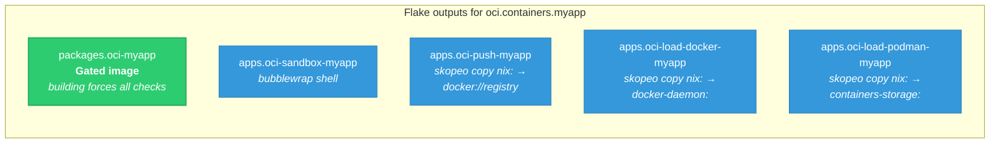
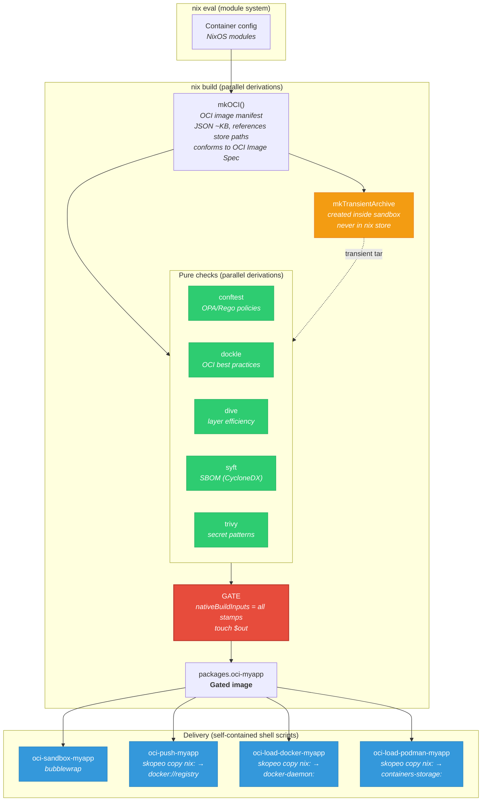
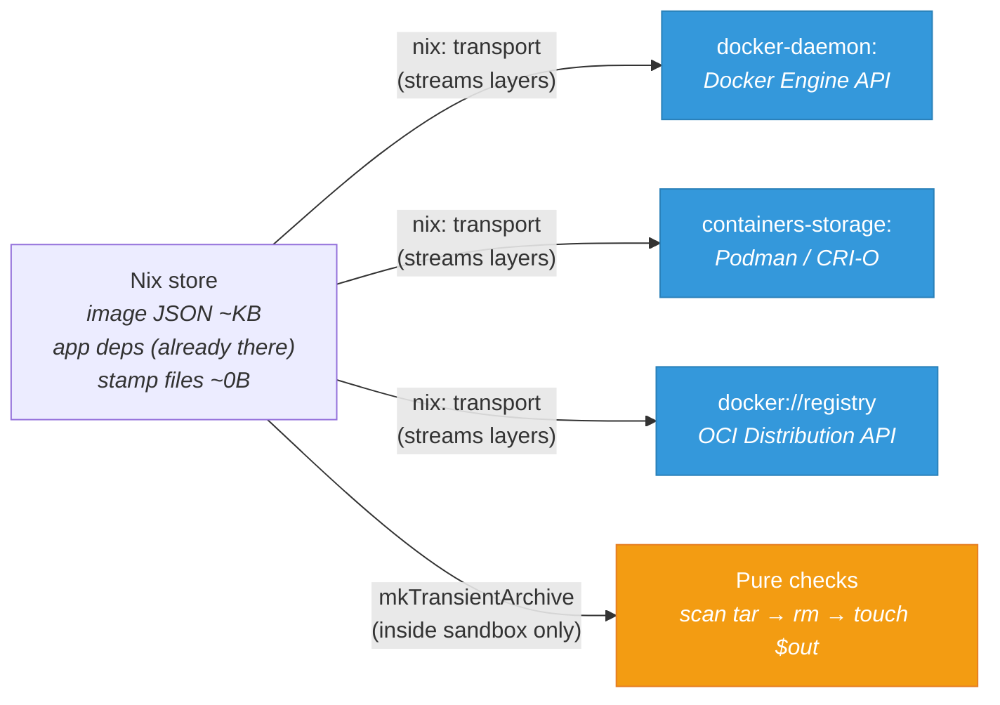
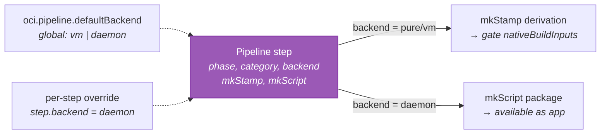
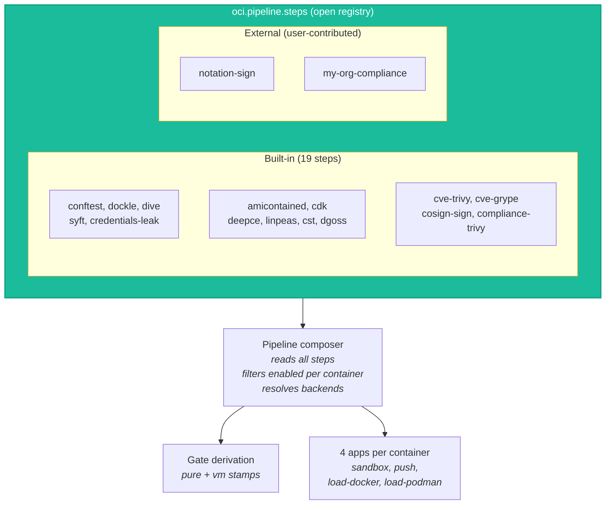

+++
title = "Validation-gated delivery"
description = "How nix-oci enforces that every image is validated before it can be loaded or published — probes, checks, and signing as prerequisites, never afterthoughts"
+++

# Validation-gated delivery

nix-oci enforces a simple rule: **no image leaves your machine without
passing validation.** Probes and checks are not optional post-hoc steps —
they are prerequisites wired into the build and delivery pipeline.

- You cannot **build** the image package without pure checks passing (build-time gate)
- You cannot **push** or **load** the image without the gate passing first
- All validation is expressed as Nix derivations — hermetic, cached, parallel

## Flake outputs per container

Each container produces exactly 5 outputs:



| Output | Purpose |
|---|---|
| `packages.oci-myapp` | Gated OCI image — building it forces all checks to pass |
| `apps.oci-sandbox-myapp` | Run the container filesystem in a bubblewrap sandbox |
| `apps.oci-push-myapp` | Push to registry via `skopeo copy nix: → docker://` (streams, no archive) |
| `apps.oci-load-docker-myapp` | Load into Docker via `skopeo copy nix: → docker-daemon:` |
| `apps.oci-load-podman-myapp` | Load into Podman via `skopeo copy nix: → containers-storage:` |

Every app references the gate — Nix will build all checks before
the app script can execute.

## Full pipeline



## OCI transport model

All delivery apps use the
[OCI Distribution Specification](https://github.com/opencontainers/distribution-spec)
transports via [Skopeo](https://github.com/containers/skopeo).
No intermediate archive is ever written to disk:



| Transport | OCI spec | Used by |
|---|---|---|
| `nix:` → `docker://` | [Distribution Spec](https://github.com/opencontainers/distribution-spec) push API | `oci-push-*` |
| `nix:` → `docker-daemon:` | Docker Engine API (local) | `oci-load-docker-*` |
| `nix:` → `containers-storage:` | containers/storage library | `oci-load-podman-*` |
| `mkTransientArchive` | [Image Layout](https://github.com/opencontainers/image-spec/blob/main/image-layout.md) (ephemeral) | Pure checks only |

Every arrow streams or creates transient data. No tarball ever lands
in the Nix store.

## Backend toggle

Probes (amicontained, CDK, DEEPCE, linPEAS) can run as **build-time
VM checks** (derivations, in the gate) or at runtime. A single toggle
controls the routing:



```nix
# Global default — all probes in the build-time gate
oci.pipeline.defaultBackend = "vm";
```

| Scenario | Gate (build-time) | Available as app |
|---|---|---|
| `defaultBackend = "vm"` | all probes + pure checks | none |
| `defaultBackend = "daemon"` | pure checks only | all probes |

## Step registry (extensibility)

Tools register themselves into `oci.pipeline.steps` — the pipeline
composer reads what is registered. This is dependency inversion via
the NixOS module system:



Adding a new tool requires **zero changes to nix-oci**:

```nix
# In your flake.nix
perSystem = { config, pkgs, ... }: {
  oci.pipeline.steps.notation-sign = {
    phase = "post-push";
    category = "signing";
    deps = [ "push" ];
    isEnabled = c: c.signing.notation.enabled or false;
    mkScript = { containerId, perSystemConfig }:
      pkgs.writeShellScriptBin "notation-sign" ''
        REGISTRY="''${NIX_OCI_REGISTRY}"
        REF="$REGISTRY/${containerId}:latest"
        DIGEST=$(skopeo inspect --format '{{.Digest}}' "docker://$REF")
        notation sign "$REF@$DIGEST" --key "$NOTATION_KEY"
      '';
    timeout = 60;
  };
};
```

### Step spec

Each step declares:

| Field | Type | Purpose |
|---|---|---|
| `phase` | `"build-check"` / `"probe"` / `"post-push"` | Pipeline phase |
| `category` | `"policy"` / `"cve"` / `"lint"` / ... | For docs and grouping |
| `backend` | `"pure"` / `"vm"` / `"daemon"` / `null` | Override or infer from phase |
| `isEnabled` | `containerConfig → bool` | Per-container activation |
| `mkStamp` | `{ containerId, perSystemConfig } → derivation` | Build-time gate stamp |
| `mkScript` | `{ containerId, perSystemConfig } → package` | Runtime script |
| `timeout` | `int` | Seconds |

## What is pure vs. what needs network

Not all tools are equal. The build-time gate only includes tools that
are truly **offline** — no database downloads, no network access:

| Tool | Pure? | Why |
|---|---|---|
| conftest | Yes | Runs OPA/Rego policies (Nix store paths) against image JSON |
| dockle | Yes | Lints with built-in rules |
| dive | Yes | Analyzes layer efficiency from tar |
| syft | Yes | Generates SBOM from file patterns — no vuln DB |
| trivy (secret scan) | Yes | Built-in regex patterns for credentials |
| trivy (CVE) | No | Needs vulnerability database download |
| grype (CVE) | No | Needs vulnerability database download |
| trivy (compliance) | No | Scans from registry |
| cosign | No | Needs registry digest |

CVE scanners and signing are `phase = "post-push"` — they run outside
the Nix sandbox, after the image is in a registry.

## Nothing stored beyond what Nix already has

nix2container produces an
[OCI Image Manifest](https://github.com/opencontainers/image-spec/blob/main/manifest.md)
as JSON (~KB) referencing existing Nix store paths. No layers, no archives
are stored:

```
IN STORE:                              NEVER IN STORE:
+-- OCI image manifest JSON (~KB)      +-- compressed layers
+-- app dependencies (already there)   +-- assembled docker archives
+-- stamp files (touch $out, ~0B)      +-- tarballs of any kind
```

## Environment variables

All pipeline env vars use the `NIX_OCI_*` prefix:

| Variable | Purpose |
|---|---|
| `NIX_OCI_REGISTRY` | Override target registry |
| `NIX_OCI_PUSHED_TAG` | Stdout marker for pushed tags |
| `NIX_OCI_REPORT_DIR` | Directory for tool reports (SBOM, scan results) |

## Further reading

- [OCI Image Format Specification](https://github.com/opencontainers/image-spec)
- [OCI Distribution Specification](https://github.com/opencontainers/distribution-spec)
- [Archive-less container building](archive-less-container-building.html)
  — how nix2container avoids tar archives
- [OCI standards compliance](oci-standards-compliance.html)
  — layers, media types, image configuration
