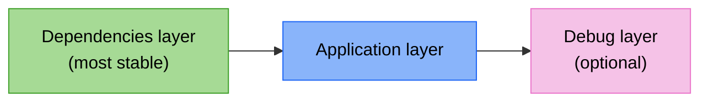

+++
title = "OCI standards compliance"
description = "How nix-oci aligns with the OCI image specification for layers, media types, file attributes, and image configuration"
+++

# OCI standards compliance

nix-oci produces images that conform to the
[OCI Image Format Specification](https://github.com/opencontainers/image-spec).
This page explains each area of the spec that is relevant to Nix-built
images and how the project satisfies it.

## Layer changesets

The OCI [layer specification](https://github.com/opencontainers/image-spec/blob/main/layer.md)
defines how filesystem changes become tar archives. Every layer
in an OCI image is a **changeset**: a set of additions, modifications,
and removals relative to the layers below it.

### Media types

The spec defines three layer media types:

| Media type | Compression | nix-oci support |
|---|---|---|
| `application/vnd.oci.image.layer.v1.tar` | none | via nix2container |
| `application/vnd.oci.image.layer.v1.tar+gzip` | gzip | see [`performance.compression`](../../reference/flake-parts-options.html) |
| `application/vnd.oci.image.layer.v1.tar+zstd` | zstd | opt-in |

nix-oci exposes a [`performance.compression`](../../reference/flake-parts-options.html)
option to choose between gzip (universal compatibility) and zstd (faster, smaller).
Skopeo applies compression at transport time; nix2container
builds layer descriptions as JSON and materializes tarballs on-the-fly.

```nix
oci.containers.myapp.performance.compression = "zstd";
```

### File attributes

The spec requires that every layer tar entry includes:

- **uid / gid**: user and group ownership
- **uname / gname**: user and group names
- **mode**: permission bits
- **mtime**: modification timestamp
- **xattrs**: extended attributes (PAX headers)
- **linkname**: symlink or hardlink target

nix2container's `buildLayer` and `buildImage` produce tar entries
directly from Nix store paths, preserving all POSIX attributes.
Nix store paths have epoch timestamps and root ownership by default,
which is consistent and reproducible.

The `perms` mechanism allows overriding uid, gid, and mode for
specific paths:

```nix
# From nix-support.nix -- sets /nix/var ownership for non-root containers
perms = [{
  path = nixVarDirs;
  regex = "/nix/var/nix/.*";
  mode = "0755";
  uid = 4000;
  gid = 4000;
}];
```

### Relative paths

The spec uses relative paths in layer tar examples (`etc/passwd`, not
`/etc/passwd`). nix2container currently produces **absolute paths** in
layer tars. For the primary push path (skopeo to a registry), runtimes
accept both forms.

For the Docker archive path (`docker load`), the `mkDockerArchive`
function rewrites paths using Python's `tarfile` module, which
preserves all tar metadata (uid, gid, mode, xattrs, hardlinks, device
nodes) while stripping leading slashes. This avoids the metadata loss
that a naive extract-and-repack approach would cause.

### No duplicate entries

The spec states that a layer tar **MUST NOT** include duplicate entries
for file paths. nix-oci satisfies this through two mechanisms:

1. **`buildEnv` deduplication**: the Nix `buildEnv` function merges
   package outputs into a single directory tree, resolving collisions
   before nix-oci produces any tar.
2. **nix2container store-path model**: each Nix store path appears
   exactly once in the layer description. The `foldImageLayers` function
   chains layers so each one excludes paths already present in prior
   layers.

### Hardlinks

The spec stores hardlinks as tar entries with type `1`. Since Nix store
paths are immutable and content-addressed, nix2container's tar generation
preserves hardlinks within store paths. The `mkDockerArchive`
rewriter also preserves hardlink entries (the `TarInfo` object carries
the link type and target through unchanged).

### Whiteout files

Whiteout files (`.wh.*` prefix) signal file deletions in a layer
relative to lower layers. nix-oci builds images **from scratch** by
default; there are no lower layers to delete from, so nix-oci does not
produce whiteout files.

When `fromImage` builds on top of a pulled base image,
nix2container and the base image's existing layers handle whiteout
processing.

## Layer ordering and deduplication



nix-oci orders layers from most stable (dependencies) to least stable
(application code), matching the OCI spec's changeset model: lower
layers change infrequently, upper layers change with each release.
This maximizes registry-level deduplication and minimizes pull sizes.

The `foldImageLayers` function implements **fold-based cross-layer
deduplication**: it builds each layer with `layers = priorLayers`, so
nix2container automatically excludes store paths already present in
earlier layers. The result is zero duplicated store paths across the
entire image.

See [Optimized layer sharing](./optimize-layers.md) for the full
layering heuristic.

## Layer count limits

The OCI spec does not define a hard layer limit, but container runtimes
impose practical limits (Docker historically had 127). nix-oci's two
layer strategies stay within bounds:

| Strategy | Layer budget | Typical total |
|---|---|---|
| `minimal` | 1 per concern | 2-3 layers |
| `fine-grained` | deps: 80, buildImage: 40, hwcaps: 2-4 | ~124 layers |

## Image configuration

The [OCI image configuration](https://github.com/opencontainers/image-spec/blob/main/config.md)
defines the runtime behavior of the container. nix-oci populates all
standard fields:

| Config field | Source |
|---|---|
| `Entrypoint` | `package.meta.mainProgram` or systemd `ExecStart` |
| `User` | `isRoot` / `user` options |
| `ExposedPorts` | `ports` option |
| `Env` | `environment` option + NixOS environment |
| `Labels` | auto-generated OCI annotations + user overrides |
| `Healthcheck` | service adapters or explicit `healthcheck` option |
| `StopSignal` | service adapters or systemd `KillSignal` |
| `WorkingDir` | systemd `WorkingDirectory`, `dataDir`, or `home` |
| `Volumes` | systemd `StateDir` / `RuntimeDir` / `CacheDir` / `LogsDir` |

### OCI annotations

Auto-generated labels follow the
[OCI pre-defined annotation keys](https://github.com/opencontainers/image-spec/blob/main/annotations.md)
convention:

```
org.opencontainers.image.title
org.opencontainers.image.version
org.opencontainers.image.description
org.opencontainers.image.licenses
org.opencontainers.image.url
org.opencontainers.image.authors
org.opencontainers.image.base.name
```

nix-oci derives these automatically from `package.meta` when you enable
[`autoLabels`](../../reference/flake-parts-options.html).
See [Automatic labeling](./automatic-labeling.md) for the full label taxonomy.

## Compression and transport

nix2container uses an **archive-less** build model: layer tars are never
stored on disk during the build. Instead, JSON manifests describe which
Nix store paths belong to each layer, and skopeo streams actual tarballs
at push time through its `nix:` transport.

This means skopeo applies compression **at transport time**, not build time.
Skopeo sets the media type in the manifest based on the target
registry's capabilities and the configured compression algorithm.

See [Archive-less container building](./archive-less-container-building.md)
for the full explanation.

## Reproducibility

OCI images built by nix-oci are **bit-for-bit reproducible**. Given the
same Nix flake lock, nix-oci produces the same image regardless of when or
where the build runs. This is a property inherited from Nix's
content-addressed store:

- Nix sets file timestamps to the Unix epoch (0).
- File ownership is deterministic (root or the configured uid/gid).
- The Nix sandbox isolates build outputs from the host environment.
- The Nix derivation graph determines layer contents entirely.

nix-oci automatically sets the `nix-oci.build.reproducible = true` label to
signal this property to downstream tooling.

## Further reading

- [OCI Image Format Specification](https://github.com/opencontainers/image-spec)
- [OCI Image Layer Filesystem Changeset](https://github.com/opencontainers/image-spec/blob/main/layer.md)
- [OCI Image Configuration](https://github.com/opencontainers/image-spec/blob/main/config.md)
- [OCI Pre-Defined Annotation Keys](https://github.com/opencontainers/image-spec/blob/main/annotations.md)
- [OCI Content Descriptors](https://github.com/opencontainers/image-spec/blob/main/descriptor.md)
