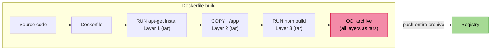
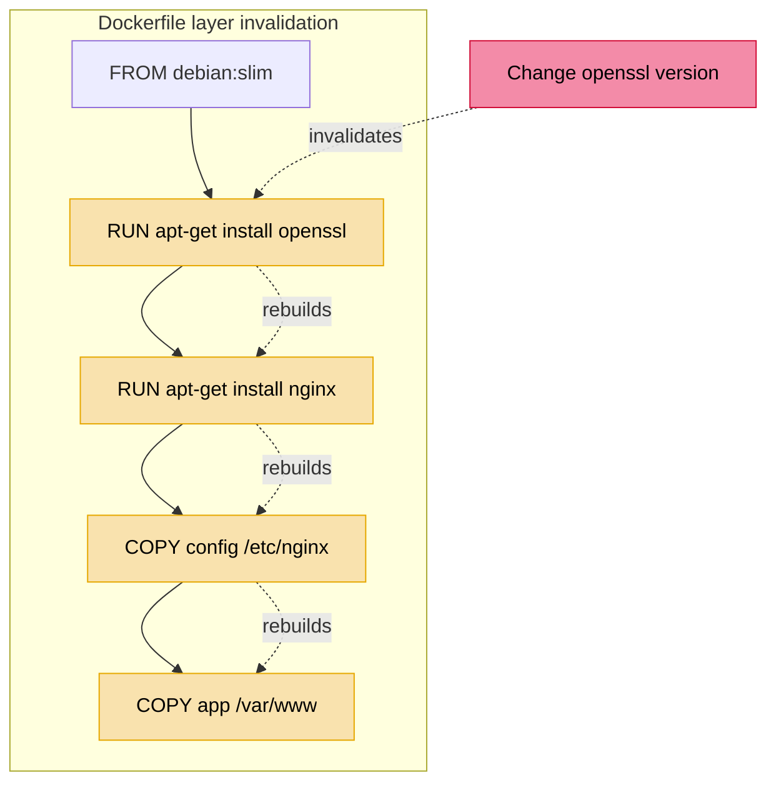
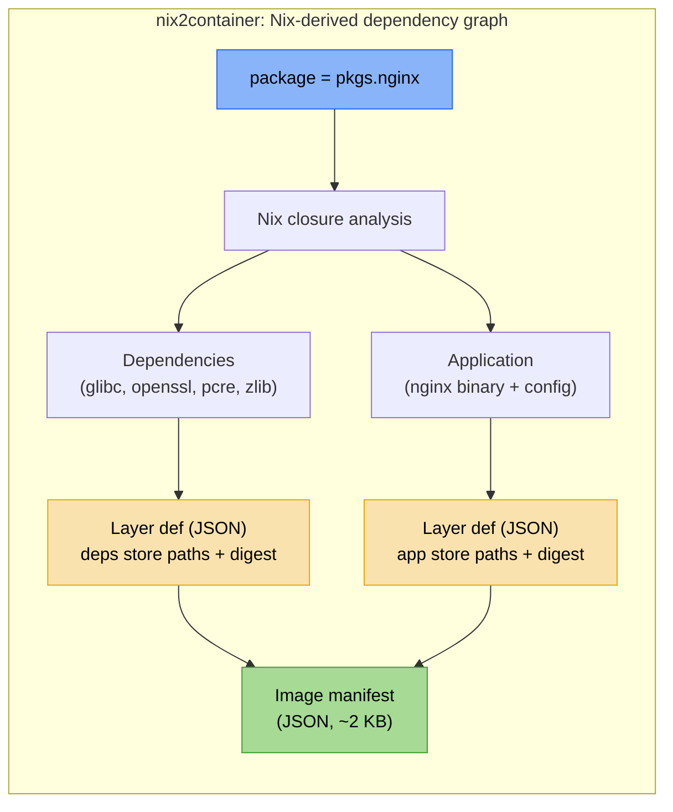
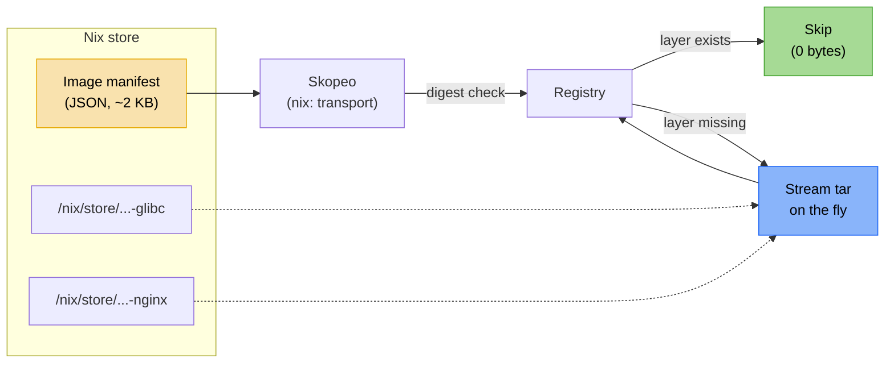

+++
title = "Archive-less container building"
description = "How nix2container builds OCI images without intermediate archives, reducing store bloat and enabling streaming pushes"
+++

# Archive-less container building

nix-oci relies on [nix2container](https://github.com/nlewo/nix2container) --
a self-described **"archive-less `dockerTools.buildImage` implementation"** --
to build OCI images using a fundamentally different approach than traditional
tools: layers are never materialized as tar archives in the Nix store.
Instead, they exist as **JSON descriptions** of store paths, and actual
tarballs are only produced at the moment they are needed -- when loading into
a runtime or pushing to a registry.

## The problem with archive-based builds

Traditional container build tools -- whether `docker build` with a Dockerfile
or Nix's built-in `dockerTools.buildImage` -- follow the same pattern:

1. Collect the filesystem contents.
2. Write one or more **tar archives** (layers) to disk.
3. Bundle them into an OCI/Docker archive.
4. Push or load that archive.

This creates two problems:

- **Store bloat**: every store path that goes into the image is stored
  *twice* -- once as a Nix derivation output and once inside a layer tarball.
  A 500 MB image effectively costs 1 GB of disk.
- **Slow rebuilds**: changing a single dependency forces the entire archive to
  be rebuilt and re-written, even if most layers are identical to the previous
  build.

### Dockerfile: user-defined build graph

With Dockerfiles, the user manually defines the build graph as an ordered
sequence of `RUN`, `COPY`, and `ADD` instructions. Each instruction produces
a layer, and layers are **ordered and sequential** -- changing one layer
invalidates all subsequent layers:

This means:
- Users must carefully order instructions to maximize cache hits.
- A single dependency change can cascade through the entire image.
- The layer graph is **linear** -- there is no way to express "these two
  things are independent and can be cached separately".
- Build outputs are **non-reproducible** -- `apt-get install` at two
  different times can produce different results.

Nix's `dockerTools.streamLayeredImage` partially addresses this by streaming
the archive instead of writing it to the store, but it still computes every
layer tarball on each invocation and cannot skip layers already present in a
registry.

## How nix2container solves it

nix2container takes a fundamentally different approach. Instead of a
user-defined linear build graph, the dependency graph comes **from Nix** --
it is a DAG (directed acyclic graph) derived from the package closure,
not a sequence of imperative instructions:

The key differences from Dockerfile builds:

| Aspect | Dockerfile | nix2container |
|---|---|---|
| Build graph | User-defined, linear, imperative | Nix-derived, DAG, declarative |
| Layer invalidation | Cascading (one change rebuilds all below) | Targeted (only affected layer changes) |
| Disk usage | Tars stored on disk (~2x image size) | JSON only (~2 KB) |
| Reproducibility | Non-deterministic (network, timestamps) | Bit-for-bit identical |
| Cache granularity | Per Dockerfile instruction | Per Nix store path |

nix2container replaces tar archives with lightweight **JSON metadata files**.
A built image in the Nix store is just a few kilobytes of JSON listing:

- The Nix store paths belonging to each layer.
- Pre-computed **digests and diff IDs** for every layer.
- OCI image configuration (entrypoint, env, labels, etc.).

No tar archive is written during `nix build`. The image "recipe" is a
pure Nix derivation that produces only JSON -- this is what **archive-less**
container building means.

### Streaming push with Skopeo

nix2container ships a small Go library (~250 lines) that plugs into
[Skopeo](https://github.com/containers/skopeo) as a custom `nix:` transport.
When you push an image:

1. Skopeo reads the JSON manifest.
2. For each layer, it checks the **pre-computed digest** against the registry.
   Layers that already exist are skipped entirely -- no data is generated or
   transferred.
3. Only missing layers are **tar-archived on the fly** and streamed directly
   to the registry, without touching the local disk.

This makes pushes dramatically faster:

| Operation | `dockerTools.buildImage` | `dockerTools.streamLayeredImage` | **nix2container** |
|---|---|---|---|
| Rebuild + push | ~10 s | ~7.5 s | **~1.8 s** |

*(Benchmarks from the [nix2container README](https://github.com/nlewo/nix2container).)*

### Loading into Docker / Podman

The same principle applies when loading images locally. nix2container
generates `copyToDockerDaemon` and `copyToPodman` scripts that use Skopeo to
stream layers into the local runtime without creating intermediate files.

## Comparison with other Nix container tools

| Tool | Archive in store | Incremental push | Layer optimization |
|---|---|---|---|
| `dockerTools.buildImage` | Yes (full OCI tar) | No | No |
| `dockerTools.buildLayeredImage` | Yes (layer tars) | No | Popularity-based |
| `dockerTools.streamLayeredImage` | No (streamed) | No (recomputes all) | Popularity-based |
| **nix2container** | **No (JSON only)** | **Yes (digest check)** | **Popularity-based** |

### Outside the Nix ecosystem

Several other tools pursue Dockerfile-free or layer-streaming strategies,
each targeting a specific language or workflow:

#### ko (Go)

[ko](https://ko.build/) builds container images from Go source code without
requiring Docker or a Dockerfile. It runs `go build` locally, places the
binary on a minimal [distroless](https://github.com/GoogleContainerTools/distroless)
base image, and pushes layers directly to a registry. Multi-platform builds,
automatic SBOM generation, and Kubernetes YAML templating are built in.
Because ko understands Go's build model, it can separate the base image from
the application binary and only re-push what changed.

See [Container images simplified with ko (Snyk)](https://snyk.io/blog/container-images-simplified-with-google-ko/)
and [Ship your Go applications faster to Cloud Run with ko (Google Cloud Blog)](https://cloud.google.com/blog/topics/developers-practitioners/ship-your-go-applications-faster-cloud-run-ko).

#### Jib (Java)

[Jib](https://github.com/GoogleContainerTools/jib) integrates with Maven and
Gradle to build Java container images without a Docker daemon. It splits the
application into three layers -- dependencies, resources, and classes -- so that
a code-only change rebuilds and pushes just the thin classes layer. Layers are
pushed in parallel directly to the registry, skipping the local `docker save`
step entirely.

See [Introducing Jib (Google Cloud Blog)](https://cloud.google.com/blog/products/application-development/introducing-jib-build-java-docker-images-better)
and [Jib 1.0.0 is GA (Google Cloud Blog)](https://cloud.google.com/blog/products/application-development/jib-1-0-0-is-ga-building-java-docker-images-has-never-been-easier).

#### Cloud Native Buildpacks

[Cloud Native Buildpacks](https://buildpacks.io/) auto-detect the application
type and produce images with modular, reusable layers. Unlike Dockerfile
builds -- where a change in one layer invalidates all subsequent layers --
each buildpack contributes an independent layer that is cached by its own
inputs. When the OS base image is updated, existing application layers are
**rebased** in milliseconds by swapping metadata, without triggering a full
rebuild.

See [Reduce, Reuse, Rebase: Sustainable Containers with Buildpacks (CNCF)](https://www.cncf.io/blog/2024/01/11/reduce-reuse-rebase-sustainable-containers-with-buildpacks/)
and [Dockerfiles vs. Cloud-native Buildpacks (Medium)](https://medium.com/@michael.vittrup.larsen/dockerfiles-vs-cloud-native-buildpacks-8acf8149dea1).

#### Nixery

[Nixery](https://nixery.dev/) takes the on-demand concept to its logical
extreme: it is a container **registry** that builds images at pull time.
A `docker pull nixery.dev/shell/git` request triggers Nix to assemble an
image containing those packages, using a
[popularity-based layering algorithm](https://tazj.in/blog/nixery-layers)
to maximize layer sharing across requests. Built layers are cached in a
storage bucket so subsequent pulls of the same packages are instant.

See [Nixery -- Improved Layering Design (tazjin's blog)](https://tazj.in/blog/nixery-layers)
and [One Docker image to rule them all (DERLIN)](https://blog.derlin.ch/nixery-one-docker-image-to-rule-them-all).

#### Comparison summary

| Tool | Language | Docker required | Archive-less | Incremental push | Reproducible |
|---|---|---|---|---|---|
| **nix2container** | Any (Nix) | No | Yes (JSON only) | Yes (digest check) | Yes (bit-for-bit) |
| **ko** | Go | No | Partial (streamed) | Yes | Yes (with `-trimpath`) |
| **Jib** | Java | No | Yes (no local tar) | Yes (parallel layers) | Configurable |
| **Buildpacks** | Multi-lang | Yes (or daemon) | No | Partial (rebase) | Configurable |
| **Nixery** | Any (Nix) | No (is a registry) | Yes (on-demand) | N/A (pull-based) | Yes |

nix2container stands out by combining Nix's reproducibility guarantees with
truly archive-less builds: the Nix store only ever contains JSON metadata,
and the actual image bytes are generated at the moment they are needed.

## Why it matters for nix-oci

Because nix-oci uses nix2container as its backend:

- **Minimal store usage** -- building dozens of container variants does not
  bloat your Nix store with duplicate tarballs.
- **Fast iteration** -- rebuilding after a code change only recomputes the JSON
  manifest; pushing only transfers the changed layer.
- **Efficient CI** -- CI runners benefit from smaller caches and shorter push
  times, since unchanged layers are never re-uploaded.
- **Reproducibility** -- the JSON manifest is a pure Nix derivation, so the
  image is bit-for-bit reproducible across machines.

## Further reading

### nix2container and Nix

- [nix2container](https://github.com/nlewo/nix2container) -- the backend powering nix-oci
- [Building container images with Nix](https://lewo.abesis.fr/posts/nix-build-container-image/) -- foundational ideas behind the archive-less approach
- [Nix & Docker: Layer explicitly without duplicate packages](https://blog.eigenvalue.net/2023-nix2container-everything-once/) -- avoiding duplicate store paths in explicit layers
- [Nixery -- Improved Layering Design](https://tazj.in/blog/nixery-layers) -- popularity-based layering for on-demand registry images
- [Minimal containers using Nix](https://tmp.bearblog.dev/minimal-containers-using-nix/) -- practical guide to small Nix-built containers
- [Using Nix with Dockerfiles](https://mitchellh.com/writing/nix-with-dockerfiles) -- Mitchell Hashimoto on combining Nix and Docker

### Dockerfile-free tools

- [Introducing Jib (Google Cloud Blog)](https://cloud.google.com/blog/products/application-development/introducing-jib-build-java-docker-images-better) -- building Java images without Docker
- [Container images simplified with ko (Snyk)](https://snyk.io/blog/container-images-simplified-with-google-ko/) -- building Go images without Docker
- [Reduce, Reuse, Rebase: Sustainable Containers with Buildpacks (CNCF)](https://www.cncf.io/blog/2024/01/11/reduce-reuse-rebase-sustainable-containers-with-buildpacks/) -- reusable layers and rebasing
- [Building Container Images without a Dockerfile](https://blog.ttulka.com/building-container-images-without-dockerfile/) -- overview of alternative approaches

### nix-oci

- [Optimized layer sharing](./optimize-layers.md) -- how nix-oci uses popularity-based layering on top of nix2container
