+++
title = "Container metadata wiring"
description = "How user options flow through nix-oci into OCI image config, systemd services, and firewall rules"
+++

# Container metadata wiring

nix-oci provides a **unified `oci.*` namespace** that works identically
across flake-parts (build-time), NixOS, and home-manager. Each option
you set on a container flows through multiple stages — from module
option, through OCI image configuration, to systemd services and
firewall rules.

This page maps that wiring for every metadata type.

## Overview

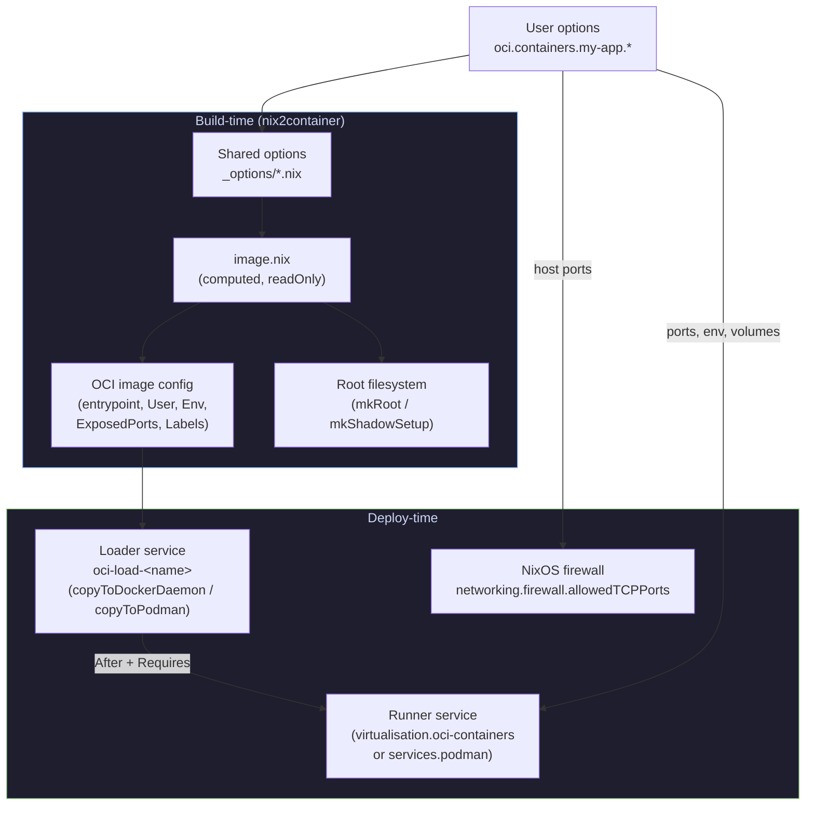

## Metadata flow per option

### Ports

Ports are the most widely wired option — they flow to **four** destinations.

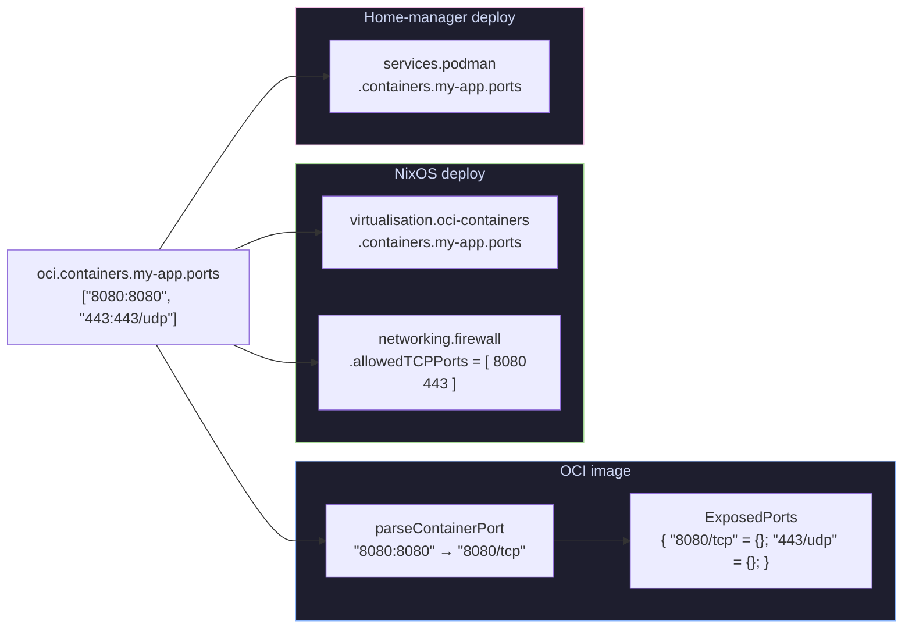

| Stage | Transformation | File |
|---|---|---|
| User input | `["8080:8080"]` | `_options/ports.nix` |
| OCI ExposedPorts | `mkExposedPorts` → `{ "8080/tcp" = {}; }` | `lib/ports.nix`, `image.nix` |
| NixOS runner | Passed as-is to `virtualisation.oci-containers` | `nixos/run-services.nix` |
| NixOS firewall | Host port extracted via `parseHostPort` → integer | `nixos/run-services.nix` |
| HM runner | Passed as-is to `services.podman.containers` | `home-manager/run-services.nix` |

### Environment

Environment variables are **dual-written** — baked into the OCI image
AND passed to the runner at deploy time.

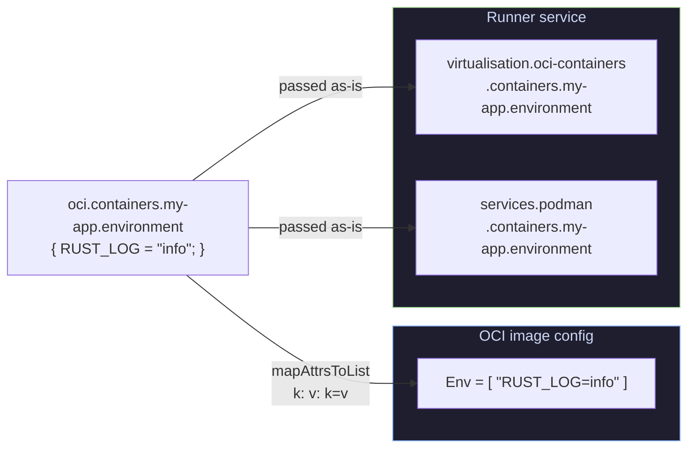

This dual-write means the variable is visible both via `docker inspect`
(from the OCI manifest) and at runtime (from the runner's `--env` flags).

### User and isRoot

The `user` and `isRoot` options control **two things**: the OCI `User`
field and the root filesystem setup (shadow files, home directory).

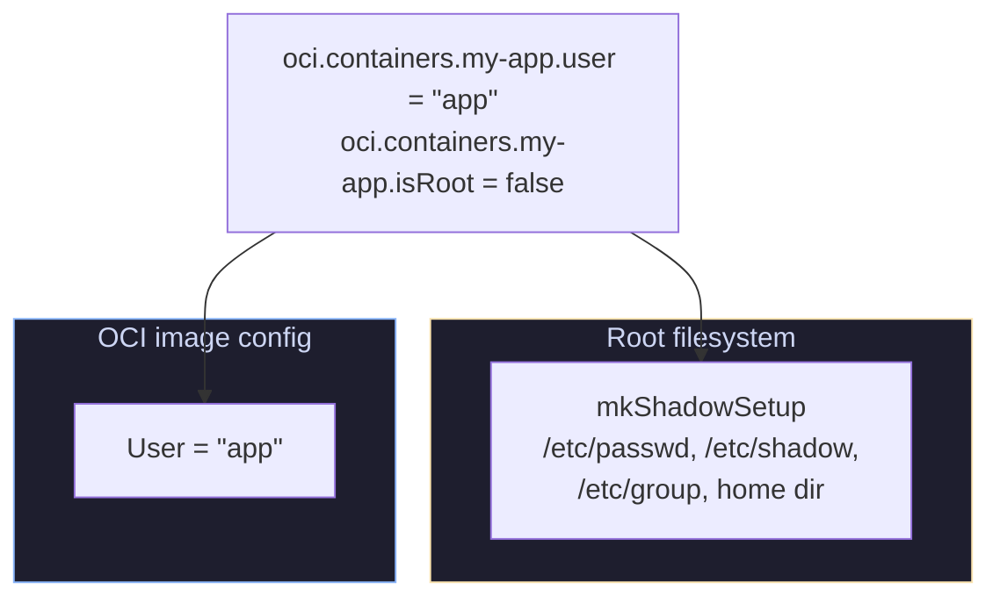

| `isRoot` | OCI `User` | Shadow setup |
|---|---|---|
| `true` | `"root"` | Standard root passwd/group |
| `false` | Value of `user` option | Non-root user with home dir |

### Entrypoint

The entrypoint is auto-derived from `package.meta.mainProgram` when not
set explicitly.

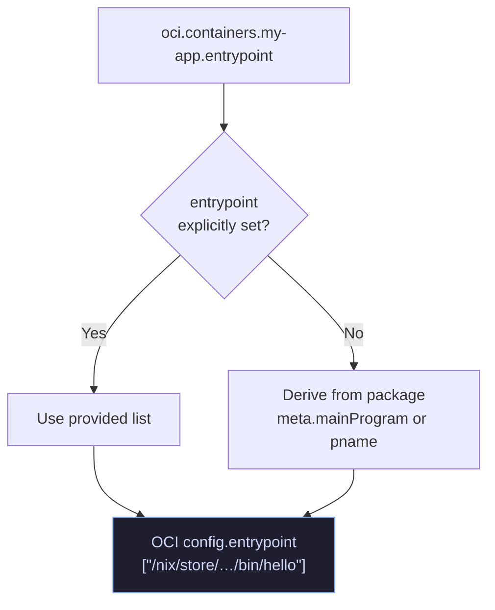

The entrypoint is **only** written to the OCI image config — it is not
forwarded to the runner service (the container runtime reads it from the
image).

### Labels

Labels flow **only** to the OCI image manifest — they are pure metadata
with no deploy-time effect.

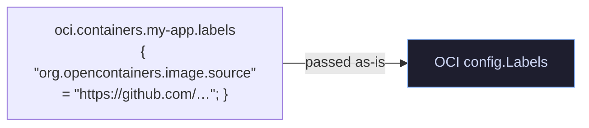

### Config files

Config file derivations are included in the container root filesystem.
They end up in the **app layer** when `optimizeLayers` is enabled.

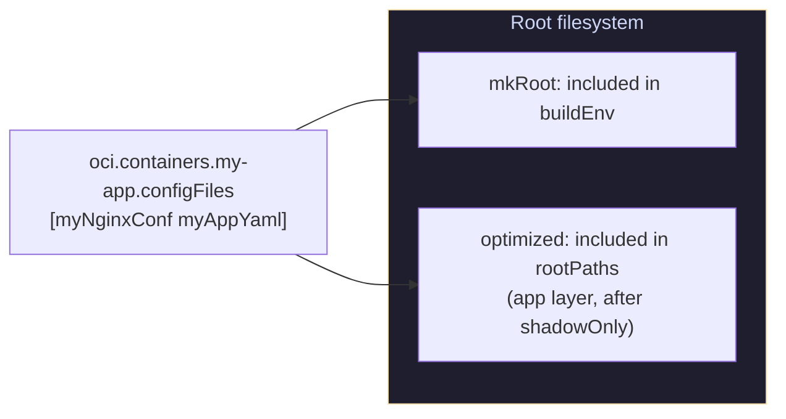

### Name, tag, and imageRef

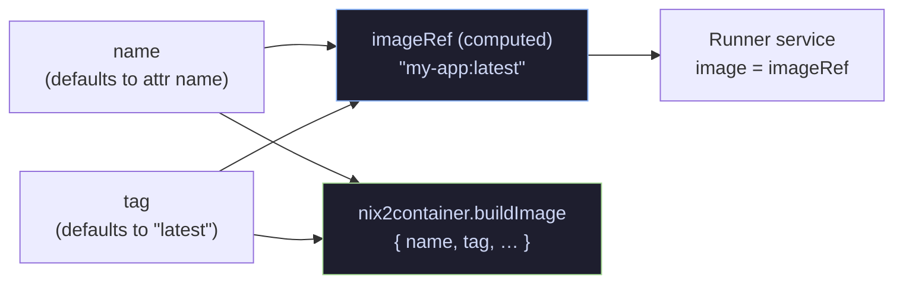

`imageRef` is a **readOnly** computed option (`"name:tag"`) used by
the runner service to reference the locally-loaded image.

### Package and dependencies

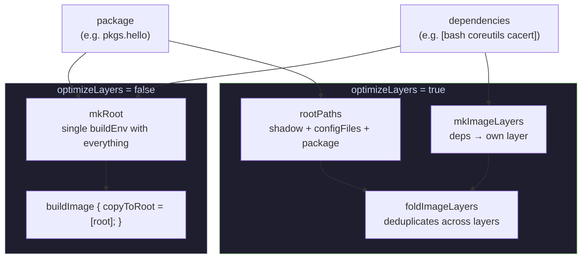

### Deploy-only: autoStart and volumes

These options exist **only** in the deploy modules — they have no effect
on the OCI image itself.

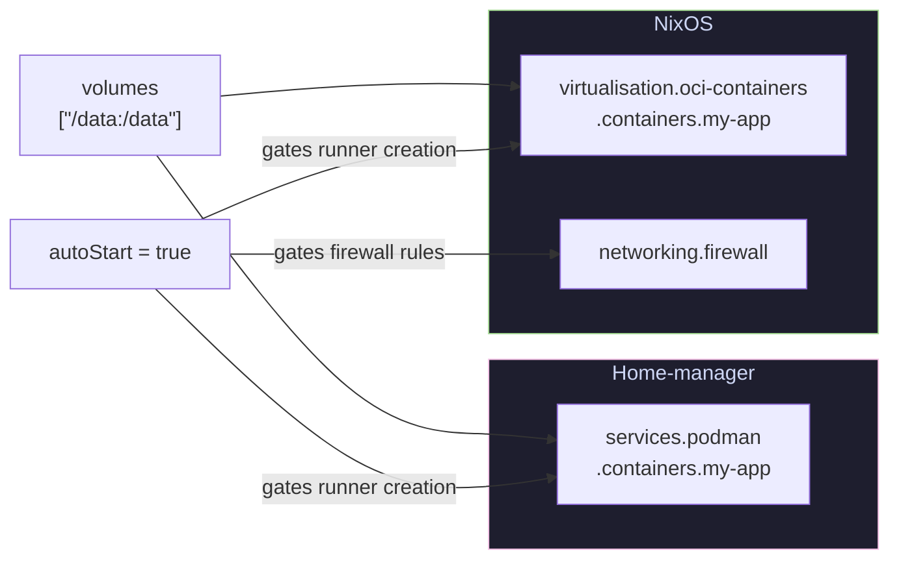

When `autoStart = false`, only the loader service is created — no runner,
no firewall rules, no volumes. The image is loaded but not started.

## Service dependency chain

Both NixOS and home-manager wire a strict ordering between the loader
and runner services.

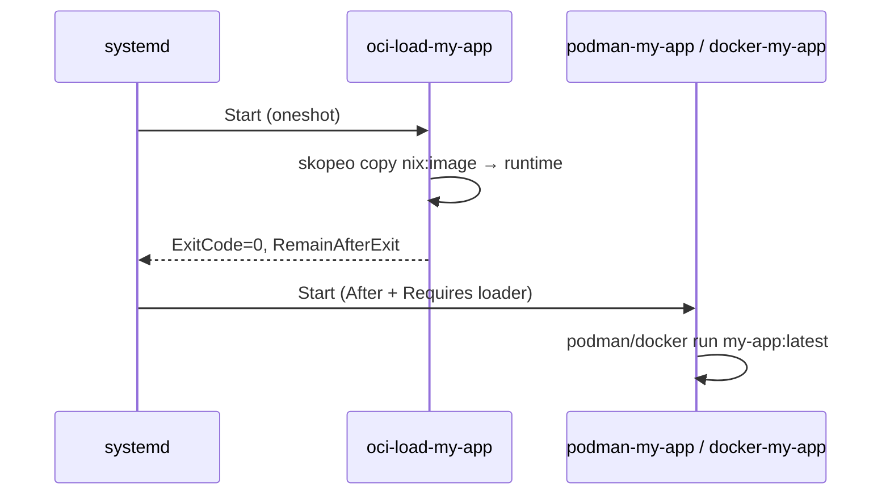

| Platform | Loader | Runner | Dependency mechanism |
|---|---|---|---|
| NixOS | `systemd.services.oci-load-<name>` | `systemd.services.<backend>-<name>` | `After` + `Requires` on runner |
| Home-manager | `systemd.user.services.oci-load-<name>` | Podman quadlet | `extraConfig.Unit.After` + `Requires` |

## Complete wiring summary

```mermaid
flowchart TD
    subgraph user ["User-facing options"]
        pkg[package]
        deps[dependencies]
        ep[entrypoint]
        usr[user / isRoot]
        ports[ports]
        env[environment]
        labels[labels]
        cfg[configFiles]
        nm[name / tag]
        auto[autoStart]
        vols[volumes]
    end

    subgraph oci ["OCI image config"]
        oEP[config.entrypoint]
        oUser[config.User]
        oExposed[config.ExposedPorts]
        oEnv[config.Env]
        oLabels[config.Labels]
    end

    subgraph rootfs ["Root filesystem / layers"]
        root[mkRoot / rootPaths]
        shadow[mkShadowSetup]
        layers[mkImageLayers]
    end

    subgraph services ["Deploy services"]
        loader[oci-load-&lt;name&gt;]
        runner[runner service]
        fw[NixOS firewall]
    end

    ep --> oEP
    usr --> oUser
    usr --> shadow
    ports --> oExposed
    ports --> runner
    ports --> fw
    env --> oEnv
    env --> runner
    labels --> oLabels
    cfg --> root
    pkg --> root
    deps --> layers
    nm --> loader
    nm --> runner
    auto --> runner
    vols --> runner
    shadow --> root

    style user fill:#1e1e2e,stroke:#cdd6f4,color:#cdd6f4
    style oci fill:#1e1e2e,stroke:#89b4fa,color:#cdd6f4
    style rootfs fill:#1e1e2e,stroke:#f9e2ae,color:#cdd6f4
    style services fill:#1e1e2e,stroke:#a6da95,color:#cdd6f4
```

## Note on healthcheck

nix-oci does **not** currently provide a `healthcheck` option. OCI
healthchecks can be configured at the container runtime level (e.g. via
NixOS `virtualisation.oci-containers` options or Podman quadlet config)
but are not wired through the nix-oci module system.
