+++
title = "Container metadata wiring"
description = "How user options flow through nix-oci into OCI image config, systemd services, and firewall rules"
+++

# Container metadata wiring

nix-oci provides a **unified `oci.*` namespace** that works identically
across flake-parts (build-time), NixOS, and home-manager. Each option
you set on a container flows through multiple stages — from module
option, through OCI image configuration, to systemd services and
firewall rules.

This page maps that wiring for every metadata type.

## Overview

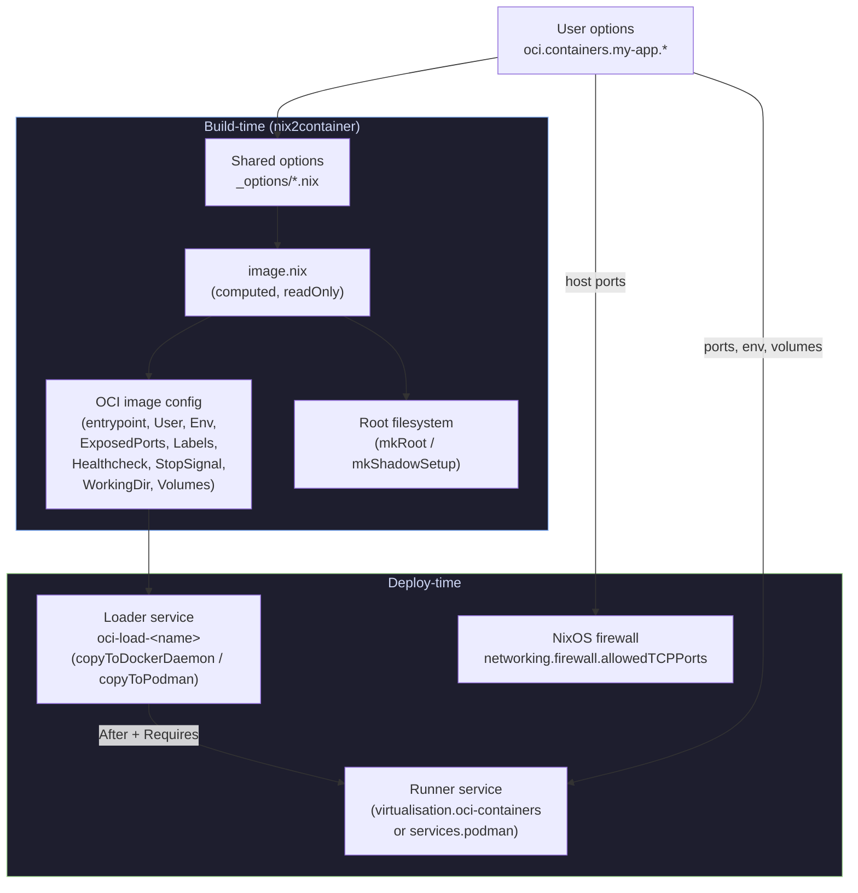

## Metadata flow per option

### Ports

Ports are the most widely wired option — they flow to **four** destinations.

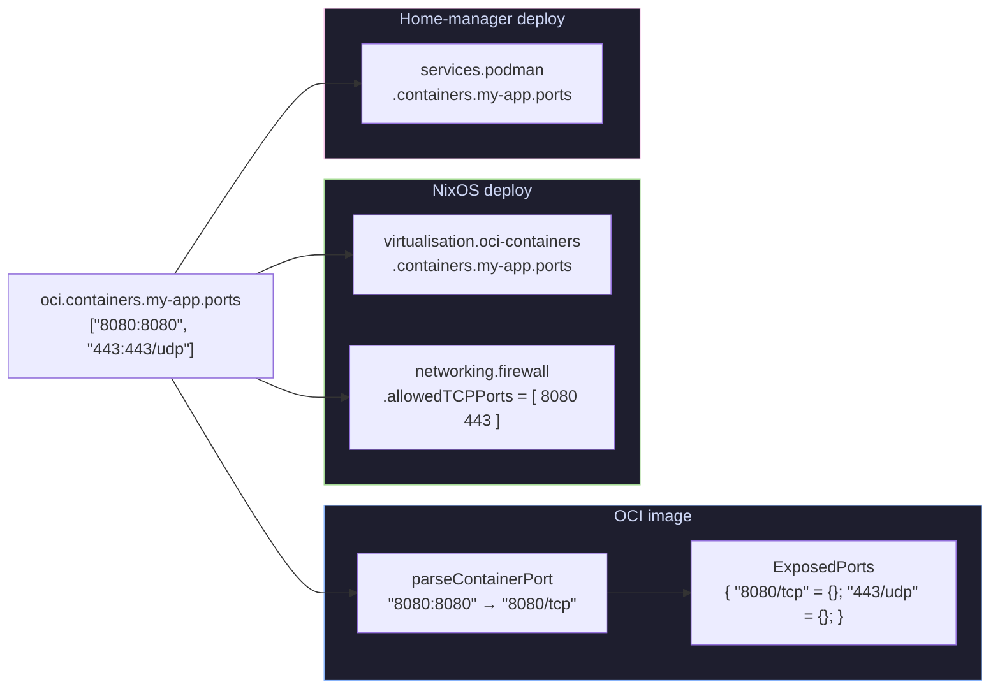

| Stage | Transformation | File |
|---|---|---|
| User input | `["8080:8080"]` | `_options/ports.nix` |
| OCI ExposedPorts | `mkExposedPorts` → `{ "8080/tcp" = {}; }` | `lib/ports.nix`, `image.nix` |
| NixOS runner | Passed as-is to `virtualisation.oci-containers` | `nixos/run-services.nix` |
| NixOS firewall | Host port extracted via `parseHostPort` → integer | `nixos/run-services.nix` |
| HM runner | Passed as-is to `services.podman.containers` | `home-manager/run-services.nix` |

### Environment

Environment variables are **dual-written** — baked into the OCI image
AND passed to the runner at deploy time.

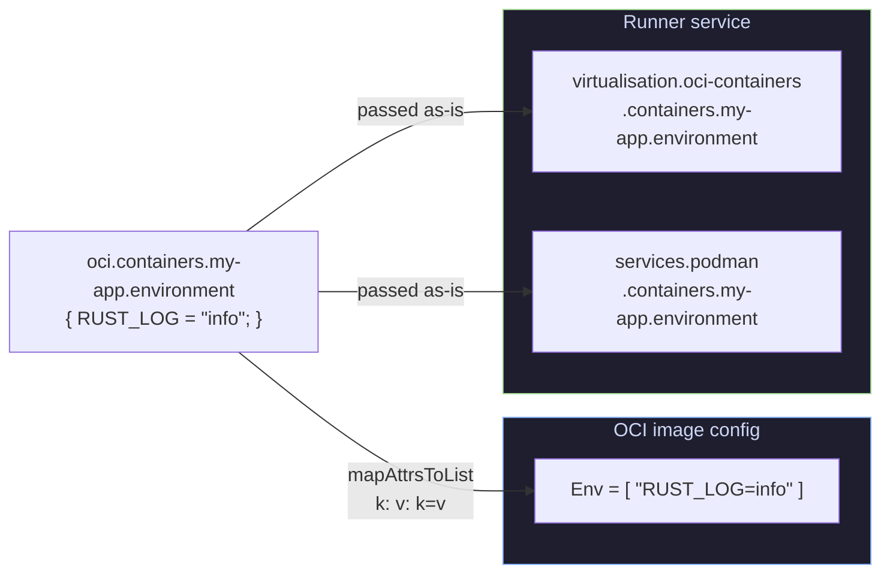

This dual-write means the variable is visible both via `docker inspect`
(from the OCI manifest) and at runtime (from the runner's `--env` flags).

### User and isRoot

The `user` and `isRoot` options control **two things**: the OCI `User`
field and the root filesystem setup (shadow files, home directory).

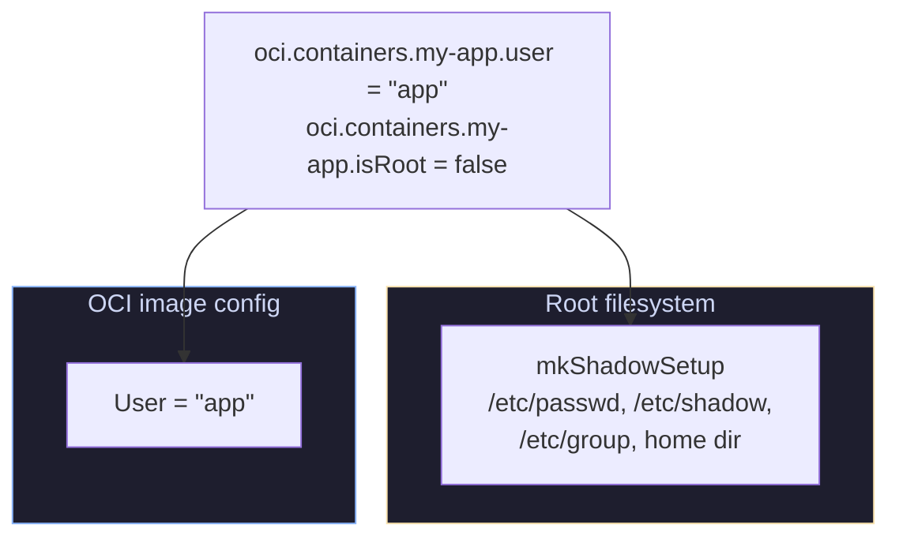

| `isRoot` | OCI `User` | Shadow setup |
|---|---|---|
| `true` | `"root"` | Standard root passwd/group |
| `false` | Value of `user` option | Non-root user with home dir |

### Entrypoint

The entrypoint is auto-derived from `package.meta.mainProgram` when not
set explicitly.

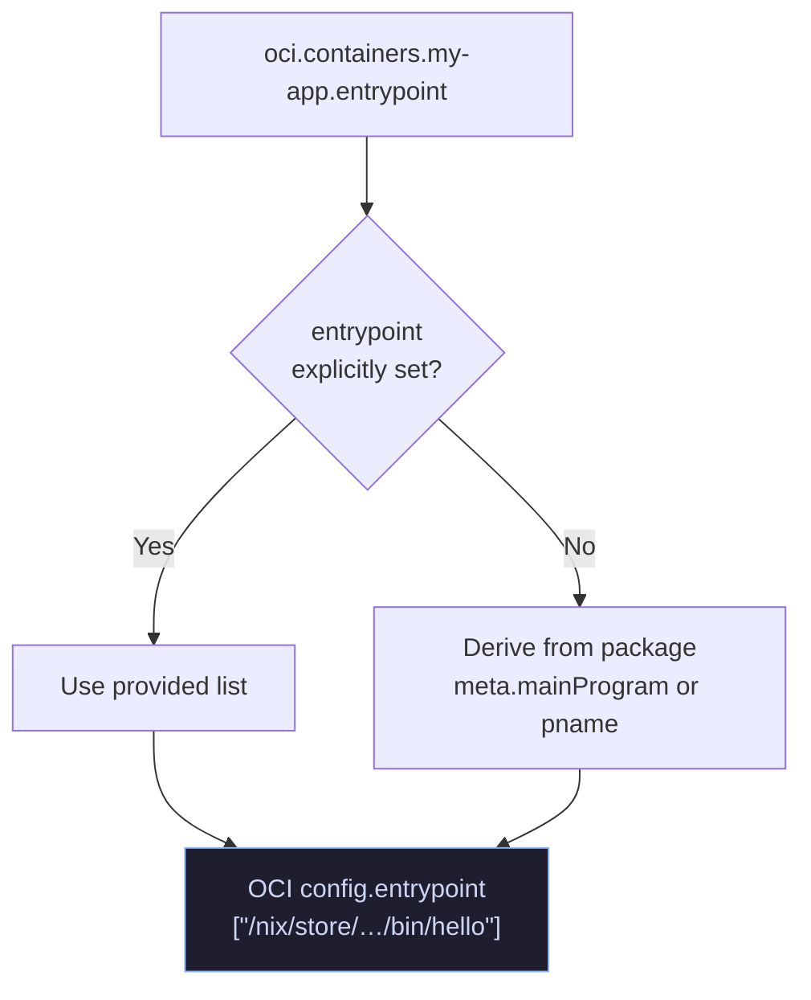

The entrypoint is **only** written to the OCI image config — it is not
forwarded to the runner service (the container runtime reads it from the
image).

### Labels

Labels flow **only** to the OCI image manifest — they are pure metadata
with no deploy-time effect. nix-oci automatically generates labels from
package metadata and container configuration; user-provided labels always
override auto-generated ones.

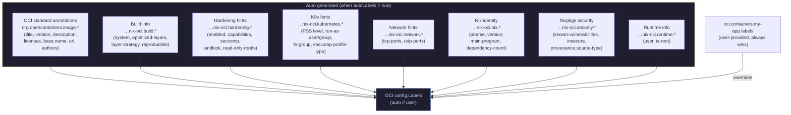

#### Auto-generated label sources

| Label namespace | Source | Example |
|---|---|---|
| `org.opencontainers.image.title` | `config.name` | `"caddy"` |
| `org.opencontainers.image.version` | `config.tag` or `package.version` | `"2.7.6"` |
| `org.opencontainers.image.description` | `package.meta.description` | `"Fast web server"` |
| `org.opencontainers.image.licenses` | `package.meta.license` (SPDX) | `"Apache-2.0"` |
| `org.opencontainers.image.url` | `package.meta.homepage` | `"https://…"` |
| `org.opencontainers.image.authors` | `package.meta.maintainers` | `"Jane Doe"` |
| `org.opencontainers.image.base.name` | Always `"scratch"` | `"scratch"` |
| `…nix-oci.build.system` | Build platform | `"x86_64-linux"` |
| `…nix-oci.build.optimized-layers` | `optimizeLayers` | `"true"` |
| `…nix-oci.hardening.*` | `hardening` config | various |
| `…nix-oci.kubernetes.pod-security-standard` | Computed from hardening | `"restricted"` |
| `…nix-oci.kubernetes.run-as-user` | `isRoot` (UID 4000 or 0) | `"4000"` |
| `…nix-oci.kubernetes.seccomp-profile-type` | `hardening.seccomp` | `"RuntimeDefault"` |
| `…nix-oci.network.tcp-ports` | `ports` option (parsed) | `"8080,443"` |
| `…nix-oci.nix.pname` | `package.pname` | `"nginx"` |
| `…nix-oci.nix.version` | `package.version` | `"1.27.3"` |
| `…nix-oci.nix.main-program` | `package.meta.mainProgram` | `"nginx"` |
| `…nix-oci.nix.dependency-count` | `builtins.length dependencies` | `"5"` |
| `…nix-oci.security.known-vulnerabilities` | `package.meta.knownVulnerabilities` | `"CVE-…"` |
| `…nix-oci.provenance.source-type` | `package.meta.sourceProvenance` | `"fromSource"` |

To disable auto-labeling, set `autoLabels = false` on the container.
See [Automatic OCI labels](./automatic-labeling.md) for full details.

### Config files

Config file derivations are included in the container root filesystem.
They end up in the **app layer** when `optimizeLayers` is enabled.

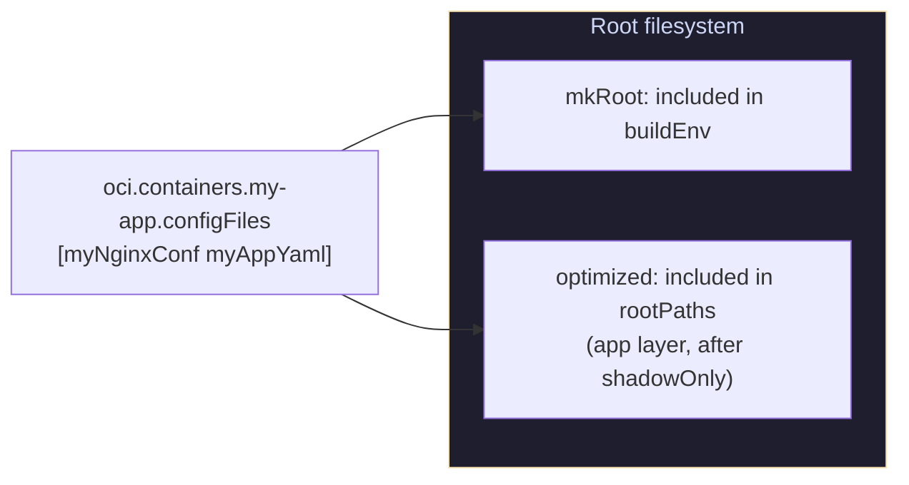

### Name, tag, and imageRef

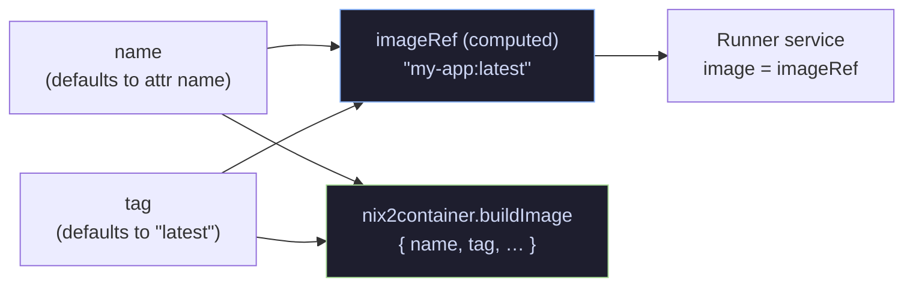

`imageRef` is a **readOnly** computed option (`"name:tag"`) used by
the runner service to reference the locally-loaded image.

### Package and dependencies

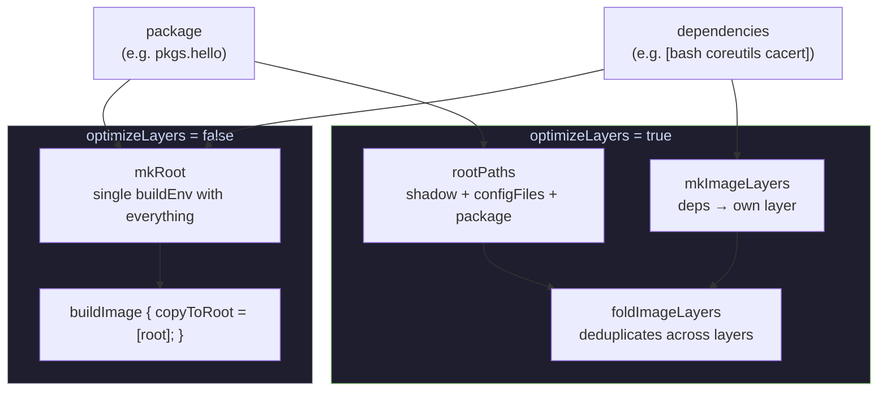

### Deploy-only: autoStart and volumes

These options exist **only** in the deploy modules — they have no effect
on the OCI image itself.

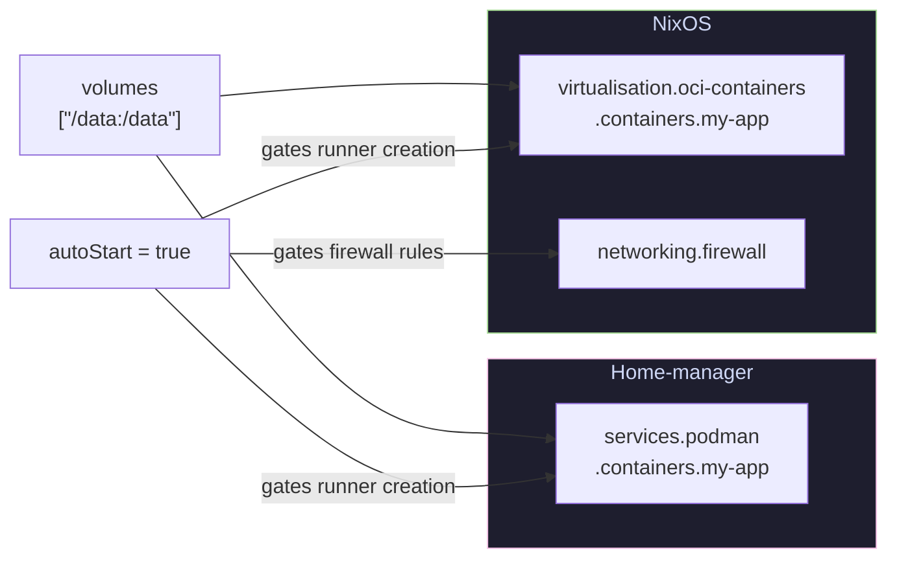

When `autoStart = false`, only the loader service is created — no runner,
no firewall rules, no volumes. The image is loaded but not started.

## Service dependency chain

Both NixOS and home-manager wire a strict ordering between the loader
and runner services. When a healthcheck is present and the backend is
Podman, the runner uses `Type=notify` with `--sdnotify=healthy` — systemd
waits for the healthcheck to pass before considering the service ready.

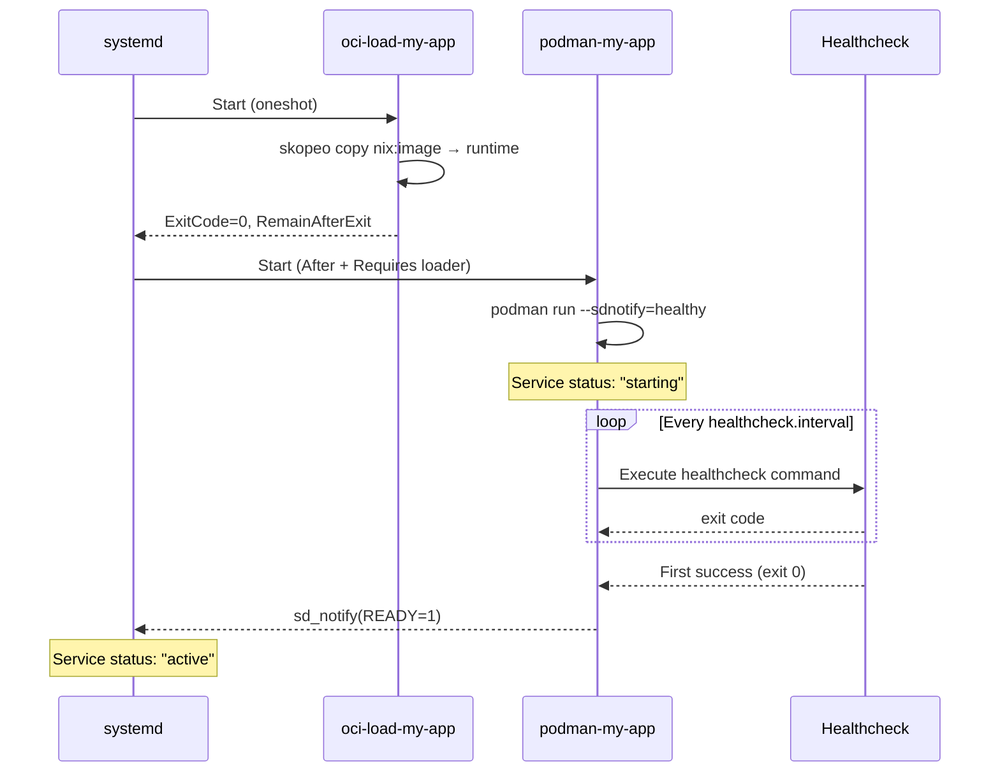

| Platform | Loader | Runner | Dependency | Health-aware |
|---|---|---|---|---|
| NixOS (Podman) | `systemd.services.oci-load-<name>` | `systemd.services.podman-<name>` | `After` + `Requires` | `--sdnotify=healthy` + `Type=notify` |
| NixOS (Docker) | `systemd.services.oci-load-<name>` | `systemd.services.docker-<name>` | `After` + `Requires` | Healthcheck in image only |
| Home-manager | `systemd.user.services.oci-load-<name>` | Podman quadlet | `extraConfig.Unit` | Quadlet `Notify=healthy` + `Type=notify` |

## Complete wiring summary

```mermaid
flowchart TD
    subgraph user ["User-facing options"]
        pkg[package]
        deps[dependencies]
        ep[entrypoint]
        usr[user / isRoot]
        ports[ports]
        env[environment]
        labels[labels]
        cfg[configFiles]
        hc[healthcheck]
        ss[stopSignal]
        wd[workingDir]
        dv[declaredVolumes]
        nm[name / tag]
        auto[autoStart]
        vols[volumes]
        hard[hardening]
    end

    subgraph autolabels ["Auto-generated labels"]
        ociStd["org.opencontainers.image.*"]
        buildMeta["…nix-oci.build.*"]
        hardLabels["…nix-oci.hardening.*"]
        k8sLabels["…nix-oci.kubernetes.*<br/>(PSS, SecurityContext)"]
        netLabels["…nix-oci.network.*"]
        nixLabels["…nix-oci.nix.*"]
        secLabels["…nix-oci.security.*"]
    end

    subgraph oci ["OCI image config"]
        oEP[config.entrypoint]
        oUser[config.User]
        oExposed[config.ExposedPorts]
        oEnv[config.Env]
        oLabels[config.Labels]
        oHC[config.Healthcheck]
        oSS[config.StopSignal]
        oWD[config.WorkingDir]
        oVols[config.Volumes]
    end

    subgraph rootfs ["Root filesystem / layers"]
        root[mkRoot / rootPaths]
        shadow[mkShadowSetup]
        layers[mkImageLayers]
    end

    subgraph services ["Deploy services"]
        loader[oci-load-&lt;name&gt;]
        runner[runner service<br/>+ sdnotify=healthy]
        fw[NixOS firewall]
    end

    ep --> oEP
    usr --> oUser
    usr --> shadow
    ports --> oExposed
    ports --> runner
    ports --> fw
    env --> oEnv
    env --> runner
    pkg -.->|"meta.*"| ociStd
    pkg -.->|"pname, version"| nixLabels
    pkg -.->|"knownVulns"| secLabels
    nm -.->|"name, tag"| ociStd
    hard -.-> hardLabels
    hard -.-> k8sLabels
    usr -.-> k8sLabels
    ports -.->|"parsed"| netLabels
    deps -.->|"count"| nixLabels
    ociStd --> oLabels
    buildMeta --> oLabels
    hardLabels --> oLabels
    k8sLabels --> oLabels
    netLabels --> oLabels
    nixLabels --> oLabels
    secLabels --> oLabels
    labels -->|"overrides"| oLabels
    hc --> oHC
    hc -->|"sdnotify=healthy<br/>Type=notify"| runner
    ss --> oSS
    wd --> oWD
    dv --> oVols
    cfg --> root
    pkg --> root
    deps --> layers
    nm --> loader
    nm --> runner
    auto --> runner
    vols --> runner
    shadow --> root

    style user fill:#1e1e2e,stroke:#cdd6f4,color:#cdd6f4
    style autolabels fill:#1e1e2e,stroke:#f5c2e7,color:#cdd6f4
    style oci fill:#1e1e2e,stroke:#89b4fa,color:#cdd6f4
    style rootfs fill:#1e1e2e,stroke:#f9e2ae,color:#cdd6f4
    style services fill:#1e1e2e,stroke:#a6da95,color:#cdd6f4
```

## Healthcheck

Healthchecks are the most deeply wired option — they flow from the NixOS
module configuration through the OCI image manifest into systemd service
readiness.

### Automatic derivation from NixOS services

When using `nixosConfig` with a `mainService`, service adapters
**automatically derive** the healthcheck command from the NixOS module
configuration. No manual healthcheck setup is required.

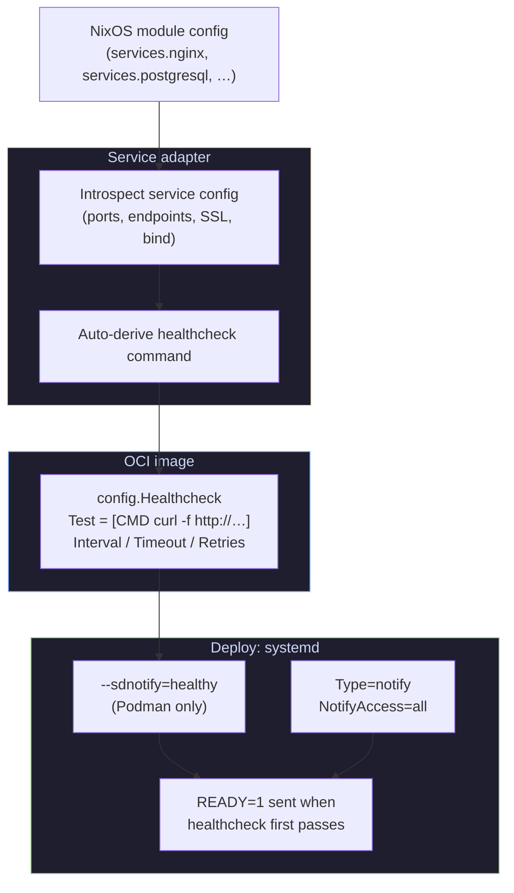

| Service | NixOS options introspected | Derived healthcheck |
|---|---|---|
| **nginx** | `virtualHosts.*.listen[].{port, ssl}`, locations (scans for `/health`, `/healthz`, `stub_status`), `onlySSL`/`forceSSL` | `curl -f http[s]://localhost:${port}${bestPath}` |
| **PostgreSQL** | `settings.port` (default 5432), `package` | `pg_isready -h localhost -p ${port}` |
| **Redis** | `servers.<name>.port`, `servers.<name>.bind` | `redis-cli -h ${bind} -p ${port} ping` |

### Explicit healthcheck (non-NixOS containers)

```nix
oci.containers.my-app = {
  package = pkgs.myApp;
  dependencies = [ pkgs.curl ];
  healthcheck = {
    command = [ "${pkgs.curl}/bin/curl" "-f" "http://localhost:8080/health" ];
    interval = 15;   # seconds
    timeout = 3;
    startPeriod = 5;
    retries = 3;
  };
};
```

### Systemd integration (deploy)

When a container has a healthcheck and the backend is Podman, the deploy
modules wire `--sdnotify=healthy` into the runner service:

| Platform | Mechanism | Effect |
|---|---|---|
| **NixOS (Podman)** | `extraOptions = ["--sdnotify=healthy"]` + `Type=notify` | systemd waits for healthcheck to pass |
| **Home-manager** | Quadlet `Notify=healthy` + `Type=notify` | systemd waits for healthcheck to pass |
| **Docker** | Healthcheck in image only | No systemd integration |

| Stage | Transformation | File |
|---|---|---|
| User/adapter input | `healthcheck.command = [...]` | `_options/healthcheck.nix` or service adapter |
| OCI image | `config.Healthcheck.Test = ["CMD"] ++ command` | `image.nix`, `mkSimpleOCI.nix`, `mkNixOCI.nix` |
| NixOS runner | `--sdnotify=healthy` + `Type=notify` | `nixos/run-services.nix` |
| HM runner | Quadlet `Notify=healthy` + `Type=notify` | `home-manager/run-services.nix` |

## StopSignal

The stop signal tells the container runtime which signal to send for
**graceful shutdown**. Different services need different signals — using
the wrong one can cause data loss or abrupt termination.

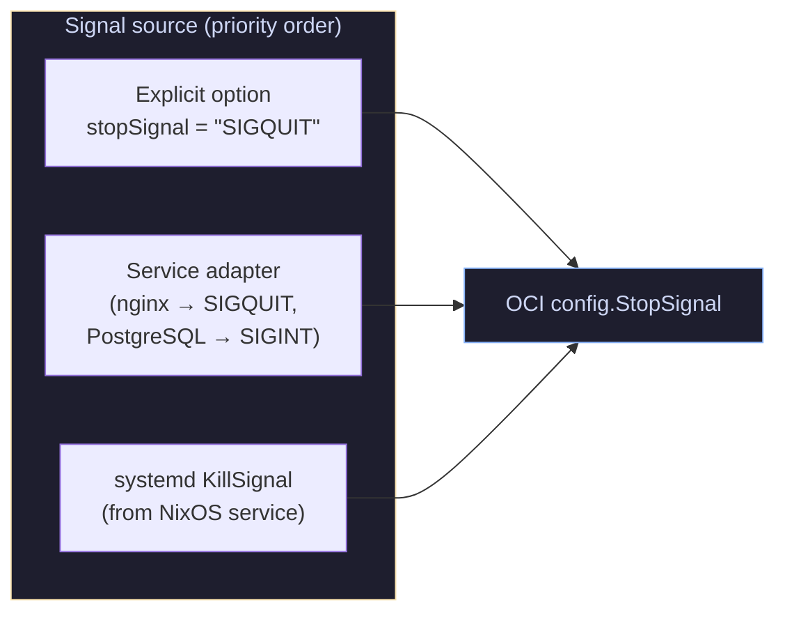

### Auto-derived signals per service

| Service | Signal | Why |
|---|---|---|
| **nginx** | `SIGQUIT` | Graceful worker shutdown — finish serving current requests before exit |
| **PostgreSQL** | `SIGINT` | Fast shutdown — rollback active transactions, clean exit. `SIGQUIT` (smart shutdown) can hang waiting for clients to disconnect |
| **Redis** | `SIGTERM` | Save dataset (if configured) and exit gracefully |
| *(default)* | `SIGTERM` | Container runtime default when not specified |

Service adapters use `lib.mkDefault`, so the user can always override.
When no adapter sets a signal, the `extractServiceData` function checks
the systemd `KillSignal` from the NixOS service config.

| Stage | Transformation | File |
|---|---|---|
| Service adapter | `oci.container.stopSignal = "SIGQUIT"` | `service-adapters/nginx.nix` etc. |
| systemd fallback | `serviceConfig.KillSignal` | `entrypoint.nix` (`extractServiceData`) |
| OCI image | `config.StopSignal = "SIGQUIT"` | `image.nix`, `mkSimpleOCI.nix`, `mkNixOCI.nix` |

## WorkingDir

The working directory sets the initial `$PWD` for the container process.

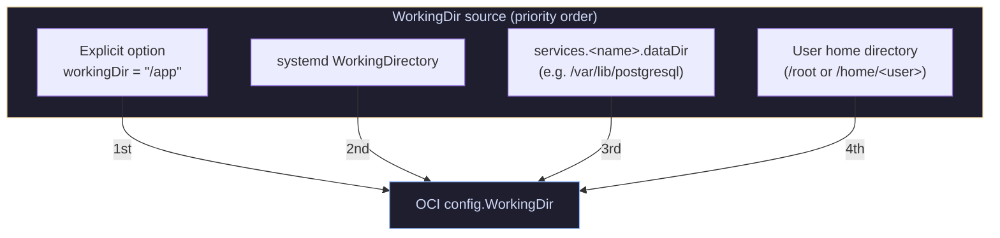

### Auto-derivation chain (NixOS containers)

For NixOS containers, the working directory is resolved in priority order:

1. **Explicit** `oci.container.workingDir` (user override)
2. **systemd** `WorkingDirectory` from the service config
3. **NixOS service** `dataDir` (e.g., PostgreSQL → `/var/lib/postgresql`)
4. **User home** directory (`/root` or `/home/<user>`)

This means PostgreSQL containers automatically get `WorkingDir = /var/lib/postgresql`
without any manual configuration.

For non-NixOS containers, `workingDir` defaults to `null` (runtime default,
typically `/`). Set it explicitly when needed.

| Stage | Transformation | File |
|---|---|---|
| NixOS auto-derive | systemd → dataDir → home | `entrypoint.nix` (`_output.workingDir`) |
| Explicit option | `workingDir = "/app"` | `_options/working-dir.nix` |
| OCI image | `config.WorkingDir = "/var/lib/postgresql"` | `image.nix`, `mkSimpleOCI.nix`, `mkNixOCI.nix` |

## Declared volumes

OCI `Volumes` declares paths in the image that contain **persistent data**.
This is image-level metadata — it tells the container runtime which paths
should be treated as named volumes (surviving container restarts).

This is **separate from** deploy-time `volumes` (host bind mounts like
`"/data:/data"` passed to the runner service).

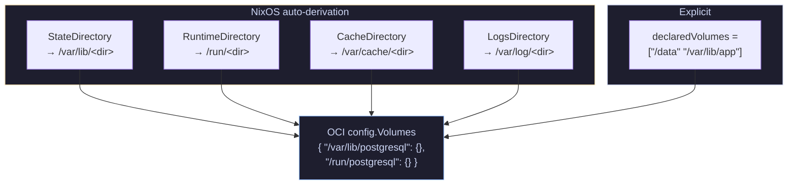

### Auto-derivation from systemd directories

The `extractServiceData` function reads the systemd service config and
translates directory declarations into OCI volume paths:

| systemd field | OCI Volume path |
|---|---|
| `StateDirectory = "postgresql"` | `/var/lib/postgresql` |
| `RuntimeDirectory = "nginx"` | `/run/nginx` |
| `CacheDirectory = "nginx"` | `/var/cache/nginx` |
| `LogsDirectory = "nginx"` | `/var/log/nginx` |

Explicit `declaredVolumes` are merged with auto-derived ones.

### Declared volumes vs deploy volumes

| | `declaredVolumes` | `volumes` |
|---|---|---|
| **What** | OCI metadata in image manifest | Host bind mounts at runtime |
| **Where** | `config.Volumes` in image | `podman run -v` / `docker run -v` |
| **Purpose** | Tells runtime "this path has persistent data" | Maps host paths into container |
| **Auto-derived** | Yes (from systemd dirs) | No (user-specified) |
| **File** | `_options/declared-volumes.nix` | `deploy/_containers/volumes.nix` |

| Stage | Transformation | File |
|---|---|---|
| NixOS auto-derive | systemd dirs → path list | `entrypoint.nix` (`_output.declaredVolumes`) |
| Explicit option | `declaredVolumes = ["/data"]` | `_options/declared-volumes.nix` |
| OCI image | `config.Volumes = { "/var/lib/postgresql" = {}; }` | `image.nix`, `mkSimpleOCI.nix`, `mkNixOCI.nix` |
