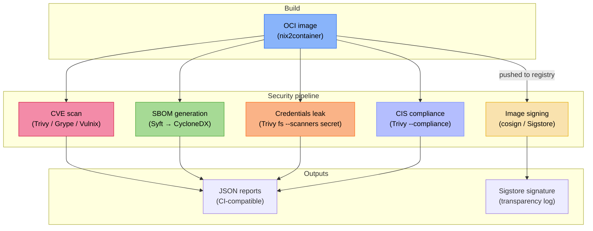

+++
title = "CVE scanning, SBOM generation & integrity tests"
description = "How nix-oci integrates vulnerability scanning (Trivy, Grype, Vulnix), SBOM generation (Syft), image signing (cosign), credentials leak detection, and CIS compliance checking into the Nix build pipeline"
+++

# CVE scanning, SBOM generation & integrity tests

nix-oci treats supply chain security as a first-class concern. Instead of
bolting scanners onto CI scripts, it declares them as **module options**
and exposes them as **flake apps** and **flake checks** — making security
scanning reproducible, cacheable, and impossible to forget.

## The problem

Container images are opaque tarballs. Without active scanning:

- Known vulnerabilities (CVEs) in bundled libraries go unnoticed until
  an attacker exploits them.
- Nobody knows *what* is inside the image — no software bill of
  materials (SBOM) means no auditability.
- Images can be tampered with between build and deploy — without
  signatures, there is no proof of provenance.
- Credentials (API keys, tokens, `.env` files) accidentally baked
  into layers are invisible until leaked.

nix-oci solves each of these with a dedicated module.

## Architecture overview



## CVE scanning

Three scanners are available, each with different strengths:

| Scanner | Approach | Best for |
|---|---|---|
| **Trivy** | Scans OCI archive against multiple vulnerability DBs | Broadest coverage, CI integration |
| **Grype** | Anchore's scanner, OCI archive input | Alternative DB, Anchore ecosystem |
| **Vulnix** | Nix-native — scans the Nix store closure directly | Nix-specific CVEs, no archive conversion needed |

### How it works

Each scanner generates a shell script derivation that:

1. Converts the nix2container image to a Docker archive (via skopeo)
   — or, for Vulnix, operates directly on the Nix store path.
2. Runs the scanner with configured flags (ignore files, whitelists).
3. Prints human-readable output to stdout.
4. Optionally writes a machine-readable JSON report for CI
   integration.

### Enable it

See the [flake-parts option reference](../reference/flake-parts-options.html)
for all CVE scanning options.

```nix
# Global (all containers)
oci.cve.trivy.enabled = true;
oci.cve.grype.enabled = true;
oci.cve.vulnix.enabled = true;
```

### Ignoring known CVEs

```nix
# Global ignore list (applies to all containers)
oci.cve.trivy.ignore.extra = [ "CVE-2023-12345" "CVE-2024-67890" ];

# Per-container ignore file
oci.containers.my-app.cve.trivy.ignore = {
  fileEnabled = true;
  # path defaults to oci.cve.configPath
};

# Vulnix whitelist
oci.cve.vulnix.whitelist.enabled = true;
```

### Running scans

```bash
# As a flake app
nix run .#trivy-my-app
nix run .#grype-my-app
nix run .#vulnix-my-app
```

### Why three scanners?

No single vulnerability database is complete. Trivy pulls from NVD,
GitHub Advisories, and OS-specific feeds. Grype uses Anchore's curated
feed. Vulnix queries the Nix-specific vulnerability roundup, catching
issues that binary scanners miss because they don't understand Nix
store paths. Running multiple scanners in parallel catches more.

## SBOM generation

An SBOM (Software Bill of Materials) is a machine-readable inventory
of every component in your container. nix-oci generates SBOMs using
**Syft**, producing **CycloneDX JSON** — the format required by the
EU Cyber Resilience Act and many enterprise procurement processes.

### How it works

Syft scans the Docker archive produced from the nix2container image
and outputs a CycloneDX JSON document listing every detected package,
version, and license.

### Enable it

See [`oci.sbom`](../reference/flake-parts-options.html) in the option reference.

```nix
oci.sbom.syft.enabled = true;
```

### Running SBOM generation

```bash
nix run .#sbom-syft-my-app
```

### Why SBOMs matter

- **Regulatory compliance**: the EU CRA and US Executive Order 14028
  require SBOMs for software sold to government agencies.
- **Incident response**: when a new CVE drops, an SBOM tells you in
  seconds whether your images are affected — no need to rescan.
- **License auditing**: SBOMs include license metadata, enabling
  automated compliance checking.
- **Nix advantage**: because Nix builds are hermetic, the SBOM is
  *complete* — there are no hidden runtime dependencies that escape
  detection.

## Image signing

nix-oci integrates **cosign** (part of the Sigstore project) for
cryptographic image signing. Signatures prove that an image was built
by your CI pipeline and has not been tampered with in the registry.

### Keyless signing (default)

By default, cosign uses **keyless signing** via Sigstore's Fulcio CA.
The signer authenticates via an OIDC provider (GitHub Actions, Google,
Microsoft), receives an ephemeral certificate, and signs the image.
The signature and certificate are recorded in Sigstore's public
transparency log (Rekor). No key management required.

### Key-based signing

For air-gapped or compliance-constrained environments, see
[`oci.signing.cosign`](../reference/flake-parts-options.html):

```nix
oci.signing.cosign = {
  enabled = true;
  keyless = false;
  key = "awskms://arn:aws:kms:eu-west-1:123456789:key/abcd-1234";
  # Or: "env://COSIGN_PRIVATE_KEY", "./cosign.key", "hashivault://mykey"
};
```

### Annotations and verification

```nix
oci.signing.cosign = {
  enabled = true;
  annotations = {
    "repo" = "https://github.com/example/repo";
    "build-system" = "nix";
  };
  verify = true;  # verify signature immediately after signing
  certificateIdentityRegexp = "https://github.com/myorg/.*";
  certificateOidcIssuerRegexp = "https://token.actions.githubusercontent.com";
};
```

### Running signing

The signing script takes the pushed image reference as argument:

```bash
nix run .#sign-cosign-my-app -- registry.example.com/my-app:v1.0.0

# With specific digest (recommended for CI)
nix run .#sign-cosign-my-app -- registry.example.com/my-app:v1.0.0 sha256:abc123...
```

### Policy enforcement

Signed images can be enforced at admission time using:

- **Kyverno** `verifyImages` policies
- **OPA/Gatekeeper** with cosign verification
- **Kubernetes ImagePolicyWebhook**

The annotations attached during signing are available in policy
evaluation, enabling rules like "only deploy images signed by our CI
with `build-system=nix`".

## Credentials leak detection

Trivy's secret scanner checks the entire image filesystem for
accidentally embedded credentials: API keys, private keys, tokens,
`.env` files, connection strings.

### Enable it

See [`oci.credentialsLeak`](../reference/flake-parts-options.html) in the option reference.

```nix
oci.credentialsLeak.trivy.enabled = true;
```

### Running the check

```bash
nix run .#credentials-leak-trivy-my-app
```

### Why Nix images still need this

Even though Nix builds are pure, credentials can leak through:

- Environment variables baked into derivations (e.g. `buildPhase`
  scripts that reference secrets).
- Config files added via `configFiles` or `copyToRoot`.
- NixOS module configuration that embeds tokens in generated configs.

## CIS compliance checking

Trivy can check images against the
[CIS Docker Benchmark](https://www.cisecurity.org/benchmark/docker)
— a set of security recommendations covering image configuration,
filesystem permissions, user settings, and more.

### Enable it

See [`compliance.trivy`](../reference/flake-parts-options.html) in the option reference.

```nix
oci.containers.my-app.compliance.trivy = {
  enabled = true;
  # spec defaults to "docker-cis-1.6.0"
  # report defaults to "summary" (or "all" for detailed output)
};
```

### Running the check

```bash
nix run .#compliance-trivy-my-app
```

### CIS + nix-oci defaults

nix-oci's security defaults (non-root user, no shell, no package
manager, read-only rootfs) satisfy many CIS controls out of the box:

| CIS Control | nix-oci Default |
|---|---|
| 4.1 — Do not use root | `isRoot = false` |
| 4.6 — Add HEALTHCHECK | Auto-derived from service adapters |
| 4.9 — Do not use ADD | No Dockerfile, no ADD |
| 4.10 — Do not store secrets | Credentials leak scanner |

## Container integrity testing

Beyond security scanning, nix-oci integrates structural and
behavioral testing tools:

| Tool | Purpose | Option |
|---|---|---|
| **container-structure-test** | Validate filesystem, commands, metadata | [`oci.test.containerStructureTest.enabled`](../reference/flake-parts-options.html) |
| **dgoss** | Behavioral testing with goss inside the container | [`oci.test.dgoss.enabled`](../reference/flake-parts-options.html) |
| **Dive** | Image layer efficiency analysis | [`oci.test.dive.enabled`](../reference/flake-parts-options.html) |

### dgoss hermetic mode

dgoss can run as a **pure Nix derivation** using Podman inside the
Nix sandbox. This makes container tests fully reproducible and
cacheable:

```nix
oci.test.dgoss = {
  enabled = true;
  hermetic = true;  # requires extra-sandbox-paths = /sys/fs/cgroup
};
```

## The Nix advantage

Traditional container security scanning suffers from a fundamental
problem: scanners analyze the *artifact* (the image) rather than the
*source* (the build definition). This creates a gap:

- A Dockerfile `RUN apt-get install` pulls packages at build time —
  the exact versions depend on the mirror state, which is
  non-deterministic.
- Scanners can only report what they find in the artifact, not what
  *should* be there.

nix-oci closes this gap:

1. **Deterministic**: the `flake.lock` pins every input. Two builds
   of the same lock produce identical images.
2. **Complete closure**: Nix knows the full dependency graph — Vulnix
   can scan it directly without unpacking the image.
3. **Scanners as derivations**: scan results are Nix build outputs,
   meaning they are cached, reproducible, and can gate CI pipelines
   as flake checks.

## Further reading

- [Security defaults](./security-defaults.md) — non-root, distroless, reproducibility
- [Automatic OCI labels](./automatic-labeling.md) — labels encoding security posture
- [Hardening](./hardening.md) — seccomp, Landlock, capability controls
- [Sigstore](https://www.sigstore.dev/) — keyless signing infrastructure
- [CycloneDX](https://cyclonedx.org/) — SBOM standard
- [CIS Docker Benchmark](https://www.cisecurity.org/benchmark/docker) — container security baseline
