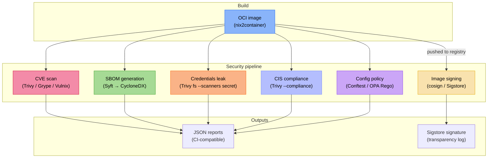

+++
title = "CVE scanning, SBOM generation & integrity tests"
description = "How nix-oci integrates vulnerability scanning (Trivy, Grype, Vulnix), SBOM generation (Syft), image signing (cosign), credentials leak detection, CIS compliance checking, and OCI config policy checking (Conftest/OPA) into the Nix build pipeline"
+++

# CVE scanning, SBOM generation & integrity tests

nix-oci treats supply chain security as a first-class concern. Instead of
bolting scanners onto CI scripts, it declares them as **module options**
and exposes them as **flake apps** and **flake checks**, making security
scanning reproducible, cacheable, and impossible to forget.

## The problem

Container images are opaque tarballs. Without active scanning:

- Known vulnerabilities (CVEs) in bundled libraries go unnoticed until
  an attacker exploits them.
- Nobody knows *what* is inside the image: no software bill of
  materials (SBOM) means no auditability.
- An attacker can tamper with images between build and deploy; without
  signatures, nothing proves provenance.
- Credentials (API keys, tokens, `.env` files) accidentally baked
  into layers are invisible until leaked.

nix-oci solves each of these with a dedicated module.

## Architecture overview



## CVE scanning

Three scanners are available, each with different strengths:

| Scanner | Approach | Best for |
|---|---|---|
| **Trivy** | Scans OCI archive against multiple vulnerability DBs | Broadest coverage, CI integration |
| **Grype** | Anchore's scanner, OCI archive input | Alternative DB, Anchore ecosystem |
| **Vulnix** | Nix-native: scans the Nix store closure directly | Nix-specific CVEs, no archive conversion needed |

### How it works

Each scanner generates a shell script derivation that:

1. Converts the nix2container image to a Docker archive (via skopeo),
   or, for Vulnix, operates directly on the Nix store path.
2. Runs the scanner with configured flags (ignore files, whitelists).
3. Prints human-readable output to stdout.
4. Optionally writes a machine-readable JSON report for CI
   integration.

### Enable it

See the [flake-parts option reference](../reference/flake-parts-options.html)
for all CVE scanning options.

```nix
# Global (all containers)
oci.cve.trivy.enabled = true;
oci.cve.grype.enabled = true;
oci.cve.vulnix.enabled = true;
```

### Ignoring known CVEs

```nix
# Global ignore list (applies to all containers)
oci.cve.trivy.ignore.extra = [ "CVE-2023-12345" "CVE-2024-67890" ];

# Per-container ignore file
oci.containers.my-app.cve.trivy.ignore = {
  fileEnabled = true;
  # see option reference for path default
};

# Vulnix whitelist
oci.cve.vulnix.whitelist.enabled = true;
```

### Running scans

```bash
# As a flake app
nix run .#trivy-my-app
nix run .#grype-my-app
nix run .#vulnix-my-app
```

### Why three scanners?

No single vulnerability database is complete. Trivy pulls from NVD,
GitHub Advisories, and OS-specific feeds. Grype uses Anchore's curated
feed. Vulnix queries the Nix-specific vulnerability roundup, catching
issues that binary scanners miss because they don't understand Nix
store paths. Running multiple scanners in parallel catches more.

## SBOM generation

An SBOM (Software Bill of Materials) is a machine-readable inventory
of every component in your container. nix-oci generates SBOMs using
**Syft**, producing **CycloneDX JSON**, the format required by the
EU Cyber Resilience Act and many enterprise procurement processes.

### How it works

Syft scans the Docker archive produced from the nix2container image
and outputs a CycloneDX JSON document listing every detected package,
version, and license.

### Enable it

See [`oci.sbom`](../reference/flake-parts-options.html) in the option reference.

```nix
oci.sbom.syft.enabled = true;
```

### Running SBOM generation

```bash
nix run .#sbom-syft-my-app
```

### Why SBOMs matter

- **Regulatory compliance**: the EU CRA and US Executive Order 14028
  require SBOMs for software sold to government agencies.
- **Incident response**: when a new CVE drops, an SBOM tells you in
  seconds whether your images contain the vulnerability, with no need to rescan.
- **License auditing**: SBOMs include license metadata, enabling
  automated compliance checking.
- **Nix advantage**: because Nix builds are hermetic, the SBOM is
  *complete*: there are no hidden runtime dependencies that escape
  detection.

## Image signing

nix-oci integrates **cosign** (part of the Sigstore project) for
cryptographic image signing. Signatures prove that your CI pipeline built
the image and that nobody tampered with it in the registry.

### Keyless signing (default)

By default, cosign uses **keyless signing** via Sigstore's Fulcio CA.
The signer authenticates via an OIDC provider (GitHub Actions, Google,
Microsoft), receives an ephemeral certificate, and signs the image.
Rekor (Sigstore's public transparency log) records the signature and
certificate. No key management required.

### Key-based signing

For air-gapped or compliance-constrained environments, see
[`oci.signing.cosign`](../reference/flake-parts-options.html):

```nix
oci.signing.cosign = {
  enabled = true;
  keyless = false;
  key = "awskms://arn:aws:kms:eu-west-1:123456789:key/abcd-1234";
  # Or: "env://COSIGN_PRIVATE_KEY", "./cosign.key", "hashivault://mykey"
};
```

### Annotations and verification

```nix
oci.signing.cosign = {
  enabled = true;
  annotations = {
    "repo" = "https://github.com/example/repo";
    "build-system" = "nix";
  };
  verify = true;  # verify signature immediately after signing
  certificateIdentityRegexp = "https://github.com/myorg/.*";
  certificateOidcIssuerRegexp = "https://token.actions.githubusercontent.com";
};
```

### Running signing

The signing script takes the pushed image reference as argument:

```bash
nix run .#sign-cosign-my-app -- registry.example.com/my-app:v1.0.0

# With specific digest (recommended for CI)
nix run .#sign-cosign-my-app -- registry.example.com/my-app:v1.0.0 sha256:abc123...
```

### Policy enforcement

You can enforce signed images at admission time using:

- **Kyverno** `verifyImages` policies
- **OPA/Gatekeeper** with cosign verification
- **Kubernetes ImagePolicyWebhook**

The annotations attached during signing are available in policy
evaluation, enabling rules like "only deploy images signed by our CI
with `build-system=nix`".

## Credentials leak detection

Trivy's secret scanner checks the entire image filesystem for
accidentally embedded credentials: API keys, private keys, tokens,
`.env` files, connection strings.

### Enable it

See [`oci.credentialsLeak`](../reference/flake-parts-options.html) in the option reference.

```nix
oci.credentialsLeak.trivy.enabled = true;
```

### Running the check

```bash
nix run .#credentials-leak-trivy-my-app
```

### Why Nix images still need this

Even though Nix builds are pure, credentials can leak through:

- Environment variables baked into derivations (e.g. `buildPhase`
  scripts that reference secrets).
- Config files added via `dependencies` or `copyToRoot`.
- NixOS module configuration that embeds tokens in generated configs.

## CIS compliance checking

Trivy can check images against the
[CIS Docker Benchmark](https://www.cisecurity.org/benchmark/docker),
a set of security recommendations covering image configuration,
filesystem permissions, user settings, and more.

### Enable it

See [`compliance.trivy`](../reference/flake-parts-options.html) in the option reference.

```nix
oci.containers.my-app.compliance.trivy = {
  enabled = true;
  # see option reference for spec and report defaults
};
```

### Running the check

```bash
nix run .#compliance-trivy-my-app
```

### CIS + nix-oci defaults

nix-oci's security defaults (non-root user, no shell, no package
manager, read-only rootfs) satisfy many CIS controls out of the box:

| CIS Control | nix-oci Default |
|---|---|
| 4.1 -- Do not use root | `isRoot = false` |
| 4.6 -- Add HEALTHCHECK | Auto-derived from service adapters |
| 4.9 -- Do not use ADD | No Dockerfile, no ADD |
| 4.10 -- Do not store secrets | Credentials leak scanner |

## Image linting (Dockle)

[Dockle](https://github.com/goodwithtech/dockle) checks container
images against CIS Docker Benchmarks and Dockerfile best practices.
Unlike Trivy's compliance mode (which checks the image *config*),
Dockle inspects the image *layers* for issues like setuid binaries,
unnecessary users, and missing healthchecks.

### Enable it

See [`oci.lint.dockle`](../reference/flake-parts-options.html) in the option reference.

```nix
oci.lint.dockle.enabled = true;
```

### Per-container configuration

```nix
oci.containers.my-app.lint.dockle = {
  enabled = true;
  exitLevel = "warn";  # "info", "warn", or "fatal"
  ignore = [ "CIS-DI-0001" "DKL-DI-0006" ];
};
```

### Running the linter

```bash
nix run .#lint-dockle-my-app
```

## OCI config policy checking (Conftest)

[Conftest](https://www.conftest.dev/) validates structured data against
**Open Policy Agent (OPA)** rules written in Rego. nix-oci uses it to
check the OCI image config JSON at build time, catching configuration
mistakes that scanners like Trivy and Dockle do not cover.

### What it checks

nix-oci ships built-in Rego policies that verify:

| Rule | Severity | Rationale |
|---|---|---|
| Container runs as root | **deny** | Root inside the container can escalate to host root via kernel exploits |
| User field is empty | **deny** | An empty User defaults to root at runtime |
| Secrets in env vars | **deny** | Env vars with `PASSWORD`, `SECRET`, `TOKEN`, `API_KEY` in the name |
| Missing `org.opencontainers.image.source` label | **warn** | Traceability back to source repository |
| Missing `org.opencontainers.image.description` label | **warn** | Image provenance metadata |
| Missing or empty Entrypoint | **deny** | Every container should have an explicit entrypoint |

### How it works

The Conftest script:

1. Converts the nix2container image to a Docker archive (via skopeo).
2. Extracts the OCI image config JSON from the archive manifest.
3. Runs `conftest test` against the config with the configured Rego
   policy directory.
4. Optionally writes a JSON report for CI integration.

No container runtime is needed. The check is purely build-time.

### Enable it

See [`oci.policy.conftest`](../reference/flake-parts-options.html) in the option reference.

```nix
# Global (all containers)
oci.policy.conftest.enabled = true;
```

### Per-container configuration

```nix
oci.containers.my-app.policy.conftest = {
  enabled = true;
  # Use custom policies instead of the built-in ones:
  # policyDir = ./my-policies;
  # Check additional Rego namespaces:
  # namespaces = [ "main" "custom" ];
};
```

### Custom policies

Create a directory of `.rego` files. Each file declares a `package`
(namespace) and defines `deny` or `warn` rules. The input is the OCI
image config JSON:

```rego
package main

deny[msg] {
  input.config.User == "root"
  msg := "container must not run as root"
}

warn[msg] {
  not input.config.Labels["team"]
  msg := "missing 'team' label"
}
```

Point `policyDir` at your directory:

```nix
oci.policy.conftest.policyDir = ./policies;
```

### Running the check

```bash
nix run .#oci-policy-conftest-my-app
```

### Why Conftest alongside Dockle and Trivy?

Dockle checks CIS benchmarks against image layers. Trivy compliance
checks a fixed set of CIS rules. Conftest lets you write **arbitrary
custom policies** in Rego: team labels, naming conventions, entrypoint
patterns, environment variable allow-lists, or anything else your
organization requires. It is the extensibility layer.

## Container integrity testing

Beyond security scanning, nix-oci integrates structural and
behavioral testing tools:

| Tool | Purpose | Option |
|---|---|---|
| **container-structure-test** | Validate filesystem, commands, metadata | [`oci.test.containerStructureTest.enabled`](../reference/flake-parts-options.html) |
| **dgoss** | Behavioral testing with goss inside the container | [`oci.test.dgoss.enabled`](../reference/flake-parts-options.html) |
| **Dive** | Image layer efficiency analysis | [`oci.test.dive.enabled`](../reference/flake-parts-options.html) |
| **amicontained** | Container introspection: runtime, capabilities, seccomp, namespaces | [`oci.test.amicontained.enabled`](../reference/flake-parts-options.html) |
| **DEEPCE** | Container escape detection: socket exposure, privileged mode, dangerous mounts | [`oci.test.deepce.enabled`](../reference/flake-parts-options.html) |

### amicontained (container introspection)

[amicontained](https://github.com/genuinetools/amicontained) is a
container introspection tool that reports the security posture of a
running container: which runtime it detects, what Linux capabilities
are available, whether seccomp is enabled, and what namespaces are
in use.

Unlike the other tools above, amicontained must run **inside** the
container. nix-oci solves this without polluting the production image
by **bind-mounting** the static binary from the Nix store:

```bash
podman run --rm \
  -v /nix/store/.../amicontained:/amicontained:ro \
  --entrypoint /amicontained \
  my-image:latest
```

This means the test validates the **actual production image**, not a
modified copy. If your hardening options (seccomp, dropped capabilities,
read-only rootfs) are effective, amicontained will confirm it.

```nix
oci.test.amicontained.enabled = true;
```

```bash
nix run .#oci-amicontained-my-app
```

The script fails with exit code 1 if the container is running in
privileged mode. It warns if seccomp is disabled.

### DEEPCE (container escape detection)

[DEEPCE](https://github.com/stealthcopter/deepce) (Docker Enumeration,
Escalation of Privileges and Container Escapes) is a pure `sh` script
that enumerates container escape vectors: exposed Docker sockets,
privileged mode, dangerous capabilities, mounted host filesystems,
namespace sharing, and known CVEs.

Since DEEPCE is a shell script and hardened images may lack `sh`,
nix-oci bind-mounts **both** a static busybox binary (as the shell
interpreter) and the script itself:

```bash
podman run --rm \
  -v /nix/store/.../busybox:/busybox:ro \
  -v /nix/store/.../deepce.sh:/deepce.sh:ro \
  --entrypoint /busybox \
  my-image:latest \
  sh /deepce.sh --no-network --no-colors
```

By default, DEEPCE runs in **enumeration-only mode** (no exploits).
The `--no-network` flag prevents external connections from CI.

```nix
oci.test.deepce.enabled = true;
```

```bash
nix run .#oci-deepce-my-app
```

The script fails with exit code 1 if a Docker socket is exposed or
the container is running in privileged mode.

### dgoss hermetic mode

dgoss can run as a **pure Nix derivation** using Podman inside the
Nix sandbox. This makes container tests fully reproducible and
cacheable:

```nix
oci.test.dgoss = {
  enabled = true;
  hermetic = true;  # requires extra-sandbox-paths = /sys/fs/cgroup
};
```

## The Nix advantage

Traditional container security scanning suffers from a fundamental
problem: scanners analyze the *artifact* (the image) rather than the
*source* (the build definition). This creates a gap:

- A Dockerfile `RUN apt-get install` pulls packages at build time --
  the exact versions depend on the mirror state, which is
  non-deterministic.
- Scanners can only report what they find in the artifact, not what
  *should* be there.

nix-oci closes this gap:

1. **Deterministic**: the `flake.lock` pins every input. Two builds
   of the same lock produce identical images.
2. **Complete closure**: Nix knows the full dependency graph; Vulnix
   can scan it directly without unpacking the image.
3. **Scanners as derivations**: scan results are Nix build outputs,
   meaning Nix caches them, they reproduce exactly, and they can gate CI pipelines
   as flake checks.

## Further reading

- [Security defaults](./security-defaults.md): non-root, distroless, reproducibility
- [Automatic OCI labels](./automatic-labeling.md): labels encoding security posture
- [Hardening](./hardening.md): seccomp, Landlock, capability controls
- [Sigstore](https://www.sigstore.dev/): keyless signing infrastructure
- [CycloneDX](https://cyclonedx.org/): SBOM standard
- [CIS Docker Benchmark](https://www.cisecurity.org/benchmark/docker): container security baseline
- [Conftest](https://www.conftest.dev/): policy-as-code for structured data
- [Open Policy Agent](https://www.openpolicyagent.org/): general-purpose policy engine (Rego language)
- [amicontained](https://github.com/genuinetools/amicontained): container introspection tool
- [DEEPCE](https://github.com/stealthcopter/deepce): container escape detection script
