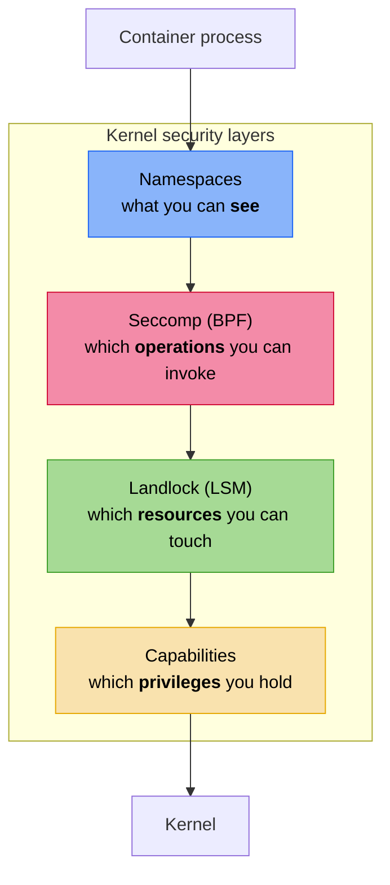

+++
title = "Container hardening"
description = "How nix-oci applies defense-in-depth with seccomp syscall filtering, Landlock LSM access control, capability dropping, read-only root filesystem, and privilege restriction"
+++

# Container hardening

nix-oci provides a declarative hardening system that layers three
independent Linux kernel primitives — **seccomp**, **Landlock**, and
**capabilities** — into a defense-in-depth posture. Each primitive
operates at a different level of the kernel, and combining them
covers gaps that any single mechanism leaves open.

## The three primitives



| Primitive | Kernel layer | Controls | Limitations |
|---|---|---|---|
| **Namespaces** | Process visibility | What processes/files/networks are visible | Container runtime handles this |
| **Seccomp** | Syscall boundary (BPF) | Which syscalls can be invoked | Cannot inspect pointer arguments (TOCTOU) |
| **Landlock** | VFS/object level (LSM) | Which specific files and ports are accessible | Requires Linux >= 5.13 (fs) / >= 6.7 (net) |
| **Capabilities** | Privilege checks | Which root sub-privileges are held | Coarse-grained per capability |

## Enabling hardening

```nix
oci.containers.my-app = {
  package = pkgs.myApp;
  hardening.enable = true;
};
```

Setting `hardening.enable = true` activates the full hardening stack
with sensible defaults. Each sub-feature can be individually tuned.

## Seccomp: syscall filtering

Seccomp uses BPF programs to filter syscalls at the kernel boundary.
A process that attempts a blocked syscall receives `EPERM` — the
syscall never executes.

### Predefined profiles

nix-oci ships three profiles, each using a different filtering
strategy:

| Profile | Strategy | Syscalls | Best for |
|---|---|---|---|
| `"strict"` | Allowlist (~60 syscalls) | Only base + file I/O + event loop | Static binaries, Go/Rust services |
| `"moderate"` | Blocklist (~44 dangerous syscalls) | Everything except dangerous ops | General-purpose containers |
| `"web-server"` | Allowlist (strict + network + threading + fs-write) | Full I/O stack | HTTP servers (nginx, Caddy) |

### Strict profile

Default action: **deny** (`SCMP_ACT_ERRNO`). Only explicitly listed
syscalls are allowed:

- Process basics: `exit`, `read`, `write`, `mmap`, `brk`, signals
- File I/O: `openat`, `fstat`, `lseek`, `readv`, `writev`, `getcwd`
- Event loop: `epoll_*`, `poll`, `select`, `eventfd2`

Blocked by omission: `mount`, `ptrace`, `execve`, `socket`, `clone`,
`setns`, `unshare`, and all other syscalls.

### Moderate profile

Default action: **allow** (`SCMP_ACT_ALLOW`). Only explicitly
dangerous syscalls are blocked:

`acct`, `bpf`, `clock_settime`, `create_module`, `delete_module`,
`finit_module`, `init_module`, `kexec_load`, `mount`, `move_mount`,
`perf_event_open`, `pivot_root`, `ptrace`, `reboot`, `setns`,
`swapoff`, `swapon`, `umount2`, `unshare`, `userfaultfd`, and more
(44 total).

This is similar to Docker's default seccomp profile.

### Web-server profile

Strict base plus the syscalls needed by HTTP servers:

- Networking: `socket`, `bind`, `listen`, `accept4`, `connect`,
  `sendto`, `recvfrom`, `sendmsg`, `recvmsg`
- Threading: `clone`, `clone3`, `wait4`, `tgkill`, `splice`,
  `sendfile`
- Filesystem writes: `fchmod`, `ftruncate`, `fsync`, `rename`,
  `unlink`, `mkdir`

### Auto-detection

When using `nixosConfig`, nix-oci detects known web server services
(nginx, httpd) and auto-defaults to the `"web-server"` profile.
Otherwise, `"strict"` is used:

```nix
# Auto-detected: nginx → web-server profile
oci.containers.my-app.nixosConfig = {
  enable = true;
  mainService = "nginx";
  modules = [({ ... }: { services.nginx.enable = true; })];
};
```

### Custom profiles

For full control, provide an OCI runtime spec JSON file:

```nix
hardening.seccomp.customProfileJson = ./my-seccomp-profile.json;
```

### Generated output

When seccomp is enabled, nix-oci produces a JSON file at
`_output.hardening.seccompProfile` following the OCI runtime spec
format. Deploy modules pass it via
`--security-opt seccomp=<path>`.

## Landlock: object-level access control

Landlock is a Linux Security Module (LSM) that operates at the
**VFS level** — it controls which specific inodes and TCP ports a
process can access, not just which syscalls it can invoke.

Key properties:
- **Unprivileged**: any process can self-restrict (no root needed).
- **Irreversible**: once applied, restrictions cannot be relaxed.
- **Survives execve**: child processes inherit restrictions.

### Filesystem restrictions

```nix
hardening.landlock = {
  enable = true;
  allowedReadPaths = [ "/nix/store" "/etc" ];
  allowedWritePaths = [ "/tmp" "/var/log" ];
  allowedExecutePaths = [ "/nix/store" ];
};
```

When `allowedReadPaths` is empty and `enable` is true, nix-oci
auto-populates it from the Nix closure of the container's package
and dependencies.

### Network restrictions (Linux >= 6.7)

```nix
hardening.landlock = {
  enable = true;
  allowedTcpBind = [ 80 443 ];    # ports this container may listen on
  allowedTcpConnect = [ 5432 ];   # ports this container may connect to
};
```

When using `nixosConfig`, TCP bind ports are auto-detected from
configured services (e.g., nginx's listen port).

### Generated output

nix-oci produces a Landlock policy JSON at
`_output.hardening.landlockPolicy`:

```json
{
  "version": 1,
  "fs": {
    "read": ["/nix/store", "/etc"],
    "write": ["/tmp", "/var/log"],
    "execute": ["/nix/store"]
  },
  "net": {
    "connectTcp": [5432],
    "bindTcp": [80, 443]
  }
}
```

A Landlock wrapper binary reads this policy and applies it via
`landlock_create_ruleset` / `landlock_add_rule` /
`landlock_restrict_self` before exec'ing the real entrypoint.

### Seccomp vs. Landlock

These are **complementary**, not competing:

| Aspect | Seccomp | Landlock |
|---|---|---|
| What it filters | Syscall numbers | Specific inodes and ports |
| Granularity | "no `mount` at all" | "read `/etc` but not `/root`" |
| Path handling | Cannot inspect paths (TOCTOU) | Resolves paths, then checks inodes |
| Network | Cannot filter by port | Can restrict TCP bind/connect ports |
| Privilege needed | None (self-imposed) | None (self-imposed) |

Use seccomp to block dangerous syscall *categories*. Use Landlock to
restrict access to specific *resources*.

## Capabilities: privilege partitioning

Linux capabilities split root's monolithic privilege into ~40
distinct units. nix-oci defaults to dropping all capabilities:

```nix
hardening.capabilities = {
  drop = [ "ALL" ];    # default
  add = [ ];           # selectively add back
};
```

### Adding capabilities back

Some services need specific capabilities:

```nix
hardening.capabilities.add = [ "NET_BIND_SERVICE" ];  # bind ports < 1024
```

Deploy modules translate these to `--cap-drop ALL --cap-add NET_BIND_SERVICE`.

### Common capabilities

| Capability | Allows | Needed by |
|---|---|---|
| `NET_BIND_SERVICE` | Bind ports below 1024 | nginx on port 80/443 |
| `CHOWN` | Change file ownership | Some init scripts |
| `SETUID` / `SETGID` | Change process UID/GID | Privilege-dropping daemons |
| `DAC_OVERRIDE` | Bypass file permission checks | Rarely needed |

## Read-only root filesystem

```nix
hardening.readOnlyRootfs = true;  # default when hardening is enabled
```

Mounts the container root filesystem as read-only at runtime
(`--read-only`). This prevents:

- Attackers from writing malware or backdoors to disk.
- Persistence across container restarts.
- Accidental writes to the image filesystem.

Applications that need writable storage should use declared volumes
(automatically derived from systemd `StateDirectory`,
`RuntimeDirectory`, etc.) or explicit `tmpfs` mounts.

## No-new-privileges

```nix
hardening.noNewPrivileges = true;  # default when hardening is enabled
```

Sets the `no_new_privs` kernel bit, preventing privilege escalation
via:

- Setuid/setgid binaries
- File capabilities
- Any mechanism that would grant more privileges than the parent
  process

Deploy modules translate to `--security-opt=no-new-privileges`.

## DNS and TLS restrictions

### Disable DNS

```nix
hardening.disableDns = true;
```

Rewrites `/etc/nsswitch.conf` to `hosts: files` only — no DNS
backend. Applications using hardcoded IP addresses are unaffected.

Note: `/etc/resolv.conf` is **not** written into the image because
container runtimes always bind-mount it at startup. To fully restrict
DNS at runtime, use `--dns=127.0.0.1` or network policies.

### Remove TLS trust store

```nix
hardening.noTlsTrustStore = true;
```

Replaces `/etc/ssl/certs/ca-bundle.crt` with an empty file,
preventing all outgoing HTTPS connections. This is a "nuclear option"
for containers that should never initiate external TLS connections.

## Hardening labels

When hardening is enabled, nix-oci embeds the security posture as
OCI labels:

| Label | Value |
|---|---|
| `io.github.dauliac.nix-oci.hardening.enabled` | `"true"` |
| `io.github.dauliac.nix-oci.hardening.no-new-privileges` | `"true"` / `"false"` |
| `io.github.dauliac.nix-oci.hardening.read-only-rootfs` | `"true"` / `"false"` |
| `io.github.dauliac.nix-oci.hardening.capabilities-drop` | `"ALL"` |
| `io.github.dauliac.nix-oci.hardening.capabilities-add` | `"NET_BIND_SERVICE"` |
| `io.github.dauliac.nix-oci.hardening.seccomp-profile` | `"strict"` / `"moderate"` / `"web-server"` |
| `io.github.dauliac.nix-oci.hardening.landlock-enabled` | `"true"` |

Deploy modules read these labels and automatically apply the
corresponding runtime flags (`--security-opt`, `--cap-drop`,
`--cap-add`, `--read-only`).

## Full hardening example

```nix
oci.containers.my-api = {
  package = pkgs.myApi;
  hardening = {
    enable = true;

    # Seccomp: strict allowlist for a Go HTTP server
    seccomp = {
      enable = true;
      profile = "web-server";
    };

    # Landlock: restrict filesystem and network access
    landlock = {
      enable = true;
      allowedWritePaths = [ "/tmp" ];
      allowedTcpBind = [ 8080 ];
      allowedTcpConnect = [ 5432 6379 ];  # PostgreSQL, Redis
    };

    # Capabilities: drop all, add back port binding
    capabilities.add = [ "NET_BIND_SERVICE" ];

    # Read-only rootfs and no-new-privileges are true by default
    # DNS and TLS restrictions are off by default
  };
};
```

## Further reading

- [Security defaults](./security-defaults.md) — non-root, distroless, reproducibility
- [Automatic OCI labels](./automatic-labeling.md) — how labels encode the full security posture
- [CVE scanning, SBOM & integrity](./cve-sbom-integrity.md) — vulnerability scanning and compliance
- [Seccomp BPF](https://www.kernel.org/doc/html/latest/userspace-api/seccomp_filter.html) — kernel documentation
- [Landlock LSM](https://docs.kernel.org/security/landlock.html) — kernel documentation
- [Linux capabilities](https://man7.org/linux/man-pages/man7/capabilities.7.html) — man page
