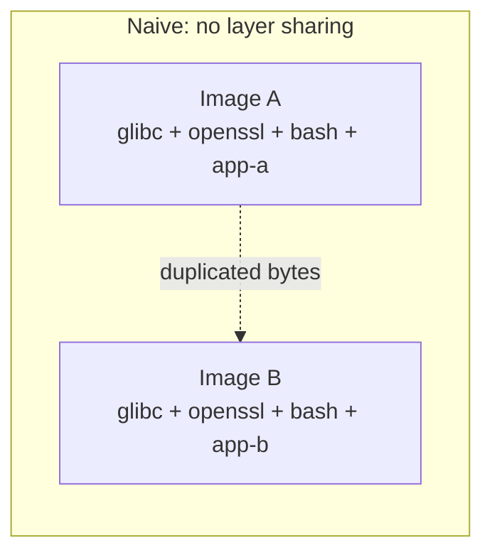
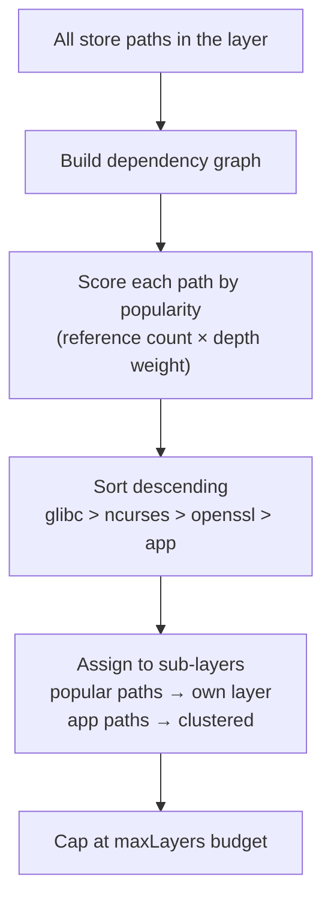
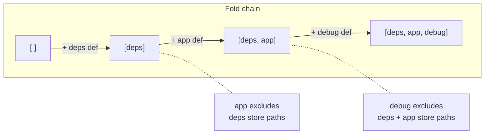
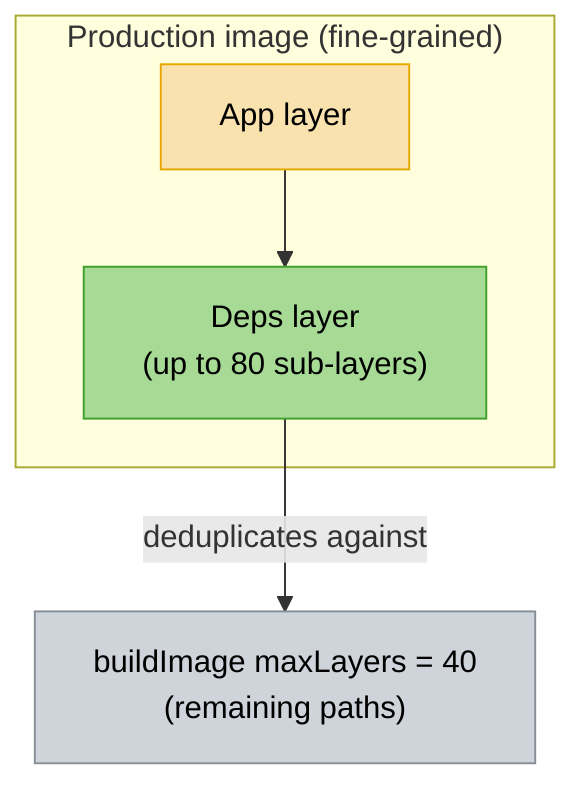
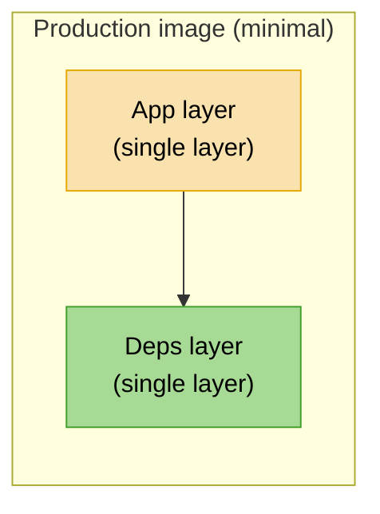
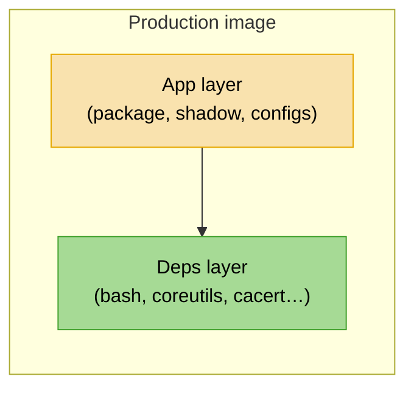
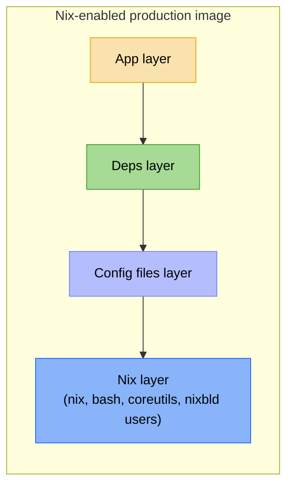
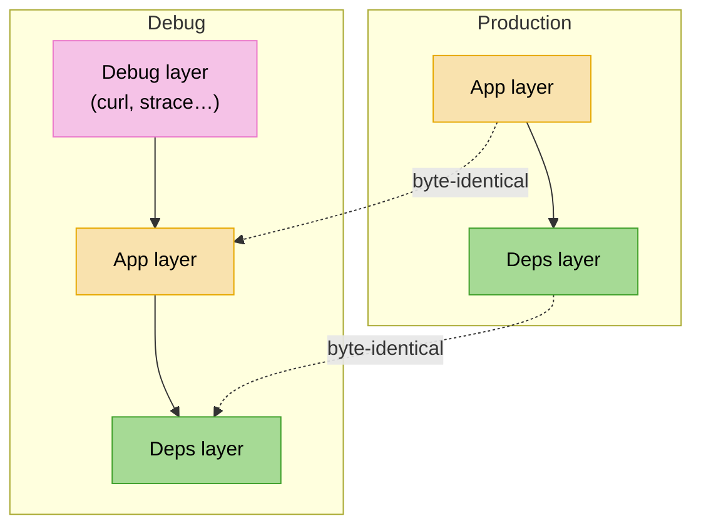
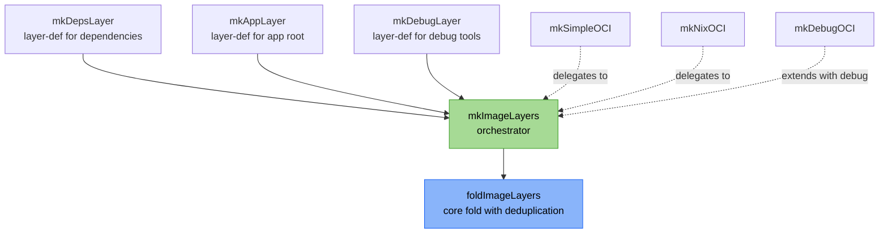

+++
title = "Optimized layer sharing"
description = "How the layering heuristic deduplicates store paths across production and debug images"
+++

# Optimized layer sharing

nix-oci can split your container into multiple OCI layers using a
**store-path popularity algorithm** combined with **fold-based
deduplication**, so that images sharing common dependencies — including
production and debug variants — automatically share layers in the
registry.

## The problem

A naive Nix-built container puts every store path into a single layer.
When you push two images that both depend on glibc, openssl, and bash,
the registry stores those bytes twice. Pulls are equally wasteful —
every deploy re-downloads the full image even if only your application
code changed.



The problem gets worse with **debug images**: a debug variant typically
adds a handful of tools (curl, coreutils, an entrypoint wrapper) on top
of an otherwise identical production image. Without explicit layer
sharing, the entire image is rebuilt from scratch and shares zero bytes
with production in the registry.

## The layering heuristic

nix-oci applies a two-level strategy when `optimizeLayers = true`:

### Level 1 — nix2container's popularity algorithm

Each `buildLayer` / `buildImage` call with a `maxLayers` cap triggers
nix2container's internal store-path popularity algorithm (originally
described in [Nix and layered Docker images](https://grahamc.com/blog/nix-and-layered-docker-images)
by Graham Christensen):



Because Nix store paths are immutable and content-addressed, two images
that share the same glibc store path produce byte-identical layers.
The registry deduplicates them automatically.

### Level 2 — fold-based cross-layer deduplication

nix2container builds each layer independently by default. When you have
multiple explicit layers (deps, app, debug), shared store paths like
glibc can end up **duplicated** across layers — this was documented in
[Nix & Docker: Layer explicitly without duplicate packages](https://blog.eigenvalue.net/2023-nix2container-everything-once/).

nix-oci solves this with a **fold pattern**: layers are built in order,
and each layer references all prior layers via the `layers` attribute.
nix2container then excludes any store path already present in a
predecessor:



```nix
# Simplified — see mkImageLayers.nix for the real implementation
foldImageLayers = { nix2container, layerDefs }:
  let
    mergeToLayer = priorLayers: layerDef:
      let
        layer = nix2container.buildLayer (layerDef // { layers = priorLayers; });
      in
        priorLayers ++ [ layer ];
  in
    lib.foldl mergeToLayer [] layerDefs;
```

The result: **zero duplicated store paths** across layers.

## Layer strategies

The `layerStrategy` option controls how aggressively nix2container
splits store paths into sub-layers. It only takes effect when
`optimizeLayers = true`.

### `"fine-grained"` (default)

Each logical layer is further split using the popularity algorithm.
Best for registries hosting many images with overlapping dependencies.



| Scope | `maxLayers` |
|---|---|
| Dependencies layer | 80 |
| `buildImage` (remaining) | 40 |
| Total budget | ~124 (under 127 OCI limit) |

### `"minimal"`

Exactly one layer per concern — no sub-splitting. Most predictable
cache behaviour: adding a dependency only invalidates the deps layer.
Best for projects with few images.



| Scope | Layers |
|---|---|
| Dependencies | exactly 1 |
| Application | exactly 1 |
| Debug (if enabled) | exactly 1 |
| Total | 2–3 |

## The layer stack

### Production image



- **App layer** — changes on each rebuild
- **Deps layer** — stable, shared across images

For Nix-enabled containers (`installNix = true`), a **Nix layer** is
prepended and all subsequent layers deduplicate against it:



### Debug image (layer sharing with production)

When `debug.enabled = true` and `optimizeLayers = true`, the debug image
is built **on top of** the production layer stack — not rebuilt from
scratch:



The deps and app layers are **byte-identical** between production and
debug. The debug layer is folded after the production layers, so it only
contains store paths **not already present** in deps or app. Pushing
both images to the same registry uploads the shared layers once.

## Enable it

### flake-parts (build-time)

```nix
perSystem = { ... }: {
  oci.containers.my-app = {
    package = pkgs.hello;
    optimizeLayers = true;
    layerStrategy = "minimal"; # or "fine-grained" (default)
  };
};
```

### Deploy modules (NixOS / Home Manager / system-manager)

Layer optimization is **enabled by default** for deploy containers
(set in `_defaults.nix`). You can disable it explicitly:

```nix
oci.containers.my-app = {
  package = pkgs.hello;
  optimizeLayers = false; # default is true for deploy
  layerStrategy = "minimal"; # or "fine-grained" (default)
};
```

## Example: production + debug sharing

```nix
oci.containers.my-app = {
  package = pkgs.myApp;
  dependencies = with pkgs; [ bashInteractive coreutils cacert ];
  optimizeLayers = true;
  layerStrategy = "fine-grained";

  debug.enabled = true;
  debug.packages = with pkgs; [ curl strace ];
};
```

With this setup:
- **Production image**: deps layer (glibc, bash, coreutils…) + app layer (myApp)
- **Debug image**: same deps layer + same app layer + thin debug layer (curl, strace)
- Only the debug layer is unique to the debug image — everything else is shared

## Lib function composition



`mkImageLayers` is the single entry point that defines the ordering
heuristic. Both `mkSimpleOCI` and `mkNixOCI` delegate to it, and
`mkDebugOCI` extends its output with a debug layer. The deploy module
has its own equivalent functions in `ociLib` following the same pattern.

## Further reading

- [Nix and layered Docker images](https://grahamc.com/blog/nix-and-layered-docker-images) — the original popularity algorithm
- [nix2container](https://github.com/nlewo/nix2container) — the backend that implements layering
- [Nix & Docker: Layer explicitly without duplicate packages](https://blog.eigenvalue.net/2023-nix2container-everything-once/) — the fold pattern for cross-layer deduplication
- [Building container images with Nix](https://lewo.abesis.fr/posts/nix-build-container-image/) — the foundational ideas behind nix2container
