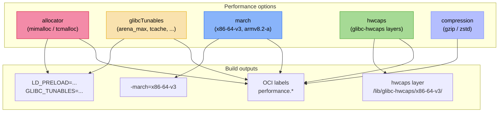
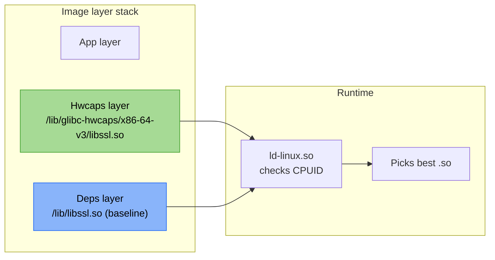

+++
title = "Performance integrations"
description = "How nix-oci optimizes container runtime performance with alternative memory allocators, glibc tunables, CPU-targeted builds, glibc-hwcaps layers, and zstd compression"
+++

# Performance integrations

nix-oci provides declarative performance tuning that goes beyond
image size optimization. Five independent optimization axes target
different bottlenecks -- memory allocation, CPU instruction sets,
glibc internals, library selection, and transport compression.

## The problem

Default container builds leave significant performance on the table:

- **glibc's ptmalloc2** creates `8 * ncores` arenas based on the
  *host* CPU count, not the container's cgroup limit -- inflating RSS
  by 20-40% in memory-constrained containers.
- **Baseline x86-64** instructions ignore AVX2, AVX-512, and other
  extensions available on modern CPUs -- crypto, compression, and math
  run slower than necessary.
- **gzip compression** for OCI layers is universal but slow -- zstd
  is 3-5x faster with 12% better compression ratios.

nix-oci addresses each of these with a single option namespace.

## Architecture overview



## Enabling performance tuning

```nix
oci.containers.my-app = {
  package = pkgs.myApp;
  performance.enable = true;
};
```

Setting [`performance.enable`](../reference/flake-parts-options.html)
to `true` activates the performance subsystem. Each feature is then
configured independently. See the
[flake-parts option reference](../reference/flake-parts-options.html)
for all performance options, or the
[NixOS container module reference](../reference/nix-oci-container-module-options.html)
for inner `oci.container.performance.*` options.

## Alternative memory allocators

glibc's default allocator (ptmalloc2) is optimized for general
desktop workloads. In containerized environments with cgroup memory
limits, it creates too many arenas and wastes RSS.

nix-oci can inject a modern allocator via `LD_PRELOAD` -- no
recompilation needed. Set
[`performance.allocator`](../reference/flake-parts-options.html):

```nix
performance.allocator = "mimalloc";  # or "tcmalloc"
```

### How it works

1. The allocator library (e.g., `pkgs.mimalloc`) is added as a
   container dependency.
2. `LD_PRELOAD=/nix/store/.../lib/libmimalloc.so` is set in the OCI
   manifest's `Env` section.
3. At process startup, the dynamic linker loads the allocator
   *before* glibc, replacing `malloc`/`free`/`realloc` globally.

### Allocator comparison

| Allocator | Strategy | Best for | RSS impact |
|---|---|---|---|
| **ptmalloc2** (default) | Per-arena, 8*ncores | Nothing specific | Baseline (often wasteful) |
| **mimalloc** | Per-heap, segment-based | Microservices, small allocations | 15-30% RSS reduction |
| **tcmalloc** | Per-CPU cache, transfer batches | High-concurrency servers, large allocations | Best throughput |

### When to use which

- **mimalloc**: general default for most containers. Lowest RSS
  overhead for typical workloads with many small allocations.
- **tcmalloc**: when throughput matters more than RSS -- high-QPS
  HTTP servers, data processing pipelines.
- **null** (default): when you don't want to risk changing allocation
  behavior, or when the application bundles its own allocator (e.g.,
  Go, Rust with `jemalloc` feature).

## glibc tunables

glibc exposes runtime tuning parameters via the `GLIBC_TUNABLES`
environment variable. nix-oci sets this in the OCI manifest via
[`performance.glibcTunables`](../reference/flake-parts-options.html):

```nix
performance.glibcTunables = {
  "glibc.malloc.arena_max" = "2";
  "glibc.malloc.mmap_threshold" = "131072";
  "glibc.malloc.tcache_count" = "7";
};
```

This produces:
```
GLIBC_TUNABLES=glibc.malloc.arena_max=2:glibc.malloc.mmap_threshold=131072:glibc.malloc.tcache_count=7
```

### Key tunables for containers

| Tunable | Default | Recommended | Why |
|---|---|---|---|
| `glibc.malloc.arena_max` | `8 * ncores` | `"2"` | Caps arenas to reduce RSS in cgroup-limited containers |
| `glibc.malloc.mmap_threshold` | `128K` | `"131072"` | Reduce heap fragmentation for large allocations |
| `glibc.malloc.tcache_count` | `7` | `"7"` | Per-thread cache slots (tune based on allocation pattern) |
| `glibc.malloc.tcache_max` | `1032` | `"4096"` | Max cacheable allocation size |

### The arena problem

ptmalloc2 creates arenas to reduce lock contention. On a 64-core
host, it creates 512 arenas -- each consuming ~1 MB of virtual memory.
But a container limited to 2 CPUs via cgroups still sees 64 cores
via `/proc/cpuinfo`, creating 512 arenas for 2 threads. Setting
`arena_max = 2` fixes this.

### When to avoid

- **musl-based containers**: glibc tunables have no effect on musl.
- **Non-glibc allocators**: if `performance.allocator` is set,
  tunables for `glibc.malloc.*` are ignored since malloc is replaced.
  However, non-malloc tunables (e.g., `glibc.cpu.*`) still apply.

## CPU microarchitecture targeting (`march`)

nix-oci can rebuild all packages in a container with a specific
`-march` and `-mtune` flag via
[`performance.march`](../reference/flake-parts-options.html):

```nix
performance.march = "x86-64-v3";
```

### x86-64 microarchitecture levels

| Level | Extensions | CPUs (approx.) |
|---|---|---|
| `x86-64` | SSE2 | Any x86-64 (baseline) |
| `x86-64-v2` | SSE4.2, POPCNT, CMPXCHG16B | Nehalem+ (2008) |
| `x86-64-v3` | AVX, AVX2, BMI1/2, FMA | Haswell+ (2013) |
| `x86-64-v4` | AVX-512 | Skylake-SP+ (2017) |

### aarch64 levels

| Level | Extensions | CPUs |
|---|---|---|
| `armv8-a` | Baseline AArch64 | All ARMv8 |
| `armv8.2-a` | LSE atomics, FP16 | Graviton2+ |
| `armv8.4-a` | SVE, crypto extensions | Graviton3+ |
| `armv9-a` | SVE2, MTE | Graviton4+ |

### Trade-off: performance vs. cache

Setting `march` changes the compiler flags for *all* packages in the
container. This means:

- Every package is rebuilt from source -- **no Hydra binary cache**.
- Build times increase significantly.
- The resulting binaries may use SIMD instructions (AVX2, etc.) that
  improve performance for crypto, compression, and math.

For most users, [`performance.hwcaps`](../reference/flake-parts-options.html)
(below) is a better choice -- it ships optimized variants of specific
hot libraries while keeping baseline packages cached.

## glibc-hwcaps: runtime CPU-optimized libraries

glibc-hwcaps is the best-of-both-worlds approach. Instead of
rebuilding everything, you rebuild **specific libraries** at
multiple microarchitecture levels and ship them all in the image.
The dynamic linker selects the best variant at process startup
based on CPUID -- zero application changes required.

```nix
performance.hwcaps = {
  enable = true;
  levels = [ "x86-64-v3" ];
  libraries = with pkgs; [ openssl zlib zstd ];
};
```

### How it works



1. `mkHwcapsLayer` rebuilds each library with
   `-march=x86-64-v3 -mtune=x86-64-v3` using an adapted stdenv.
2. Only `.so` files are extracted into
   `/lib/glibc-hwcaps/x86-64-v3/`.
3. The hwcaps layer is added to the image via the fold chain
   (deduplicating against deps).
4. At startup, `ld-linux.so` checks CPUID and loads the v3 variant
   if the CPU supports it, falling back to baseline otherwise.

### Good candidates for hwcaps

Libraries where SIMD matters most:

| Library | Why |
|---|---|
| **openssl** | AES-NI, SHA-NI, AVX2 for TLS |
| **zlib** / **zstd** | SIMD-accelerated compression |
| **blas** / **lapack** | AVX2/AVX-512 for linear algebra |
| **ICU** | String processing |

### Multiple levels

```nix
performance.hwcaps = {
  enable = true;
  levels = [ "x86-64-v2" "x86-64-v3" ];
  libraries = with pkgs; [ openssl zlib ];
};
```

This produces two hwcaps layers. Old CPUs (Nehalem) use v2, modern
CPUs (Haswell+) use v3, and the baseline fallback covers everything
else.

## Layer compression

nix-oci supports zstd compression for OCI image layers via
[`performance.compression`](../reference/flake-parts-options.html):

```nix
performance.compression = "zstd";  # default: "gzip"
```

### Comparison

| Metric | gzip | zstd |
|---|---|---|
| Compress speed | 1x | 3-5x faster |
| Decompress speed | 1x | 2-3x faster |
| Compression ratio | Baseline | ~12% smaller |
| Compatibility | Universal | OCI 1.1+ registries, containerd 2.0+ |

### When to use zstd

- Your registry supports OCI 1.1 (Docker Hub, ECR, GCR, GHCR all
  do).
- Your container runtime is containerd 2.0+ (containerd 1.7.x does
  **not** support zstd).
- You want faster pulls -- especially impactful for large images with
  many layers.

## Performance labels

When performance tuning is enabled, nix-oci emits OCI labels
documenting the configuration:

| Label | Example value |
|---|---|
| `io.github.dauliac.nix-oci.performance.enabled` | `"true"` |
| `io.github.dauliac.nix-oci.performance.allocator` | `"mimalloc"` |
| `io.github.dauliac.nix-oci.performance.glibc-tunables` | `"true"` |
| `io.github.dauliac.nix-oci.performance.compression` | `"zstd"` |
| `io.github.dauliac.nix-oci.performance.hwcaps-levels` | `"x86-64-v3"` |
| `io.github.dauliac.nix-oci.performance.march` | `"x86-64-v3"` |

These labels serve as documentation -- `docker inspect` or
`skopeo inspect` shows exactly what optimizations are baked into
the image.

## Full performance example

```nix
oci.containers.my-api = {
  package = pkgs.myApi;
  performance = {
    enable = true;

    # Inject mimalloc for 20% RSS reduction
    allocator = "mimalloc";

    # Cap arenas to match cgroup CPU limits
    glibcTunables = {
      "glibc.malloc.arena_max" = "2";
    };

    # Ship AVX2-optimized crypto and compression
    hwcaps = {
      enable = true;
      levels = [ "x86-64-v3" ];
      libraries = with pkgs; [ openssl zlib zstd ];
    };

    # Use zstd for faster registry pulls
    compression = "zstd";

    # Don't set march -- use hwcaps instead to keep the cache
  };
};
```

## NixOS container integration

When using `nixosConfig`, performance options can be set through
NixOS module composition:

```nix
oci.containers.my-app.nixosConfig.modules = [
  ({ ... }: {
    oci.container.performance = {
      enable = true;
      allocator = "mimalloc";
      glibcTunables."glibc.malloc.arena_max" = "2";
    };
  })
];
```

The inner NixOS module produces:
- `_output.performance.envVars` -- `LD_PRELOAD` and
  `GLIBC_TUNABLES` strings added to the OCI manifest `Env`.
- `_output.performance.extraDeps` -- allocator packages added to the
  image's dependency closure.
- `_output.performance.labels` -- performance labels merged into the
  image config.

## Further reading

- [Optimized layer sharing](./optimize-layers.md) -- how hwcaps layers fit into the fold chain
- [Multi-architecture images](./multi-arch-images.md) -- per-arch march and hwcaps overrides
- [mimalloc](https://github.com/microsoft/mimalloc) -- Microsoft's allocator
- [tcmalloc](https://github.com/google/tcmalloc) -- Google's allocator
- [glibc tunables](https://www.gnu.org/software/libc/manual/html_node/Memory-Allocation-Tunables.html) -- official documentation
- [glibc-hwcaps](https://www.phoronix.com/news/Glibc-2.33-Coming-HWCAPS) -- glibc 2.33 hwcaps support
- [zstd OCI compression](https://aws.amazon.com/blogs/containers/reducing-aws-fargate-startup-times-with-zstd-compressed-container-images/) -- AWS Fargate benchmarks
