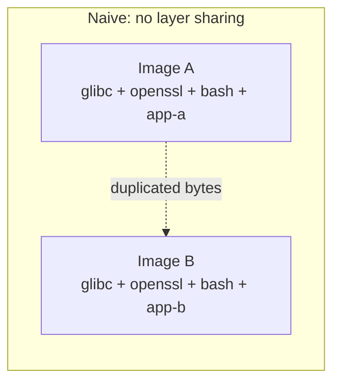
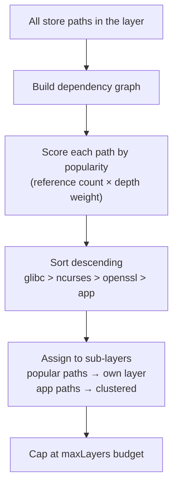
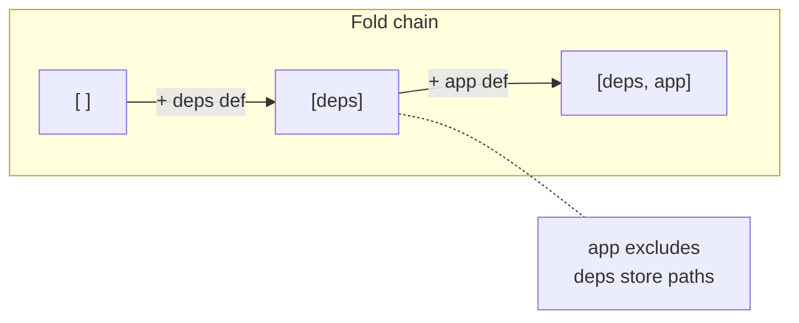
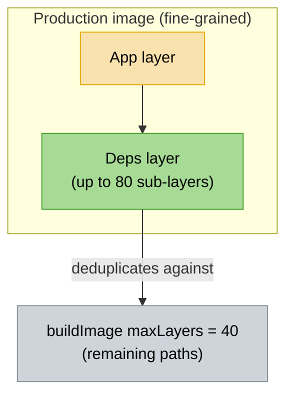
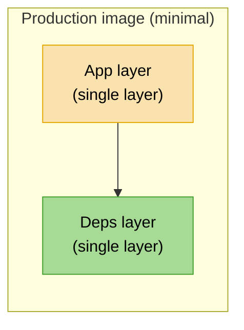
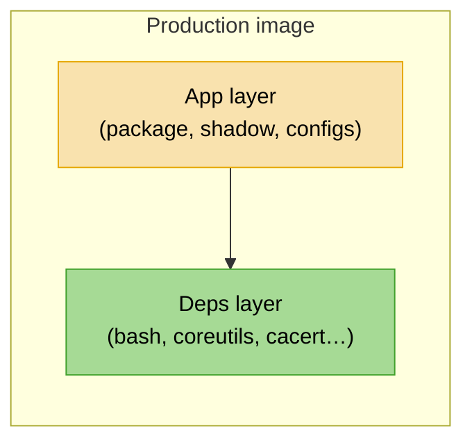
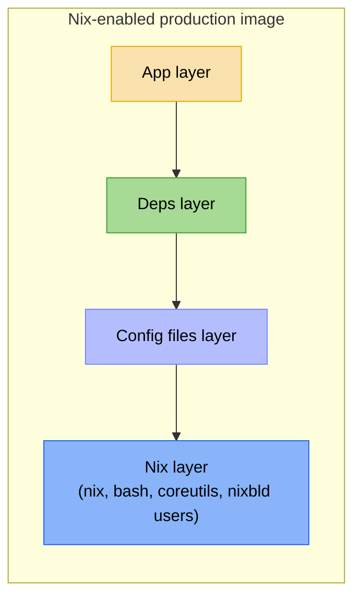
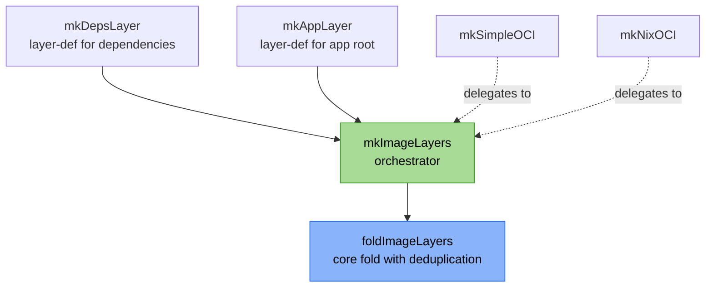

+++
title = "Optimized layer sharing"
description = "How the layering heuristic deduplicates store paths across images"
+++

# Optimized layer sharing

nix-oci can split your container into multiple OCI layers using a
**store-path popularity algorithm** combined with **fold-based
deduplication**, so that images sharing common dependencies automatically
share layers in the registry.

## The problem

A naive Nix-built container puts every store path into a single layer.
When you push two images that both depend on glibc, openssl, and bash,
the registry stores those bytes twice. Pulls are equally wasteful --
every deploy re-downloads the full image even if only your application
code changed.



The problem gets worse with **image variants** (e.g. debug flavours):
a variant typically adds a handful of tools on top of an otherwise
identical base image. Without explicit layer sharing, the entire image
is rebuilt from scratch and shares zero bytes in the registry.

## The layering heuristic

nix-oci applies a two-level strategy when `optimizeLayers = true`:

### Level 1: nix2container's popularity algorithm

Each `buildLayer` / `buildImage` call with a `maxLayers` cap triggers
nix2container's internal store-path popularity algorithm (originally
described in [Nix and layered Docker images](https://grahamc.com/blog/nix-and-layered-docker-images)
by Graham Christensen):



Because Nix store paths are immutable and content-addressed, two images
that share the same glibc store path produce byte-identical layers.
The registry deduplicates them automatically.

### Level 2: fold-based cross-layer deduplication

nix2container builds each layer independently by default. When you have
multiple explicit layers (deps, app), shared store paths like
glibc can **duplicate** across layers, as documented in
[Nix & Docker: Layer explicitly without duplicate packages](https://blog.eigenvalue.net/2023-nix2container-everything-once/).

nix-oci solves this with a **fold pattern**: it builds layers in order,
and each layer references all prior layers via the `layers` attribute.
nix2container then excludes any store path already present in a
predecessor:



```nix
# Simplified -- see mkImageLayers.nix for the real implementation
foldImageLayers = { nix2container, layerDefs }:
  let
    mergeToLayer = priorLayers: layerDef:
      let
        layer = nix2container.buildLayer (layerDef // { layers = priorLayers; });
      in
        priorLayers ++ [ layer ];
  in
    lib.foldl mergeToLayer [] layerDefs;
```

The result: **zero duplicated store paths** across layers.

## Layer strategies

The [`layerStrategy`](../../reference/flake-parts-options.html) option
controls how aggressively nix2container splits store paths into
sub-layers. It only takes effect when you enable
[`optimizeLayers`](../../reference/flake-parts-options.html).
See the option reference for default values and allowed values
([flake-parts](../../reference/flake-parts-options.html),
[NixOS](../../reference/nixos-options.html),
[Home Manager](../../reference/home-manager-options.html)).

### `"fine-grained"`

Each logical layer is further split using the popularity algorithm.
Best for registries hosting many images with overlapping dependencies.



| Scope | `maxLayers` |
|---|---|
| Dependencies layer | 80 |
| `buildImage` (remaining) | 40 |
| Total budget | ~124 (under 127 OCI limit) |

### `"minimal"`

Exactly one layer per concern, no sub-splitting. Most predictable
cache behaviour: adding a dependency only invalidates the deps layer.
Best for projects with few images.



| Scope | Layers |
|---|---|
| Dependencies | exactly 1 |
| Application | exactly 1 |
| Total | 2 |

## The layer stack

The options that control layer composition
([`optimizeLayers`](../../reference/flake-parts-options.html),
[`layerStrategy`](../../reference/flake-parts-options.html),
[`dependencies`](../../reference/flake-parts-options.html))
appear in the option reference. This section explains the
resulting image structure.

### Production image



- **App layer**: changes on each rebuild
- **Deps layer**: stable, shared across images

For Nix-enabled containers ([`installNix`](../../reference/flake-parts-options.html)),
a **Nix layer** is prepended and all subsequent layers deduplicate against it:



### Flavour images

Flavours (variant images defined via `flavours.<name>`) are full
containers that inherit the parent's config. Each flavour goes through
the same layer pipeline independently, so images sharing the same
dependencies benefit from registry-level layer deduplication via
content-addressed store paths.

## Enable it

Set [`optimizeLayers`](../../reference/flake-parts-options.html) and
optionally [`layerStrategy`](../../reference/flake-parts-options.html).
See the option reference for default values per context:
[flake-parts](../../reference/flake-parts-options.html),
[NixOS deploy](../../reference/nixos-options.html),
[Home Manager deploy](../../reference/home-manager-options.html),
[system-manager deploy](../../reference/system-manager-options.html).

### flake-parts (build-time)

```nix
perSystem = { ... }: {
  oci.containers.my-app = {
    package = pkgs.hello;
    optimizeLayers = true;
    layerStrategy = "minimal";
  };
};
```

### Deploy modules (NixOS / Home Manager / system-manager)

```nix
oci.containers.my-app = {
  package = pkgs.hello;
  optimizeLayers = true;
  layerStrategy = "minimal";
};
```

## Example: production + debug flavour

```nix
oci.containers.my-app = {
  package = pkgs.myApp;
  dependencies = with pkgs; [ bashInteractive coreutils cacert ];
  optimizeLayers = true;
  layerStrategy = "fine-grained";

  flavours.debug = {
    dependencies = with pkgs; [ curl strace ];
  };
};
```

With this setup:
- **Production image** (`oci-my-app`): deps layer + app layer
- **Debug image** (`oci-my-app-debug`): inherits all parent config, adds curl and strace to dependencies
- Images sharing the same base dependencies get registry-level layer deduplication via content-addressed store paths

## Lib function composition



`mkImageLayers` is the single entry point that defines the ordering
heuristic. Both `mkSimpleOCI` and `mkNixOCI` delegate to it. Flavour
images go through the same pipeline as regular containers; each
flavour is a full container evaluated independently.

## Beyond layer sharing: lazy pulling

Layer sharing reduces *how much* is downloaded, but lazy pulling reduces
*when* bytes are fetched. With the [turbo push backend](./turbo-push-backend.md),
nix-oci can produce SOCI v2 indexes or eStargz layers that enable
containers to start before the full image is downloaded. The deploy
modules (`oci.snapshotter.*`) configure the host-side snapshotters
that consume these artifacts. See [Turbo push backend](./turbo-push-backend.md)
for the full picture.

## Further reading

- [Turbo push backend](./turbo-push-backend.md): cross-machine layer caching, SOCI v2 lazy pulling, eStargz, and deploy-side snapshotter configuration
- [Nix and layered Docker images](https://grahamc.com/blog/nix-and-layered-docker-images): the original popularity algorithm
- [nix2container](https://github.com/nlewo/nix2container): the backend that implements layering
- [Nix & Docker: Layer explicitly without duplicate packages](https://blog.eigenvalue.net/2023-nix2container-everything-once/): the fold pattern for cross-layer deduplication
- [Building container images with Nix](https://lewo.abesis.fr/posts/nix-build-container-image/): the foundational ideas behind nix2container
