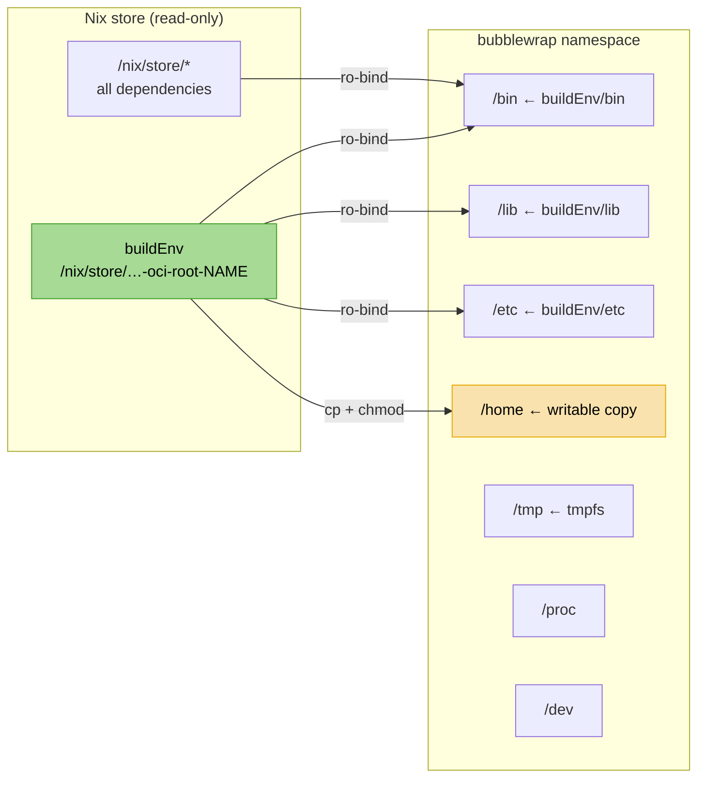

+++
title = "Container sandbox"
description = "Rootless, isolated shell into any container's filesystem using bubblewrap -- no Docker or Podman required"
+++

# Container sandbox

nix-oci generates a **bubblewrap sandbox** for every container, giving you
an instant, rootless, isolated shell into the container's filesystem without
requiring Docker, Podman, or any OCI runtime.

```bash
nix run .#oci-sandbox-nginx
```

This drops you into an interactive bash shell where `/bin`, `/etc`, and
`/home` are the container's -- not the host's.

## How it works

Every container's root filesystem is built as a single `pkgs.buildEnv`
derivation in the Nix store. The sandbox reuses this derivation directly
rather than building and loading an OCI image:



The sandbox script performs these steps:

1. **Bind-mount `/nix/store`** read-only -- symlinks inside the `buildEnv`
   resolve through this mount
2. **Bind-mount `buildEnv` subdirectories** (`/bin`, `/lib`, `/etc`) into
   their FHS positions, read-only
3. **Copy the home directory** to a writable tmpdir -- tools like starship,
   git, and bash need to write to `~/.cache`, `~/.local`, etc.
4. **Set environment variables** -- `PATH`, `HOME`, `USER`, `TERM`, plus
   all container-declared environment variables
5. **Apply PID namespace isolation** -- processes inside the sandbox cannot
   see or signal host processes
6. **Exec into bash** (or a user-provided command)

## Usage

```bash
# Interactive bash shell (default)
nix run .#oci-sandbox-nginx

# Run a specific command
nix run .#oci-sandbox-nginx -- ls -la /etc/nginx

# Run the container's entrypoint
nix run .#oci-sandbox-nginx -- /bin/nginx -v

# Inspect /etc/passwd (shows container users, not host)
nix run .#oci-sandbox-postgres -- cat /etc/passwd
```

The sandbox adds `coreutils` and `bash` to `PATH` after the container's
own `/bin`, so you always have `ls`, `cat`, `grep`, etc. available for
exploration -- even in minimal containers that only ship a single binary.

## Home-manager integration

When a container uses `homeConfig`, the sandbox automatically picks up
home-manager's dotfiles. nix-oci provides internal defaults (all
`mkDefault`, user-overridable) that make the sandbox experience pleasant
out of the box:

| Default | Value |
|---|---|
| **Shell** | `programs.bash.enable = true` with history and aliases (`ll`, `la`, `l`) |
| **Prompt** | `programs.starship` with container-aware format (username, hostname, directory, git, nix-shell) |
| **TERM** | `xterm-256color` |

These defaults are injected as `hmContainerDefaults` in the NixOS eval
and apply to all containers with `homeConfig.enable = true`. Override
any setting in your `homeConfig.modules`:

```nix
homeConfig = {
  enable = true;
  homeManagerFlake = inputs.home-manager;
  modules = [
    ({ ... }: {
      # Override the default starship symbol
      programs.starship.settings.character.success_symbol = "[>](bold cyan)";

      # Disable starship entirely
      # programs.starship.enable = false;
    })
  ];
};
```

## What is isolated

| Resource | Isolation | Details |
|---|---|---|
| **Filesystem** | Isolated | Only container's `/bin`, `/lib`, `/etc` visible; host dirs hidden |
| **PID namespace** | Isolated | `--unshare-pid`; host processes invisible |
| **Home directory** | Writable copy | Copied from Nix store to tmpdir; discarded on exit |
| **`/tmp`** | Isolated | Fresh tmpfs per sandbox session |
| **Network** | Shared | Host network available (useful for debugging DNS, HTTP, etc.) |
| **`/nix/store`** | Read-only | Entire store visible (required for symlink resolution) |

## Comparison with alternatives

| | `oci-sandbox-*` | `docker run` | `nix-shell` |
|---|---|---|---|
| Requires runtime daemon | No | Yes | No |
| Filesystem isolation | Yes (bwrap) | Yes (namespaces) | No |
| Uses exact container filesystem | Yes | Yes | No (different env) |
| Build time | Instant (reuses `buildEnv`) | Must build + load image | N/A |
| Diffable | `nix-diff` on store paths | Layer tars | N/A |
| Writable home | Yes (tmpdir copy) | Yes (overlay) | Yes (host home) |
| Security policies | Deferred (v2) | seccomp, AppArmor | None |

## Architecture

The sandbox is implemented across four files:

- **`nix/lib/oci.nix`** (`mkSandboxScript`) -- pure function that generates
  the bubblewrap wrapper script
- **`nix/modules/oci/lib/mkSandbox.nix`** -- nix-lib module wrapper,
  exposes `config.lib.oci.mkSandboxScript`
- **`nix/modules/oci/internal/packages.nix`** -- `sandboxApps` and
  `prefixedSandboxApps` options that generate one script per container
- **`nix/modules/oci/outputs/apps.nix`** -- wires sandbox apps into
  `oci.flake.apps`

The sandbox reads the container's `nixosConfig.eval` to obtain the
`rootFilesystem`, `entrypoint`, `workingDir`, and `user` -- the same
data used to build the OCI image.

## Future work

- **Seccomp enforcement** -- the OCI JSON profile needs BPF compilation
  for bubblewrap's `--seccomp` flag
- **Landlock enforcement** -- requires a wrapper binary that calls
  `landlock_restrict_self` before exec
- **Network isolation** -- opt-in `--unshare-net` flag
- **Volume mounts** -- bind-mount paths matching `declaredVolumes`
