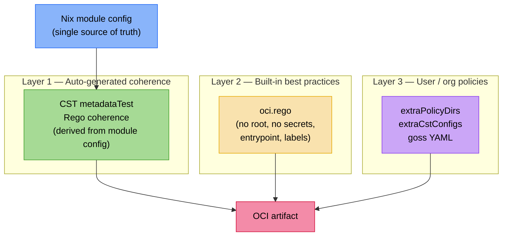

+++
title = "Policy composition and coherence testing"
description = "How nix-oci uses the Nix module config as a single source of truth for multi-backend container validation: auto-generated coherence checks, built-in security policies, and user-extensible policy composition"
+++

# Policy composition and coherence testing

nix-oci validates container images at three layers, each serving a
different purpose. Understanding these layers explains why certain
checks exist, when to write your own policies, and why nix-oci can
auto-generate validation that Dockerfile-based toolchains cannot.

## The three-layer validation model



**Layer 1 — Auto-generated coherence checks** validate that the built
OCI artifact matches what the Nix module config declared. These are
*derived* from the config, not written by hand.

**Layer 2 — Built-in best practices** are static Rego rules that
enforce universal security hygiene (no root, no secrets in environment
variables, entrypoint must exist). These ship with nix-oci and apply to
every container by default.

**Layer 3 — User/org policies** are rules specific to your
organisation: required labels, naming conventions, allowed ports, team
ownership. These are supplied via `extraPolicyDirs` or custom CST
configs and compose *on top of* the built-in policies.

## Why Nix is the meta-definition

Most container policy engines (OPA/Gatekeeper, Kyverno, Conftest) exist
because Dockerfiles are imperative and error-prone — you *need* a
post-hoc policy gate because the build process does not guarantee
anything about the output.

nix-oci is fundamentally different. The Nix module system is a
constraint-based configuration language with types, assertions, and
composable defaults. It already *knows* what the container should look
like at evaluation time:

```
Dockerfile → (opaque build) → artifact → (policy check) ← information gap
Nix config → (nix eval)     → artifact → (policy check) ← derived from config
```

This means nix-oci can close the loop: the module config declares the
container's properties, and the validation artifacts are *generated*
from the same config. No separate policy language, no manual
synchronisation, no drift.

CUE, Nickel, and Rego were considered as intermediate meta-languages.
The conclusion: **Nix module config is already the meta-definition**.
Each validation backend (Conftest, CST, dgoss) gets its own generator
function — a Nix function that reads the container config and produces
backend-specific output. No new language or dependency is needed.

## Coherence checking in practice

When container-structure-test is enabled with `coherence = true`
(the default), nix-oci auto-generates a CST `metadataTest` config
from the container's module options:

| Module option | CST metadataTest field |
|---|---|
| `user` | `user` |
| `entrypoint` | `entrypoint` |
| `ports` | `exposedPorts` |
| `labels` | `labels` (user-declared only) |
| `environment` | `env` (via NixOS eval `envVars`) |
| `workingDir` | `workdir` |
| `declaredVolumes` | `volumes` |

The auto-generated config is prepended to any user-supplied CST
configs, so both run together. If you supply your own YAML with
filesystem tests or command tests, those compose naturally alongside
the coherence metadata checks.

### What coherence catches

Coherence checks are defence-in-depth. They catch:

- **nix2container bugs** — a layer composition issue silently drops a
  label or changes the entrypoint.
- **fromImage overrides** — a base image sets `USER root` and
  overrides your non-root configuration.
- **NixOS eval surprises** — a service activation changes the
  environment variables or working directory.

### What coherence does not replace

Coherence validates *the artifact matches the intent*. It does not
replace:

- **Organisational policies** (Layer 3) — "all images must have a
  `team` label" is a constraint *on* the config, not derived from it.
- **Security scanning** — CVE scanning, SBOM generation, and
  credentials leak detection operate on the image contents, not the
  config metadata.

## Policy composition

Setting `policyDir` replaces the built-in policies entirely. This is
useful when you want full control, but it means losing the built-in
`oci.rego` rules.

`extraPolicyDirs` solves this. It merges additional Rego directories
*with* the built-in policies using a symlink-join derivation:

```nix
oci.policy.conftest = {
  enabled = true;
  extraPolicyDirs = [ ./my-org-policies ./team-policies ];
};
```

Both the built-in rules (no root, secrets check, entrypoint, labels)
and your custom rules run together. If an extra directory contains a
file with the same name as a built-in (e.g., `oci.rego`), the extra
directory's version takes precedence — allowing selective override of
specific built-in rules.

When `extraPolicyDirs` is empty (the default), no merge derivation is
created — `policyDir` is used directly with zero overhead.

## Design decisions

### Why auto-generated labels are excluded from coherence

The CST coherence test validates **user-declared fields only** (user,
entrypoint, ports, user-declared labels, env, workdir, volumes). It
intentionally excludes auto-generated labels (OCI annotations, build
metadata, hardening hints).

The reasons:

1. Auto-generated labels are already validated by the option test
   system (`_tests.assertions.imageConfig`).
2. Including them would tightly couple coherence tests to the internal
   label generation logic — any change to auto-label format would
   break all coherence tests.
3. It avoids needing `globalConfig` in the CST code path, keeping the
   interface simple.

### Why three layers instead of one

A single validation layer would force a choice: either ship a large
static policy set (which becomes opinionated and hard to maintain) or
ship nothing and let users write everything (which means no security by
default).

Three layers give each concern a clear owner:

- **Layer 1** is owned by the build system (automatic, zero config).
- **Layer 2** is owned by nix-oci maintainers (universal, small,
  stable).
- **Layer 3** is owned by users and their organisations (specific,
  extensible, composable).

## Further reading

- [Supply-chain security](security/index.html)
  — detailed coverage of each security tool integration
- [Security defaults](security-defaults.html)
  — why nix-oci defaults to non-root, distroless containers
- [flake-parts option reference](../../reference/flake-parts-options.html)
  — all `oci.policy.conftest.*` and `oci.test.containerStructureTest.*`
  options
