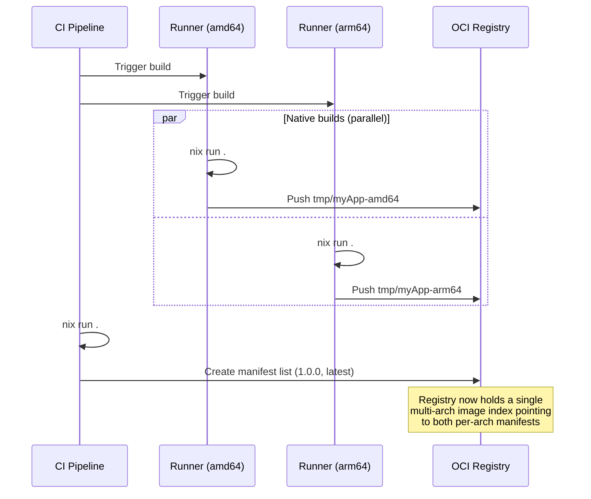
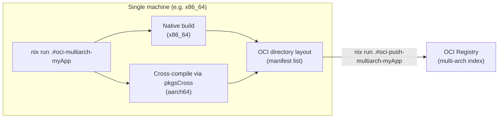
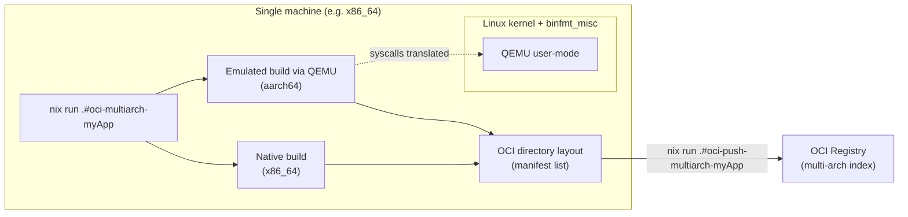
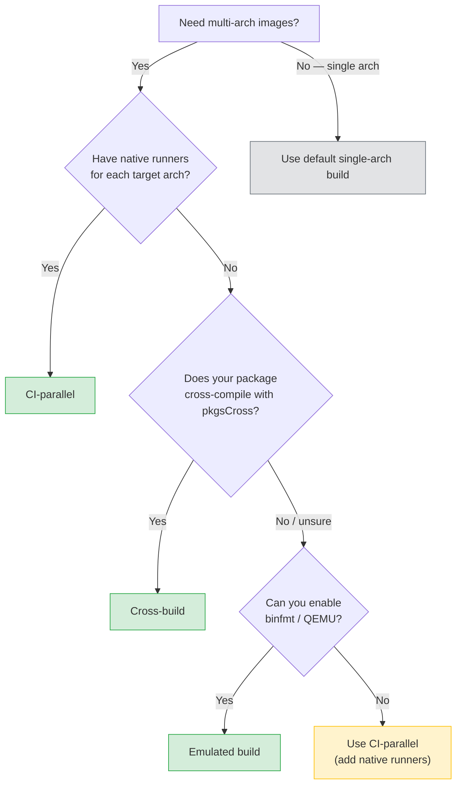

+++
title = "Multi-architecture images"
description = "How nix-oci builds OCI images that run on multiple CPU architectures from a single declaration"
+++

# Multi-architecture images

nix-oci supports building OCI images that target multiple CPU
architectures (e.g. `amd64` and `arm64`) from a single container
declaration. A multi-arch image is an
[OCI image index](https://github.com/opencontainers/image-spec/blob/main/image-index.md)
(manifest list) that contains one per-architecture manifest. Container
runtimes automatically select the correct manifest for the host they run
on.

## Three strategies

nix-oci offers three complementary workflows for producing multi-arch
images:

### CI-parallel: native builds on multiple runners

Each CI runner builds the image for its own native architecture, pushes a
temporary per-arch tag, and a final merge step assembles the manifest
list.

```nix
oci.containers.myApp = {
  package = pkgs.hello;
  registry = "ghcr.io/myorg";
  tags = [ "1.0.0" "latest" ];
  multiArch.systems = [
    "x86_64-linux"
    "aarch64-linux"
  ];
};
```

See [`multiArch`](../reference/flake-parts-options.html) in the flake-parts option reference.

This produces:

| Flake output | Purpose |
|---|---|
| `oci-push-tmp-myApp-amd64` | Push the amd64 image with a temporary tag |
| `oci-push-tmp-myApp-arm64` | Push the arm64 image with a temporary tag |
| `oci-merge-myApp` | Create the manifest list and tag it |

A typical CI pipeline runs `oci-push-tmp-*` in parallel on native
runners, then runs `oci-merge-*` once all runners finish pushing.



See the [CI multi-arch example](https://github.com/Dauliac/nix-oci/blob/main/examples/flake/multi-arch/ci-multi-arch-01.nix)
and the [CI multi-arch with custom tags example](https://github.com/Dauliac/nix-oci/blob/main/examples/flake/multi-arch/ci-multi-arch-custom-tags-01.nix).

### Cross-build: all arches from a single machine

When `crossBuild.enable = true`, non-native architectures are
cross-compiled on the current host using Nix's `pkgsCross`
infrastructure. The result is a single OCI directory layout containing
the manifest list, with no registry or merge step needed.

```nix
oci.containers.myApp = {
  package = pkgs.hello;
  registry = "localhost:5000";
  tags = [ "1.0.0" "latest" ];
  multiArch = {
    systems = [
      "x86_64-linux"
      "aarch64-linux"
    ];
    crossBuild.enable = true;
  };
};
```

See [`multiArch.crossBuild`](../reference/flake-parts-options.html) in the flake-parts option reference.

This produces:

| Flake output | Purpose |
|---|---|
| `oci-multiarch-myApp` | OCI directory layout with the manifest list |
| `oci-push-multiarch-myApp` | Push the multi-arch image to a registry |



See the [cross-build example](https://github.com/Dauliac/nix-oci/blob/main/examples/flake/multi-arch/cross-build-01.nix)
and the [cross-build with dependencies example](https://github.com/Dauliac/nix-oci/blob/main/examples/flake/multi-arch/cross-build-with-deps-01.nix).

### Emulated build: QEMU binfmt emulation

When `emulatedBuild.enable = true`, non-native architectures are built
under QEMU user-mode emulation. Instead of cross-compiling with
`pkgsCross`, nix-oci imports nixpkgs for the target system and builds
natively under emulation. This is slower than cross-compilation but
works for **any package** — including those that fail to cross-compile.

```nix
oci.containers.myApp = {
  package = pkgs.hello;
  registry = "localhost:5000";
  tags = [ "1.0.0" "latest" ];
  multiArch = {
    systems = [
      "x86_64-linux"
      "aarch64-linux"
    ];
    emulatedBuild.enable = true;
  };
};
```

See [`multiArch.emulatedBuild`](../reference/flake-parts-options.html) in the flake-parts option reference.

Prerequisites:

- **NixOS**: `boot.binfmt.emulatedSystems = [ "aarch64-linux" ];`
- **nix.conf**: `extra-platforms = aarch64-linux`

Like cross-build, this produces `oci-multiarch-*` and
`oci-push-multiarch-*` outputs with no CI merge step needed.



See the [emulated build example](https://github.com/Dauliac/nix-oci/blob/main/examples/flake/multi-arch/emulated-build-01.nix).

## Automatic package inference

For both strategies, nix-oci automatically resolves cross-compiled
packages via `pkgsCross`. When the container declares
`package = pkgs.hello`, nix-oci infers the arm64 variant as
`pkgs.pkgsCross.aarch64-multiplatform.hello`, with no manual `archConfigs`
needed.

nix-oci infers dependencies listed in `dependencies` the same way. Any
dependency whose `pname` does not match a `pkgsCross` attribute is
silently dropped for that architecture.

## Manual overrides with archConfigs

When auto-inference fails (e.g. custom derivations, `writeShellApplication`,
or packages with a different attribute name in `pkgsCross`), override the
package per-architecture:

```nix
oci.containers.myApp = {
  package = myScript;
  multiArch = {
    systems = [ "x86_64-linux" "aarch64-linux" ];
    crossBuild.enable = true;
  };
  archConfigs."aarch64-linux".package = myScriptArm;
};
```

See the [cross-build with writeShellApplication example](https://github.com/Dauliac/nix-oci/blob/main/examples/flake/multi-arch/cross-build-write-shell-01.nix).

## Supported architectures

| Nix system | OCI architecture | pkgsCross attribute |
|---|---|---|
| `x86_64-linux` | `amd64` | `gnu64` |
| `aarch64-linux` | `arm64` | `aarch64-multiplatform` |
| `armv7l-linux` | `arm/v7` | `armv7l-hf-multiplatform` |
| `riscv64-linux` | `riscv64` | `riscv64` |

## When to use which strategy

| | CI-parallel | Cross-build | Emulated build |
|---|---|---|---|
| **Build speed** | Fast -- native on each runner | Moderate -- cross-compilation overhead | Slowest -- QEMU emulation overhead |
| **CI infrastructure** | Needs runners for each arch | Single runner | Single runner + binfmt |
| **Registry required** | Yes (temporary tags) | No (local OCI directory) | No (local OCI directory) |
| **Package compatibility** | Any | Requires pkgsCross support | Any |
| **Best for** | Production CI with multi-arch runners | Packages that cross-compile cleanly | Packages that fail to cross-compile |

## Decision diagram

Use this flowchart to pick the right strategy for your situation:



**Quick summary:**

1. **CI-parallel** — fastest builds, but requires CI runners for each architecture.
2. **Cross-build** — single machine, good speed, but the package must support `pkgsCross`.
3. **Emulated build** — single machine, works with any package, but slowest.

## Options reference

See the [flake-parts option reference](../reference/flake-parts-options.html) for
default values and full type details.

| Option | Description |
|---|---|
| [`multiArch.systems`](../reference/flake-parts-options.html) | Target architectures (non-empty enables multi-arch) |
| [`multiArch.crossBuild.enable`](../reference/flake-parts-options.html) | Cross-compile all arches locally |
| [`multiArch.tempTagPrefix`](../reference/flake-parts-options.html) | Prefix for temporary per-arch tags (CI workflow) |
| [`archConfigs.<system>.package`](../reference/flake-parts-options.html) | Per-arch package override |
| [`multiArch.emulatedBuild.enable`](../reference/flake-parts-options.html) | Build under QEMU binfmt emulation |
| [`archConfigs.<system>.dependencies`](../reference/flake-parts-options.html) | Per-arch dependencies override |

## All multi-arch examples

- [CI multi-arch](https://github.com/Dauliac/nix-oci/blob/main/examples/flake/multi-arch/ci-multi-arch-01.nix): parallel native builds + merge
- [CI multi-arch with custom tags](https://github.com/Dauliac/nix-oci/blob/main/examples/flake/multi-arch/ci-multi-arch-custom-tags-01.nix): multiple tags on the manifest list
- [CI multi-arch single system](https://github.com/Dauliac/nix-oci/blob/main/examples/flake/multi-arch/ci-multi-arch-single-system-01.nix): start with one arch, add more later
- [Cross-build](https://github.com/Dauliac/nix-oci/blob/main/examples/flake/multi-arch/cross-build-01.nix): basic cross-compilation
- [Cross-build with dependencies](https://github.com/Dauliac/nix-oci/blob/main/examples/flake/multi-arch/cross-build-with-deps-01.nix): auto-inferred cross deps
- [Cross-build jq](https://github.com/Dauliac/nix-oci/blob/main/examples/flake/multi-arch/cross-build-jq-01.nix): real-world package
- [Cross-build non-root](https://github.com/Dauliac/nix-oci/blob/main/examples/flake/multi-arch/cross-build-non-root-01.nix): multi-arch with user/labels
- [Cross-build writeShellApplication](https://github.com/Dauliac/nix-oci/blob/main/examples/flake/multi-arch/cross-build-write-shell-01.nix): manual archConfigs override
- [Emulated build](https://github.com/Dauliac/nix-oci/blob/main/examples/flake/multi-arch/emulated-build-01.nix): QEMU binfmt emulation for any package
- [Single extra arch](https://github.com/Dauliac/nix-oci/blob/main/examples/flake/multi-arch/single-extra-arch-01.nix): add arm64 to an amd64-native build
