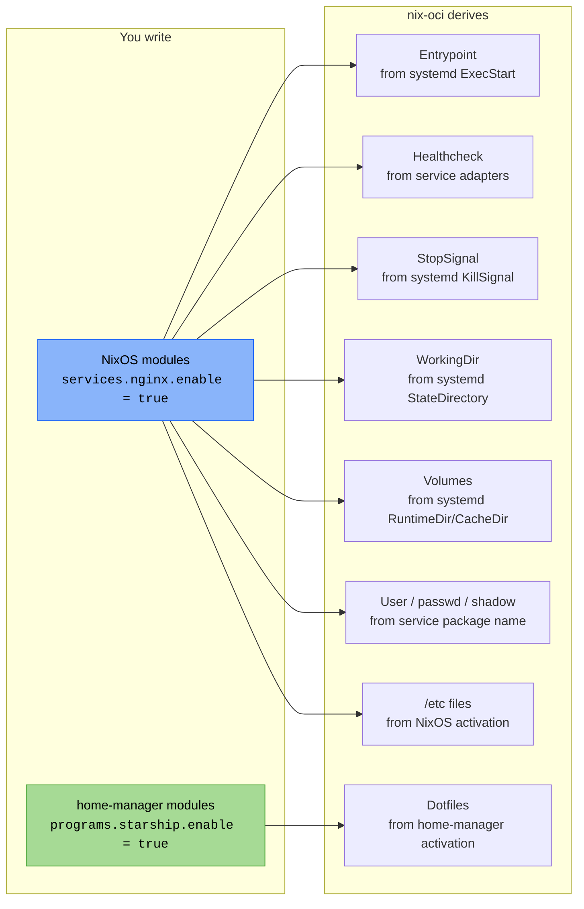

+++
title = "NixOS and home-manager in containers"
description = "How nix-oci leverages NixOS module evaluation and home-manager to produce containers that are declarative, introspectable, and comfortable to work in"
+++

# NixOS and home-manager in containers

nix-oci builds on a radical idea: **containers are just NixOS systems
without a kernel**. Instead of writing Dockerfiles or shell scripts, you
write NixOS module configuration, the same language used to configure
full NixOS machines, and nix-oci evaluates it into a minimal OCI image.

Home-manager extends this further: dotfiles, shell configuration, and
developer tooling bake into the container at build time, producing
images that are not only functional servers but also comfortable
environments to work in.

## Why NixOS modules matter for containers

### The Dockerfile problem

Traditional container images suffer from three fundamental issues:

1. **Imperative construction**: Dockerfiles are sequences of shell
   commands. The final state depends on execution order, layer caching,
   and implicit state from base images.
2. **No introspection**: once built, there's no way to ask "what
   services does this configure?" or "what user runs this process?" without
   reverse-engineering the image.
3. **Manual metadata**: operators must specify healthchecks, stop signals,
   exposed ports, and labels by hand and keep them in sync with the
   actual service configuration.

### The NixOS module answer

NixOS modules are **declarative**, **composable**, and **introspectable**.
nix-oci evaluates them in a container context and extracts everything
needed to build a correct OCI image:



A single `services.nginx.enable = true` gives you:

- The correct entrypoint (`nginx` in foreground mode via a
  [service adapter](../reference/flake-parts-options.md#service-adapters))
- A healthcheck (probing `stub_status` on localhost)
- The right stop signal (`SIGQUIT` for graceful shutdown)
- A non-root user derived from the package name
- `/etc/nginx/` configuration files
- Automatic [OCI labels](./automatic-labeling.md) describing the image

None of this requires a Dockerfile, a shell script, or manual
configuration. See [Automatic metadata derivation](./automatic-metadata.md)
for the full list of auto-derived fields.

## How the NixOS evaluation works

When you use `nixosConfig.modules` or `mainService` on a container, nix-oci
performs a full NixOS module evaluation in a minimal context:

1. **Imports** `_nixos-oci/` modules: entrypoint extraction,
   healthcheck, hardening, performance, root filesystem assembly
2. **Forwards** container options via central routing (`environment.variables`,
   `extraPackages`, `generatedLabels`, `includedEtcFiles`)
3. **Merges** your `nixosConfig.modules` and `homeManager.modules`
4. **Extracts** the evaluated config: systemd units, `/etc` files,
   environment variables, users, and home-manager dotfiles
5. **Assembles** a `buildEnv` root filesystem from the results

The evaluation is lazy; nix-oci only materializes what the image
actually needs. A container with `services.nginx` does not pull in
systemd, sudo, or the full NixOS default package set.

## Home-manager: dotfiles as infrastructure

Home-manager manages user-level configuration: shell, prompt, editor,
git, SSH keys, XDG directories. In a container context, this means
dotfiles are **reproducible build artifacts**, not runtime state.

### What home-manager enables

- **Shell configuration**: `.bashrc`, `.zshrc` with aliases, completions,
  history settings
- **Prompt**: [starship](https://starship.rs/) or any prompt system,
  configured declaratively
- **Git**: `.gitconfig` with user identity, aliases, signing
- **Editor**: neovim/vim/emacs with plugins and language servers
- **XDG directories**: `~/.config/`, `~/.local/share/` populated at
  build time

### Container-friendly defaults

When you set [`homeManager.flake`](../reference/flake-parts-options.html),
nix-oci injects sensible defaults (all `lib.mkDefault`, freely overridable):

- **Bash** with history configuration and common aliases
- **Starship** with a container-aware prompt format showing username,
  hostname, directory, git status, and a container indicator
- **TERM** environment variable configured for color support

These defaults work with the
[container sandbox](./sandbox.md), giving you a pleasant interactive
shell without any configuration.

### How nix-oci bakes in dotfiles

Home-manager produces an **activation package** containing a `home-files`
directory tree with symlinks to Nix store paths:

```
home-manager-generation/
  home-files/
    .bashrc -> /nix/store/...-bashrc
    .config/
      starship.toml -> /nix/store/...-starship.toml
      git/config -> /nix/store/...-gitconfig
```

nix-oci copies this tree into the container's home directory during the
root filesystem `buildEnv` assembly. The resulting OCI image contains
the dotfiles as regular files, ready to use at container start.

## The consumer provides home-manager

nix-oci does **not** bundle home-manager as a dependency. Consumers
provide it via their flake inputs and pass it through
`homeManager.flake`:

```nix
{
  inputs = {
    nix-oci.url = "github:Dauliac/nix-oci";
    home-manager.url = "github:nix-community/home-manager";
  };

  outputs = { nix-oci, home-manager, ... }:
    nix-oci.inputs.flake-parts.lib.mkFlake { inherit inputs; } {
      imports = [ nix-oci.modules.flake.nix-oci ];

      perSystem = { pkgs, ... }: {
        oci.containers.my-app = {
          package = pkgs.curl;
          homeManager = {
            flake = home-manager;
            modules = [
              ({ ... }: {
                programs.starship.settings.character.success_symbol = "[>](cyan)";
              })
            ];
          };
        };
      };
    };
}
```

This keeps nix-oci's dependency tree minimal and lets consumers pin
their own home-manager version.

## Composability: the real power

NixOS modules and home-manager modules are composable by design. You
can split configuration across files, override defaults, and share
modules between containers:

```nix
# shared/dev-tools.nix -- reusable home-manager module
{ pkgs, ... }: {
  programs.git.enable = true;
  programs.starship.enable = true;
  programs.bash.shellAliases.k = "kubectl";
}
```

```nix
# Container A uses shared module + adds curl
oci.containers.api = {
  package = pkgs.my-api;
  homeConfig = {
    homeManagerFlake = inputs.home-manager;
    modules = [ ./shared/dev-tools.nix ];
  };
};

# Container B uses the same shared module + adds psql
oci.containers.worker = {
  package = pkgs.my-worker;
  dependencies = [ pkgs.postgresql ];
  homeConfig = {
    homeManagerFlake = inputs.home-manager;
    modules = [
      ./shared/dev-tools.nix
      ({ ... }: { programs.bash.shellAliases.db = "psql"; })
    ];
  };
};
```

Both containers share the same dev-tools baseline but can extend it
independently. Changes to `dev-tools.nix` propagate to all containers
that import it: a single source of truth.

## See also

- [Container module options](../reference/flake-parts-options.md): full reference for `nixosConfig` and `homeConfig`
- [Container sandbox](./sandbox.md): interactive shell leveraging home-manager dotfiles
- [Automatic metadata derivation](./automatic-metadata.md): healthchecks, stop signals, working directories from NixOS services
- [flake-parts options](../reference/flake-parts-options.md): build-time container options
- [home-manager manual](https://nix-community.github.io/home-manager/): upstream documentation
- [home-manager options](https://nix-community.github.io/home-manager/options.xhtml): full option reference
- [NixOS options search](https://search.nixos.org/options): find any NixOS service option
