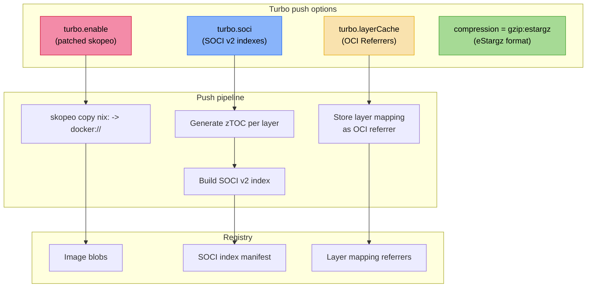
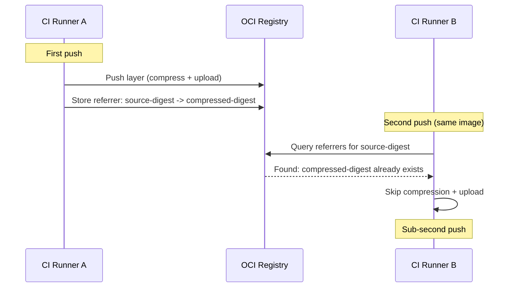
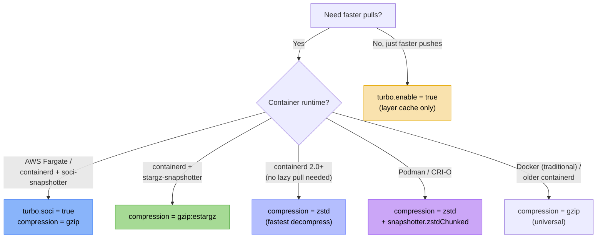

+++
title = "Turbo push backend"
description = "How nix2container-turbo adds cross-machine layer caching, SOCI v2 lazy pulling, and eStargz compression to nix-oci image pushes"
+++

# Turbo push backend

nix-oci integrates [nix2container-turbo](https://github.com/schlarpc/nix2container-turbo)
as an optional push backend that accelerates image distribution. Three
independent capabilities target different bottlenecks: layer
re-upload, cold-start latency, and lazy pulling.

## The problem

Default container pushes with nix2container have two inefficiencies:

- **Every push re-compresses and re-uploads all layers**, even if the
  registry already has them from a previous push on a different CI
  runner. nix2container's local layer cache (`nix2container-cache.json`)
  is per-machine; it does not survive ephemeral CI environments.
- **Cold-start is sequential**: the container runtime must download the
  *entire* image before the process starts. For large images (1 GB+),
  this can take 50+ seconds on AWS Fargate.

nix2container-turbo solves both problems by patching skopeo with three
new capabilities.

## Architecture overview



## Enabling turbo

### Global (all containers)

See [`oci.turbo`](../reference/flake-parts-options.html) in the flake-parts option reference.

```nix
perSystem = { ... }: {
  oci.turbo = {
    enable = true;   # use turbo-patched skopeo
    soci = true;     # generate SOCI v2 indexes
  };
};
```

### Per-container

See [`performance.turbo`](../reference/flake-parts-options.html) in the flake-parts option reference.

```nix
oci.containers.my-app = {
  package = pkgs.myApp;
  performance.turbo = {
    enable = true;
    soci = true;
  };
};
```

Per-container options inherit from the global `oci.turbo.*` defaults
and can be overridden individually. For example, enable turbo globally
but disable SOCI for a small container where it adds no benefit:

```nix
perSystem = { ... }: {
  oci.turbo = {
    enable = true;
    soci = true;
  };
  oci.containers.tiny-tool.performance.turbo.soci = false;
};
```

## Cross-machine layer caching

This is the most impactful feature. When turbo is enabled,
`turbo.layerCache` is `true` by default.

### How it works



1. nix2container annotates each layer with `n2ct.source-digest`, the
   uncompressed tar hash derived from the Nix store paths.
2. On first push, turbo stores a **referrer manifest** in the registry
   mapping `source-digest -> {compressed-digest, size, media-type}`.
3. On subsequent pushes from *any* machine, skopeo queries the
   [OCI Referrers API](https://github.com/opencontainers/distribution-spec/blob/main/spec.md#listing-referrers),
   finds the mapping, and tells the registry "this blob already exists":
   **zero re-compression, zero re-upload**.

### Performance impact

| Scenario | Without turbo | With turbo |
|---|---|---|
| Cold push (1 GB image) | ~35s | ~35s |
| Repush (unchanged layers) | ~35s | **< 1s** |
| Repush (1 layer changed) | ~35s | ~5s (only new layer) |

The key insight: in most CI pipelines, the majority of layers
(base packages, dependencies) are unchanged between builds. Only the
application layer changes. Turbo makes the common case near-instant.

### Registry requirements

The Referrers API is supported by:
- AWS ECR
- GitHub Container Registry (GHCR)
- Docker Hub
- Google Artifact Registry (GCR)
- Azure Container Registry

Most modern OCI-compliant registries support it. Older or
self-hosted registries (e.g., Harbor < 2.6) may not.

## SOCI v2 lazy pulling

SOCI (Seekable OCI) enables containers to start *before* the full
image is downloaded. The container runtime fetches only the bytes
needed for the first few file accesses, then streams the rest in
the background.

```nix
performance.turbo = {
  enable = true;
  soci = true;
  sociSpanSize = 4194304;  # 4 MiB (default)
};
```

See [`performance.turbo.soci`](../reference/flake-parts-options.html) in the flake-parts option reference.

### How it works

1. During push, turbo generates a **zTOC** (table of contents) for
   each gzip-compressed layer using C/zlib deflate checkpoints.
2. The zTOC contains:
   - A list of files with their byte offsets in the compressed stream
   - Deflate checkpoints at regular intervals (`sociSpanSize`)
   - SHA-256 digests for each span
3. All zTOCs are bundled into a **SOCI v2 index manifest** and pushed
   alongside the image in an OCI Index.
4. At pull time, containerd with
   [soci-snapshotter](https://github.com/awslabs/soci-snapshotter)
   fetches the SOCI index first, then lazily fetches compressed spans
   on demand via HTTP Range requests.

### Cold-start benchmarks

Measured on AWS Fargate (1 vCPU, 2 GB):

| Image | Plain gzip | With SOCI v2 |
|---|---|---|
| Firefox (~1 GB) | ~53s | **~20s** |
| Python3 (~50 MB) | ~21s | ~21s |

SOCI shines for large images. For small images (< 100 MB), the
overhead of fetching the SOCI index is comparable to just downloading
the full image.

### Span size tuning

The `sociSpanSize` option controls checkpoint granularity:

| Span size | Seeking precision | Index size | Best for |
|---|---|---|---|
| 1 MiB | Fine | Larger | Images with many small files |
| **4 MiB** (default) | Balanced | Moderate | General workloads |
| 8 MiB | Coarse | Smaller | Images with few large files |

### Requirements

- Container runtime: containerd with
  [soci-snapshotter](https://github.com/awslabs/soci-snapshotter)
- AWS Fargate supports SOCI natively
- Compression must be **gzip** (SOCI does not support zstd)

## eStargz compression

eStargz is an alternative lazy-pull format using multi-member gzip.
Unlike SOCI (which adds an index alongside the image), eStargz
modifies the layer format itself to be seekable.

```nix
oci.containers.my-app = {
  package = pkgs.myApp;
  performance = {
    turbo.enable = true;
    compression = "gzip:estargz";
  };
};
```

See [`performance.compression`](../reference/flake-parts-options.html) in the flake-parts option reference.

### Requirements

- Container runtime: containerd with
  [stargz-snapshotter](https://github.com/containerd/stargz-snapshotter)
- Requires turbo (`performance.turbo.enable = true`)

::: {.warning}
**eStargz and SOCI cannot be combined.** The soci-snapshotter does not
handle multi-member gzip (the eStargz format), so SOCI lazy pulling
only works with standard gzip compression. nix-oci enforces this with
an eval-time assertion.
:::

## Option reference

### Global options (`oci.turbo.*`)

| Option | Type | Default | Description |
|---|---|---|---|
| `oci.turbo.enable` | `bool` | `false` | Use turbo-patched skopeo for all containers |
| `oci.turbo.soci` | `bool` | `false` | Generate SOCI v2 indexes for all containers |
| `oci.turbo.sociSpanSize` | `int` | `4194304` | Default span size in bytes |
| `oci.turbo.layerCache` | `bool` | `true` | Cross-machine layer caching for all containers |

### Per-container options (`performance.turbo.*`)

| Option | Type | Default | Description |
|---|---|---|---|
| `performance.turbo.enable` | `bool` | `oci.turbo.enable` | Use turbo-patched skopeo |
| `performance.turbo.soci` | `bool` | `oci.turbo.soci` | Generate SOCI v2 indexes |
| `performance.turbo.sociSpanSize` | `int` | `oci.turbo.sociSpanSize` | Span size in bytes |
| `performance.turbo.layerCache` | `bool` | `oci.turbo.layerCache` | Cross-machine layer caching |

### Compression formats

| Format | Lazy pull | Requires turbo | Requires |
|---|---|---|---|
| `"gzip"` (default) | With SOCI | No | Universal |
| `"zstd"` | No | No | OCI 1.1+, containerd 2.0+ |
| `"gzip:estargz"` | Native | Yes | stargz-snapshotter |

## Safety assertions

nix-oci enforces valid option combinations at eval time:

- `turbo.enable = true` requires the `nix2container-turbo` flake input
- `turbo.soci = true` requires `compression != "zstd"` (SOCI needs gzip)
- `turbo.soci = true` requires `compression != "gzip:estargz"` (incompatible)
- `compression = "gzip:estargz"` requires `turbo.enable = true`

Invalid combinations fail during `nix eval`, not at push time.

## Performance labels

When turbo is enabled, nix-oci emits additional OCI labels:

| Label | Example value |
|---|---|
| `io.github.dauliac.nix-oci.performance.turbo` | `"true"` |
| `io.github.dauliac.nix-oci.performance.turbo-soci` | `"true"` |
| `io.github.dauliac.nix-oci.performance.turbo-layer-cache` | `"true"` |

These are visible via `skopeo inspect` or `docker inspect`.

## Full example

```nix
{
  perSystem = { pkgs, ... }: {
    # Global: enable turbo with SOCI for all containers
    oci.turbo = {
      enable = true;
      soci = true;
    };

    oci.containers = {
      # Large API image -- benefits from SOCI lazy pulling
      my-api = {
        package = pkgs.myApi;
        performance = {
          enable = true;
          allocator = "mimalloc";
          compression = "gzip";  # required for SOCI
        };
      };

      # Small CLI tool -- disable SOCI (overhead > benefit)
      my-tool = {
        package = pkgs.myTool;
        performance.turbo.soci = false;
      };

      # Desktop app with eStargz instead of SOCI
      my-desktop = {
        package = pkgs.myDesktop;
        performance = {
          turbo.soci = false;       # disable SOCI for this container
          compression = "gzip:estargz";  # use eStargz instead
        };
      };
    };
  };
}
```

## Deploy-side: snapshotter configuration

The turbo options above control the **build/push** side -- they produce
SOCI indexes and eStargz layers. For the container runtime to actually
*consume* these artifacts at pull time, the **host** must have the
matching snapshotter configured.

nix-oci's deploy modules (`oci.snapshotter.*`) handle this automatically
for NixOS and system-manager hosts. Home-manager is excluded because
snapshotters are system-level daemons.

### Runtime compatibility

| Backend | Lazy pull technology | Deploy option |
|---|---|---|
| containerd (Docker 25+) | [soci-snapshotter](https://github.com/awslabs/soci-snapshotter) | `oci.snapshotter.soci.enable` |
| containerd (Docker 25+) | [stargz-snapshotter](https://github.com/containerd/stargz-snapshotter) | `oci.snapshotter.stargz.enable` |
| Podman / CRI-O | zstd:chunked (native in containers/storage) | `oci.snapshotter.zstdChunked.enable` |
| Docker (traditional) | None | -- |

::: {.warning}
**SOCI and stargz are containerd-only.** They run as gRPC proxy
snapshotters alongside containerd. If your deploy backend is `podman`,
use `zstdChunked` instead -- it is a native feature of Podman's
`containers/storage` layer.
:::

### Auto-activation

When any container has `performance.turbo.soci = true`, the deploy
module auto-enables `oci.snapshotter.soci` via `mkDefault`. You can
override this explicitly:

```nix
# NixOS / system-manager configuration
{
  oci = {
    enable = true;
    backend = "docker";

    # Explicitly configure the snapshotter
    snapshotter.soci = {
      enable = true;
      socketPath = "/run/soci-snapshotter-grpc/soci-snapshotter-grpc.sock";
      spanSize = 4194304;  # 4 MiB
    };
  };
}
```

See [`oci.snapshotter`](../reference/nixos-options.html) in the NixOS option reference and [`oci.snapshotter`](../reference/system-manager-options.html) in the system-manager option reference.

### What the deploy module configures

For **SOCI** or **stargz** (containerd snapshotters):
- A systemd service running the snapshotter gRPC daemon
- containerd `proxy_plugins` configuration pointing to the daemon socket

For **zstd:chunked** (Podman):
- A `storage.conf` drop-in enabling `pull_options.enable_partial_images`

### Snapshotter options

| Option | Type | Default | Description |
|---|---|---|---|
| `oci.snapshotter.soci.enable` | `bool` | `false` | Enable SOCI v2 proxy snapshotter |
| `oci.snapshotter.soci.socketPath` | `str` | `/run/soci-snapshotter-grpc/soci-snapshotter-grpc.sock` | gRPC socket path |
| `oci.snapshotter.soci.spanSize` | `int` | `4194304` | SOCI index span size in bytes |
| `oci.snapshotter.stargz.enable` | `bool` | `false` | Enable eStargz proxy snapshotter |
| `oci.snapshotter.stargz.socketPath` | `str` | `/run/containerd-stargz-grpc/containerd-stargz-grpc.sock` | gRPC socket path |
| `oci.snapshotter.zstdChunked.enable` | `bool` | `false` | Enable Podman partial image pulls |

### Safety assertions

The deploy module enforces valid combinations at eval time:

- `soci.enable` requires `backend != "podman"` (containerd proxy only)
- `stargz.enable` requires `backend != "podman"` (containerd proxy only)
- `zstdChunked.enable` requires `backend == "podman"` (native feature)
- SOCI and stargz are mutually exclusive (only one default snapshotter)
- zstd:chunked cannot be combined with containerd snapshotters

### End-to-end example

```nix
{
  # Build side (flake-parts)
  perSystem = { pkgs, ... }: {
    oci.turbo = {
      enable = true;
      soci = true;
    };
    oci.containers.my-api.package = pkgs.myApi;
  };

  # Deploy side (NixOS)
  nixosConfigurations.server = {
    oci = {
      enable = true;
      backend = "docker";
      snapshotter.soci.enable = true;  # or auto-enabled by turbo
      containers.my-api = {
        imageRef = "registry.example.com/my-api:latest";
        autoStart = true;
      };
    };
  };
}
```

The build host pushes images with SOCI indexes; the deploy host pulls
them lazily via the soci-snapshotter daemon.

## Decision guide: SOCI vs. eStargz vs. zstd



## Further reading

- [Performance integrations](./performance-integrations.md): allocators, glibc, march, hwcaps, compression
- [Archive-less container building](./archive-less-container-building.md): how nix2container avoids tarballs
- [nix2container-turbo](https://github.com/schlarpc/nix2container-turbo): upstream project
- [SOCI snapshotter](https://github.com/awslabs/soci-snapshotter): AWS lazy pulling
- [stargz-snapshotter](https://github.com/containerd/stargz-snapshotter): containerd lazy pulling
- [OCI Referrers API](https://github.com/opencontainers/distribution-spec/blob/main/spec.md#listing-referrers): registry-side layer mapping
- [AWS Fargate SOCI announcement](https://aws.amazon.com/blogs/aws/aws-fargate-enables-faster-container-startup-using-seekable-oci/): Fargate lazy pull benchmarks
