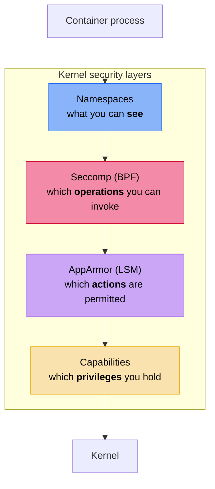

+++
title = "Container hardening"
description = "How nix-oci applies defense-in-depth with seccomp syscall filtering, AppArmor MAC, capability dropping, read-only root filesystem, and privilege restriction"
+++

# Container hardening

nix-oci provides a declarative hardening system that layers three
independent Linux kernel primitives (**seccomp**, **AppArmor**, and
**capabilities**) into a defense-in-depth posture. Each primitive
operates at a different level of the kernel, and combining them
covers gaps that any single mechanism leaves open.

A built-in [coherence checker](#coherence-cross-checks) catches
contradictions between backends at build time.

## The three primitives



| Primitive | Kernel layer | Controls | Limitations |
|---|---|---|---|
| **Namespaces** | Process visibility | What processes/files/networks are visible | Container runtime handles this |
| **Seccomp** | Syscall boundary (BPF) | Which syscalls a process can invoke | Cannot inspect pointer arguments (TOCTOU) |
| **AppArmor** | Pathname-level (LSM) | Which actions are permitted (mount, ptrace, userns) | Requires host kernel support + profile loading |
| **Capabilities** | Privilege checks | Which root sub-privileges the process holds | Coarse-grained per capability |

## Enabling hardening

```nix
oci.containers.my-app = {
  package = pkgs.myApp;
  hardening.enable = true;
};
```

Setting [`hardening.enable`](../reference/flake-parts-options.html)
activates the full hardening stack with sensible defaults.
Each sub-feature can be individually tuned. See the
[flake-parts option reference](../reference/flake-parts-options.html)
for all available hardening options, or the
[NixOS container module reference](../reference/nixos-options.html)
for the inner `oci.container.hardening.*` options.

## Seccomp: syscall filtering

Seccomp uses BPF programs to filter syscalls at the kernel boundary.

### Enforcement mode

[`hardening.seccomp.mode`](../reference/flake-parts-options.html)
controls what happens when a process attempts a blocked syscall:

| Mode | Action | Use case |
|---|---|---|
| `"enforce"` (default) | Block with `SCMP_ACT_ERRNO` | Production |
| `"audit"` | Log with `SCMP_ACT_LOG` but allow | Profile discovery, debugging |

Start with `"audit"` to discover which syscalls your application
actually needs, then switch to `"enforce"` for production.

### Predefined profiles

nix-oci ships five profiles via
[`hardening.seccomp.profile`](../reference/flake-parts-options.html),
each using a different filtering strategy:

| Profile | Strategy | Syscalls | Best for |
|---|---|---|---|
| `"strict"` | Allowlist (~60 syscalls) | Only base + file I/O + event loop | Static binaries, Go/Rust services |
| `"moderate"` (default) | Blocklist (~50 dangerous syscalls) | Everything except dangerous ops, with argument-level filtering | General-purpose containers |
| `"web-server"` | Allowlist (strict + network + threading + fs-write) | Full I/O stack | HTTP servers (nginx, Caddy) |
| `"database"` | Allowlist (web-server + memory management) | Full I/O + shared memory | PostgreSQL, Redis |
| `"gpu-compute"` | Allowlist (web-server + CUDA/GPU syscalls) | Full I/O + GPU device access | CUDA workloads, ML inference |

### Strict profile

Default action: **deny** (`SCMP_ACT_ERRNO`). Only explicitly listed
syscalls may execute:

- Process basics: `exit`, `read`, `write`, `mmap`, `brk`, signals
- File I/O: `openat`, `fstat`, `lseek`, `readv`, `writev`, `getcwd`
- Event loop: `epoll_*`, `poll`, `select`, `eventfd2`

Blocked by omission: `mount`, `ptrace`, `execve`, `socket`, `clone`,
`setns`, `unshare`, and all other syscalls.

### Moderate profile

Default action: **allow** (`SCMP_ACT_ALLOW`). Dangerous syscalls are
explicitly blocked, with argument-level filtering for finer control:

`acct`, `bpf`, `clock_settime`, `create_module`, `delete_module`,
`finit_module`, `init_module`, `kexec_load`, `mount`, `move_mount`,
`perf_event_open`, `pivot_root`, `ptrace`, `reboot`, `setns`,
`swapoff`, `swapon`, `umount2`, `unshare`, `userfaultfd`, and more
(~50 total).

This is similar to Docker's default seccomp profile but with
additional argument-level restrictions on certain syscalls.

### Web-server profile

Strict base plus the syscalls needed by HTTP servers:

- Networking: `socket`, `bind`, `listen`, `accept4`, `connect`,
  `sendto`, `recvfrom`, `sendmsg`, `recvmsg`
- Threading: `clone`, `clone3`, `wait4`, `tgkill`, `splice`,
  `sendfile`
- Filesystem writes: `fchmod`, `ftruncate`, `fsync`, `rename`,
  `unlink`, `mkdir`

### Database profile

Web-server base plus memory management syscalls needed by databases:

- Shared memory: `shmget`, `shmat`, `shmdt`, `shmctl`
- Memory mapping: additional `mmap`/`mprotect` variants
- Suitable for PostgreSQL, Redis, and similar data stores

### GPU-compute profile

Web-server base plus CUDA/GPU device access syscalls:

- Device I/O: `ioctl` (GPU drivers), device file access
- Memory: large allocation and pinning syscalls
- Suitable for CUDA workloads, ML inference, GPU-accelerated services

### Auto-detection

When using `nixosConfig`, nix-oci detects known services and
auto-selects the appropriate
[`seccomp.profile`](../reference/flake-parts-options.html):

- **Web servers** (nginx, httpd) → `"web-server"` profile
- **Databases** (PostgreSQL, Redis) → `"database"` profile
- **GPU workloads** → `"gpu-compute"` profile

```nix
# Auto-detected: nginx → web-server profile
oci.containers.my-app.nixosConfig = {
  mainService = "nginx";
  modules = [({ ... }: { services.nginx.enable = true; })];
};
```

### Custom profiles

For full control, provide an OCI runtime spec JSON file via
[`hardening.seccomp.customProfileJson`](../reference/flake-parts-options.html):

```nix
hardening.seccomp.customProfileJson = ./my-seccomp-profile.json;
```

> **Note:** A custom JSON profile makes cross-backend coherence checks
> opaque. The build will emit a warning (C2) that automated
> contradiction detection is limited.

### Generated output

With seccomp enabled, nix-oci produces a JSON file at
`_output.hardening.seccompProfile` following the OCI runtime spec
format. Deploy modules pass it via
`--security-opt seccomp=<path>`.

## AppArmor: mandatory access control

AppArmor is a Linux Security Module (LSM) that uses **pathname-based**
mandatory access control. Unlike seccomp (which filters syscall
numbers), AppArmor enforces high-level action policies: can this
process mount? Can it ptrace another process? Can it create user
namespaces?

### Enabling AppArmor

```nix
hardening.apparmor = {
  enable = true;
  mode = "enforce";  # or "complain" for discovery
};
```

### Enforcement mode

| Mode | Behavior | Use case |
|---|---|---|
| `"enforce"` (default) | Violations blocked and logged | Production |
| `"complain"` | Violations logged but allowed | Profile discovery |

### Default deny rules

When enabled, AppArmor applies three deny rules by default:

#### Deny user namespace creation

```nix
hardening.apparmor.denyUserNamespace = true;  # default
```

Prevents `unshare(CLONE_NEWUSER)` inside the container, mitigating
local privilege escalation vulnerabilities such as CVE-2023-2640
and CVE-2023-32629. Enforced via the `deny userns_create,` rule.

#### Deny mount operations

```nix
hardening.apparmor.denyMount = true;  # default
```

Prevents filesystem remounting, overlay stacking, and bind-mount
escape attacks. Enforced via the `deny mount,` rule.

#### Deny ptrace

```nix
hardening.apparmor.denyPtrace = true;  # default
```

Prevents process inspection and memory manipulation of other
processes. Enforced via `deny ptrace (read, read, trace, traceby),`.

### Custom AppArmor profiles

For full control, provide a custom profile file:

```nix
hardening.apparmor.customProfile = ./my-apparmor-profile;
```

> **Note:** A custom profile overrides ALL computed rules and makes
> cross-backend coherence checks opaque (warning C3).

### Generated output

With AppArmor enabled, nix-oci produces a profile at
`_output.hardening.apparmorProfile`. Deploy modules load it via
`--security-opt apparmor=<profile-name>`.

### Host requirements

AppArmor requires kernel support and the `apparmor_parser` tool on
the host. If the host does not meet these prerequisites, the build
emits a warning (D6).

### Seccomp vs. AppArmor

These are **complementary**, not competing:

| Aspect | Seccomp | AppArmor |
|---|---|---|
| What it filters | Syscall numbers | Actions (mount, ptrace, userns) |
| Granularity | "no `mount` at all" | "deny mount operations" |
| Path handling | Cannot inspect paths (TOCTOU) | Pathname-based rules |
| Network | Cannot filter by port | Network action rules |
| Privilege needed | None (self-imposed) | Host kernel support required |

Use seccomp to block dangerous syscall *categories*. Use AppArmor to
deny high-level *actions* (mount, ptrace, user namespaces).

## Capabilities: privilege partitioning

Linux capabilities split root's monolithic privilege into ~40
distinct units. nix-oci defaults to dropping all capabilities via
[`hardening.capabilities`](../reference/flake-parts-options.html):

```nix
hardening.capabilities = {
  drop = [ "ALL" ];
  add = [ ];
};
```

### Adding capabilities back

Some services need specific capabilities:

```nix
hardening.capabilities.add = [ "NET_BIND_SERVICE" ];  # bind ports < 1024
```

Deploy modules translate these to `--cap-drop ALL --cap-add NET_BIND_SERVICE`.

### Common capabilities

| Capability | Allows | Needed by |
|---|---|---|
| `NET_BIND_SERVICE` | Bind ports below 1024 | nginx on port 80/443 |
| `CHOWN` | Change file ownership | Some init scripts |
| `SETUID` / `SETGID` | Change process UID/GID | Privilege-dropping daemons |
| `DAC_OVERRIDE` | Bypass file permission checks | Rarely needed |

## Read-only root filesystem

[`hardening.readOnlyRootfs`](../reference/flake-parts-options.html):

```nix
hardening.readOnlyRootfs = true;
```

Mounts the container root filesystem as read-only at runtime
(`--read-only`). This prevents:

- Attackers from writing malware or backdoors to disk.
- Persistence across container restarts.
- Accidental writes to the image filesystem.

Applications that need writable storage should use declared volumes
(automatically derived from systemd `StateDirectory`,
`RuntimeDirectory`, etc.) or explicit `tmpfs` mounts.

## No-new-privileges

[`hardening.noNewPrivileges`](../reference/flake-parts-options.html):

```nix
hardening.noNewPrivileges = true;
```

Sets the `no_new_privs` kernel bit, preventing privilege escalation
via:

- Setuid/setgid binaries
- File capabilities
- Any mechanism that would grant more privileges than the parent
  process

Deploy modules translate to `--security-opt=no-new-privileges`.

## DNS and TLS restrictions

### Disable DNS

[`hardening.disableDns`](../reference/flake-parts-options.html):

```nix
hardening.disableDns = true;
```

This rewrites `/etc/nsswitch.conf` to `hosts: files` only, with no DNS
backend. Applications using hardcoded IP addresses remain unaffected.

Note: `/etc/resolv.conf` is **not** written into the image because
container runtimes always bind-mount it at startup. To fully restrict
DNS at runtime, use `--dns=127.0.0.1` or network policies.

### Remove TLS trust store

[`hardening.noTlsTrustStore`](../reference/flake-parts-options.html):

```nix
hardening.noTlsTrustStore = true;
```

Replaces `/etc/ssl/certs/ca-bundle.crt` with an empty file,
preventing all outgoing HTTPS connections. This is a "nuclear option"
for containers that should never initiate external TLS connections.

## Coherence cross-checks

When multiple hardening backends are enabled, contradictions between
them can create dead rules (a rule that can never fire) or phantom
permissions (a capability that seccomp silently blocks). nix-oci
detects these at **build time**.

### Assertions (hard build failure)

| Code | Detects |
|---|---|
| **P2** | `NET_RAW` capability dead under seccomp argument filters |
| **P3** | Capabilities dead because seccomp blocks their corresponding syscalls (phantom permissions) |
| **P5** | AppArmor network rules dead because seccomp blocks network |
| **P6** | AppArmor `denyMount`/`denyUserNamespace` contradicts `SYS_ADMIN` capability |
| **C1** | Privileged ports (< 1024) declared without `NET_BIND_SERVICE` capability |
| **C2** | Custom seccomp JSON makes cross-checks opaque |
| **C3** | Custom AppArmor profile makes computed rules opaque |
| **S1** | Strict seccomp profile contradicts detected web server |
| **S2** | Strict seccomp profile contradicts detected database |
| **S4** | `noNewPrivileges` disabled with otherwise strict hardening |

### Warnings (build succeeds, trace emitted)

| Code | Detects |
|---|---|
| **D2** | Capabilities added without dropping any |
| **D3** | Seccomp audit mode in production |
| **D4** | `readOnlyRootfs` disabled with hardening enabled |
| **D5** | AppArmor complain mode in production |
| **D6** | AppArmor host prerequisite not met |
| **G3** | All enforcement backends weak or disabled |

## Hardening labels

With hardening enabled, nix-oci embeds the security posture as
OCI labels:

| Label | Value |
|---|---|
| `io.github.dauliac.nix-oci.hardening.enabled` | `"true"` |
| `io.github.dauliac.nix-oci.hardening.no-new-privileges` | `"true"` / `"false"` |
| `io.github.dauliac.nix-oci.hardening.read-only-rootfs` | `"true"` / `"false"` |
| `io.github.dauliac.nix-oci.hardening.capabilities-drop` | `"ALL"` |
| `io.github.dauliac.nix-oci.hardening.capabilities-add` | `"NET_BIND_SERVICE"` |
| `io.github.dauliac.nix-oci.hardening.seccomp-profile` | `"strict"` / `"moderate"` / `"web-server"` / `"database"` / `"gpu-compute"` |
| `io.github.dauliac.nix-oci.hardening.apparmor-enabled` | `"true"` |
| `io.github.dauliac.nix-oci.hardening.apparmor-mode` | `"enforce"` / `"complain"` |

Deploy modules read these labels and automatically apply the
corresponding runtime flags (`--security-opt`, `--cap-drop`,
`--cap-add`, `--read-only`).

## Full hardening example

```nix
oci.containers.my-api = {
  package = pkgs.myApi;
  hardening = {
    enable = true;

    # Seccomp: strict allowlist for a Go HTTP server
    seccomp = {
      enable = true;
      profile = "web-server";
      mode = "enforce";
    };

    # AppArmor: block mount, ptrace, and user namespace creation
    apparmor = {
      enable = true;
      mode = "enforce";
      denyUserNamespace = true;
      denyMount = true;
      denyPtrace = true;
    };

    # Capabilities: drop all, add back port binding
    capabilities.add = [ "NET_BIND_SERVICE" ];

    # See option reference for readOnlyRootfs, noNewPrivileges,
    # disableDns, and noTlsTrustStore defaults
  };
};
```

## Further reading

- [Security defaults](./security-defaults.md): non-root, distroless, reproducibility
- [Vulnerability scanning](./vulnerability-scanning.md): CVE detection with Trivy, Grype, Vulnix
- [Image signing](./image-signing.md): Cosign supply-chain integrity
- [Policy & coherence testing](./policy-coherence-testing.md): OPA/Rego policy enforcement
- [Container probes](./container-probes.md): runtime security auditing tools
- [Seccomp BPF](https://www.kernel.org/doc/html/latest/userspace-api/seccomp_filter.html): kernel documentation
- [AppArmor](https://gitlab.com/apparmor/apparmor/-/wikis/Documentation): project documentation
- [Linux capabilities](https://man7.org/linux/man-pages/man7/capabilities.7.html): man page
