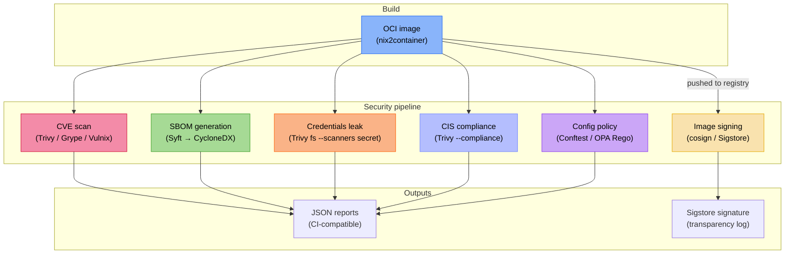

+++
title = "Supply-chain security"
description = "How nix-oci integrates vulnerability scanning, SBOM generation, image signing, policy checking, and integrity testing into the Nix build pipeline"

+++

# Supply-chain security

nix-oci treats supply chain security as a first-class concern. Instead of
bolting scanners onto CI scripts, it declares them as **module options**
and exposes them as **flake apps** and **flake checks**, making security
scanning reproducible, cacheable, and impossible to forget.

## The problem

Container images are opaque tarballs. Without active scanning:

- Known vulnerabilities (CVEs) in bundled libraries go unnoticed until
  an attacker exploits them.
- Nobody knows *what* is inside the image: no software bill of
  materials (SBOM) means no auditability.
- An attacker can tamper with images between build and deploy; without
  signatures, nothing proves provenance.
- Credentials (API keys, tokens, `.env` files) accidentally baked
  into layers are invisible until leaked.

nix-oci solves each of these with a dedicated module.

## Architecture overview

## Topics

- [Security defaults](security-defaults.html)
  — non-root user, distroless images, capability-dropped containers

- [Hardening](hardening.html)
  — seccomp, Landlock, AppArmor, capability controls, read-only rootfs

- [Vulnerability scanning, SBOM & compliance](vulnerability-scanning.html)
  — CVE scanning (Trivy, Grype, Vulnix), SBOM generation (Syft),
  credentials leak detection, CIS compliance, image linting (Dockle)

- [Image signing & provenance](image-signing.html)
  — cosign / Sigstore integration, keyless and key-based signing,
  annotations, verification, policy enforcement

- [Policy checking & integrity testing](policy-integrity-testing.html)
  — Conftest / OPA Rego policies, container-structure-test (including
  coherence auto-generation), dgoss, Dive

- [Policy composition & coherence testing](policy-coherence-testing.html)
  — three-layer validation model, auto-generated coherence checks

- [Container probes](container-probes.html)
  — amicontained, CDK, DEEPCE, linPEAS security probes

## The Nix advantage

Traditional container security scanning suffers from a fundamental
problem: scanners analyse the *artifact* (the image) rather than the
*source* (the build definition). This creates a gap:

- A Dockerfile `RUN apt-get install` pulls packages at build time --
  the exact versions depend on the mirror state, which is
  non-deterministic.
- Scanners can only report what they find in the artifact, not what
  *should* be there.

nix-oci closes this gap:

1. **Deterministic**: the `flake.lock` pins every input. Two builds
   of the same lock produce identical images.
2. **Complete closure**: Nix knows the full dependency graph; Vulnix
   can scan it directly without unpacking the image.
3. **Scanners as derivations**: scan results are Nix build outputs,
   meaning Nix caches them, they reproduce exactly, and they can gate
   CI pipelines as flake checks.

## Further reading

- [Security defaults](security-defaults.html): non-root, distroless, reproducibility
- [Policy composition and coherence testing](policy-coherence-testing.html): three-layer validation model
- [Automatic OCI labels](../architecture/automatic-labeling.html): labels encoding security posture
- [Hardening](hardening.html): seccomp, Landlock, capability controls
- [Sigstore](https://www.sigstore.dev/): keyless signing infrastructure
- [CycloneDX](https://cyclonedx.org/): SBOM standard
- [CIS Docker Benchmark](https://www.cisecurity.org/benchmark/docker): container security baseline
- [Conftest](https://www.conftest.dev/): policy-as-code for structured data
- [Open Policy Agent](https://www.openpolicyagent.org/): general-purpose policy engine (Rego language)
